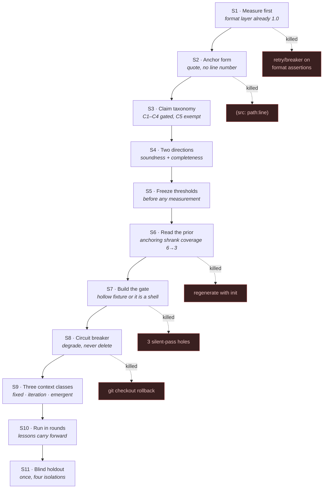
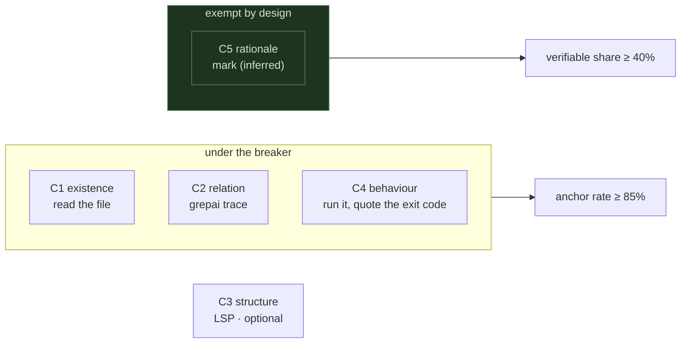
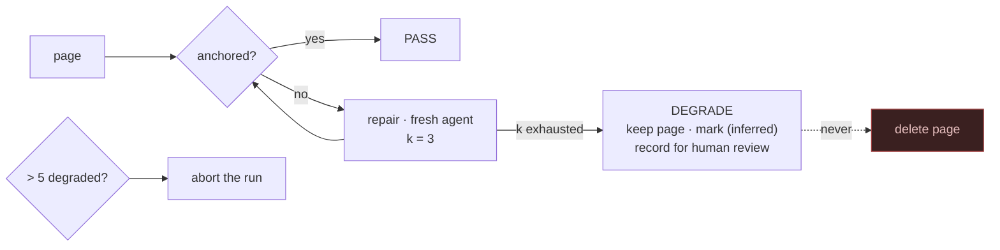
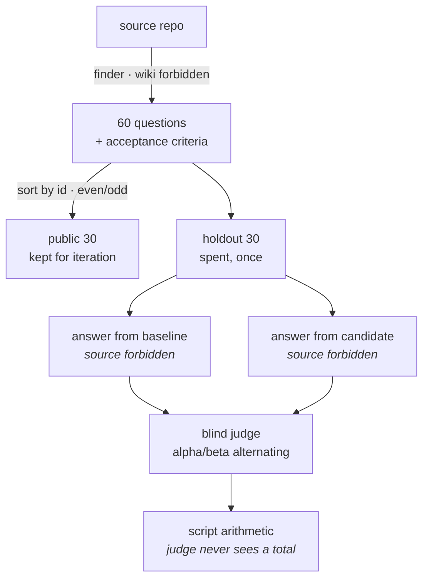

<div align="right">

**English** · [繁體中文](STAGES.zh-TW.md)

</div>

# The stages that produced the difference

Not a plan followed. Eleven stages, six of which overturned the stage before them. What each
one cost is stated; the four that were not anticipated are at the bottom and are the reason
this file exists.



---

## S1 · Measure before building anything

The opening instinct was a phase gate with a retry budget and a circuit breaker, on the
reasoning that a chain of N stages at 80% success collapses and local retry rescues it.

Measuring the existing wiki first killed that ordering. It had **zero** half-written pages,
**zero** broken links, and every frontmatter block valid. The format layer's success rate was
already 1.0, and `k` retries on a stage that never fails buys exactly nothing.

What it *did* have was 236 claims naming a source file and 5 line references in 29,451 words.

> **The assertion is the gate.** Without a claim structure to assert against, a circuit
> breaker guards nothing. Data structure precedes mechanism.

## S2 · The anchor form, decided by the official prompt

The plan was `(src: path:line \`quote\`)`. Reading `init.system.md` killed the line number:

> *prefer stable paths and symbol names over line numbers*

The baseline's zero line-anchors were **obedience, not oversight**, and the port's own
invariant forbids editing official text. The official reasoning also holds independently: a
line number is stale after the next commit; the quote is the evidence itself.

The quote is not optional. A bare `(src: path)` asserts only that a file exists — nearly
unfalsifiable. A retired predecessor in this codebase checked path and quote separately, so a
bare anchor passed; that is the hollow-anchor gap this form closes by construction.

## S3 · Claim taxonomy, and one class deliberately ungated



Design rationale — *why* something is built this way — usually has no verbatim source. Demand
an anchor for it and the wiki becomes an API reference: mechanically perfect, no longer worth
reading. C5 is exempt, marked `(inferred)`, and constrained from the other side by a floor on
how much of the page must still be checkable.

**Cost:** `(inferred)` is unfalsifiable by construction. A page could hide a wrong rationale
behind the tag. The floor bounds how much, not whether.

## S4 · Anchoring is only half of it

| direction | invariant | prevents | baseline |
|---|---|---|---|
| **A soundness** | every claim → a source location | fabrication | 0 anchors |
| **B completeness** | every substantial unit → at least one claim | silent omission | no mechanism |

Without B you get a wiki where every sentence is checkable and half the repository is missing.
The unit is a **gate-semantic entrypoint** — `__main__`, a hook, a console script — because it
is mechanically enumerable, **fixed in number so it cannot be padded**, and matches what an
agent actually asks: which script owns this, how do I run it, what does failure return.

Using "every exported symbol" would invite filler pages. Using git churn makes the denominator
move between runs, so no two measurements compare.

## S5 · Freeze the thresholds before measuring

Six thresholds committed before the first number existed. Thresholds chosen after seeing a
result get chosen wherever the result landed, with a plausible reason attached — that moves
the *judgement* rather than the metric, and it is invisible afterwards.

One threshold was later **raised**, never lowered: coverage moved from 90% to the measured
baseline of 30/32 once that was known.

## S6 · Read the priors before repeating them

The codebase held a measured A/B of this exact change from a month earlier: same repo, same
pin, one variable. Fabrication went to zero — **and round-1 coverage went from 6 pages to 3**,
for +4 points and 40% more authoring time.

The mechanism is not laziness. Anchoring raises the per-claim cost, and a bounded author
absorbs a cost increase by narrowing scope, not by working longer. Telling it not to narrow
does nothing.

Two consequences, both now enforced:

1. The coverage threshold ships **alongside** the anchor requirement, never after it.
2. Anchor as an **update over finished pages**, never as a fresh generation. Regenerating
   discards a 93.8%-coverage artifact that already passed three gates, and confounds the
   comparison with a second roll of the generation dice.

## S7 · Build the gate, then prove it is not a shell

```
good   → anchor real, quote matches                → exit 0
hollow → real path, quote NOT in that file         → exit 2, and the REASON must be "quote not found"
```

Asserting the exit code alone is not enough; a gate that fails for the wrong reason is a gate
that will pass the wrong thing later. The fixture asserts the reason.

**The negative control must not be bound to live data.** It first was — exhaustion was
demonstrated on a real page, and the moment that page got anchored the control silently
stopped testing anything. It announced itself by turning red. It now runs against a fixture
that is permanently unanchorable.

## S8 · The breaker degrades, it does not roll back



Code refactoring rolls back to known-good code. Wiki generation has no such thing — rollback
means the page is gone. And a deleted page **raises** the anchor rate by shrinking its
denominator while lowering coverage.

> Left alone, the breaker's default behaviour is *delete the pages that were hardest to
> write in order to make the dashboard green* — and the hardest pages are the ones a reader
> most needs.

A word-count floor against baseline blocks the same cheat inside a page. A global abort above
five degraded pages exists because that is no longer bad luck, it is a systemic fault, and
burning the rest of the corpus buys no information.

## S9 · Three context classes, which already existed

The dispatch contract in this codebase already carried all three; nothing new was invented.

| class | carrier | contents |
|---|---|---|
| **fixed** | passive context + task contract by pointer | what an anchor is, what must carry one |
| **iteration-auto** | regenerated per attempt | *this page's* unanchored claims, from the gate — never self-reported |
| **emergent** | prior files + packet field | what earlier rounds discovered the hard way |

The emergent class was the one with no carrier at all. Findings like *"the target contains a
copy of this wiki, so anchoring there is circular"* lived in one session's head, which means
every fresh agent rediscovered them at full price.

**The task contract is passed by pointer, not pasted.** A driver handed a full declarative
contract reads it as a specification and does not act — a failure mode already recorded in
the dispatch script's own comments.

## S10 · Rounds, and what carrying lessons forward actually bought

| run | pages | lessons carried | cited as useful | false claims found |
|---|---|---|---|---|
| 1 | 4 | 4 seeds | — | 2 |
| 2 | 5 | 17 | 14 of 17 | 9 |
| 3 | 24 | 19 | **189 citations across 24 agents** | 42 |

Three lessons were cited by 21–22 of the 24 agents independently: what the auditor counts as a
claim, how blocks are formed, and that a global failure says nothing about your own page.

**This is not causal evidence.** There is no unseeded arm. Agents were asked which lessons they
used, not whether the list helped — and they converged on the same few.

**What never happened, in three runs: a second round inside one run.** Every batch cleared in a
single pass, so the retry-with-enlarged-context path has executed zero times outside its
fixture. The breaker is tested; the *loop* around it is not.

## S11 · The holdout, once



Each isolation exists against a specific way the number could have been meaningless:

- Finder never sees a wiki → nobody writes questions a wiki happens to answer.
- Answerer never sees source → an answer rebuilt from code measures the model, not the wiki.
- Judge sees anonymous answers, mapping alternates per batch → no position or style bias.
- Scoring is arithmetic in a script → the judge cannot round toward a preferred conclusion.

---

# The four things that were not anticipated

## 1 · The metric smuggled in the Goodhart the prompt was designed to avoid

C5 exemption was written into the *prompt*. It was not written into the *denominator* — blocks
marked `(inferred)` still counted as claims owing an anchor. A page with honest rationale would
have been failed for having it, and the pressure to strip explanation would have arrived
through the scoreboard while the instructions still said the opposite.

> A rule stated in the prompt and contradicted by the metric is decided by the metric.

## 2 · Three silent-pass holes, all inside the verifier

| hole | symptom |
|---|---|
| two anchors in one parenthesis | regex matched nothing, substring test counted the block as anchored → `anchors=0, invalid=0, rate=1, status=passed` |
| anchor missing its opening paren | reads as evidence to a human, worth zero, invisible when the block has a real anchor too |
| anchoring into the wiki's own output | the target contains a copy of this wiki and the review transcripts; anchoring there is circular and scored green |

The first is the worst kind of bug a gate can have: it reported **passed** on a page whose only
anchor was unparseable. Anchored-ness was decided by a substring test while validation went
through a regex, and the two disagreed.

> A gate that can silently pass is worse than no gate, because it converts "unverified" into
> "verified" without anyone choosing to.

None of the three were found by design review. Two were found by the agents doing the work.

## 3 · Two metrics turned out to share evidence

Entrypoint coverage is a substring search over the wiki. An anchor's *path* is a substring. So
anchoring a page whose evidence lives in an uncovered entrypoint closes that coverage gap for
free — coverage went 30/32 → 32/32 without a single page being written for it.

Pleasant here, and a warning: **the two directions are not independent**, so "both improved"
is weaker evidence than it looks. A future threshold set should either accept the coupling
explicitly or measure coverage by something an anchor cannot incidentally satisfy.

## 4 · The instrument was wrong twice before it measured anything

- **Granularity.** Claims were counted per line while markdown wraps, so an anchor routinely
  landed on the line *after* the claim it supported. First reading: 22.2%. True figure far
  higher. Claims are now blocks.
- **Path resolution.** Bare filenames like `` `git_gate.py` `` were resolved only from the
  repository root, so the first run reported **67 fabricated references**. The real number is
  **6**, and all six are cross-repository or generic. Publishing 67 would have been the exact
  unverified-claim failure this gate was built to catch.

> Every number a new instrument produces is a claim about the instrument before it is a claim
> about the world. The first surprising reading is far more likely to be a measurement bug
> than a discovery.

---

## Also worth knowing, from the corrections themselves

**One wrong number propagated to ten pages.** The push gate runs 22 gates; the wiki said 23 on
ten pages, in frontmatter, in headings, and inside a mermaid diagram. The cause was
eye-counting a Python list literal that contains a comment block. Nothing in the pipeline
compares two pages to each other, so a single miscount replicates silently and then looks like
corroboration — ten pages agreeing is not ten pieces of evidence.

**"The wiki does not say" halved, from 12 to 6.** The anchoring pass was never asked to add
coverage. Forcing every claim to face its source apparently makes the surrounding page more
answerable as a side effect.

**One question went backwards.** An anchored rewrite dropped a branch the original mentioned.
Rewriting a sentence to make it true can lose something that was already true.
