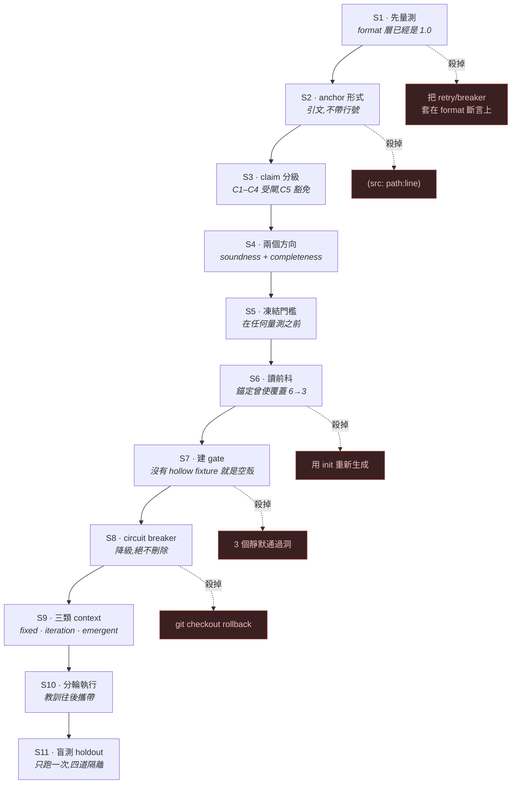
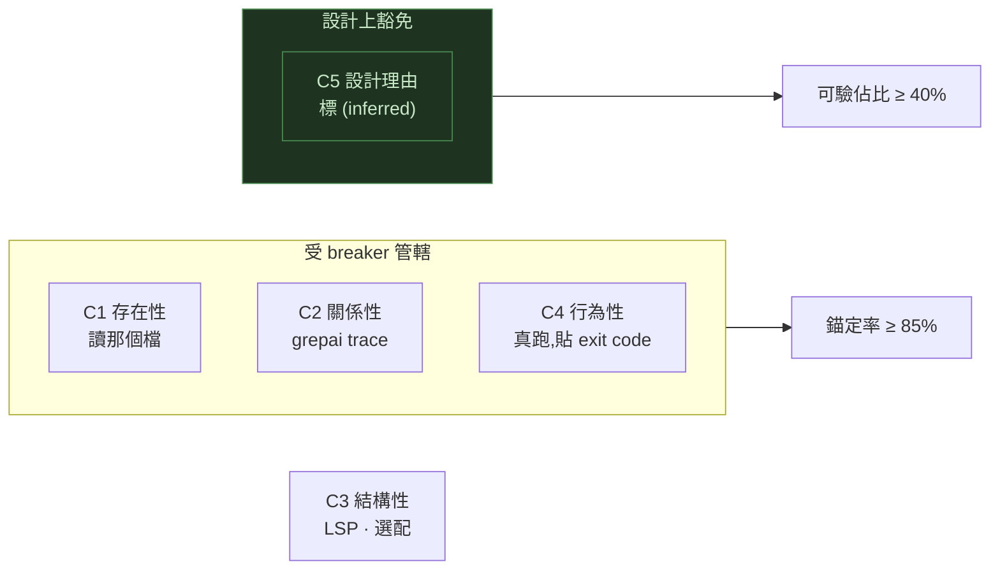
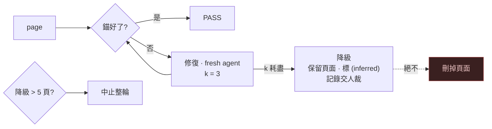
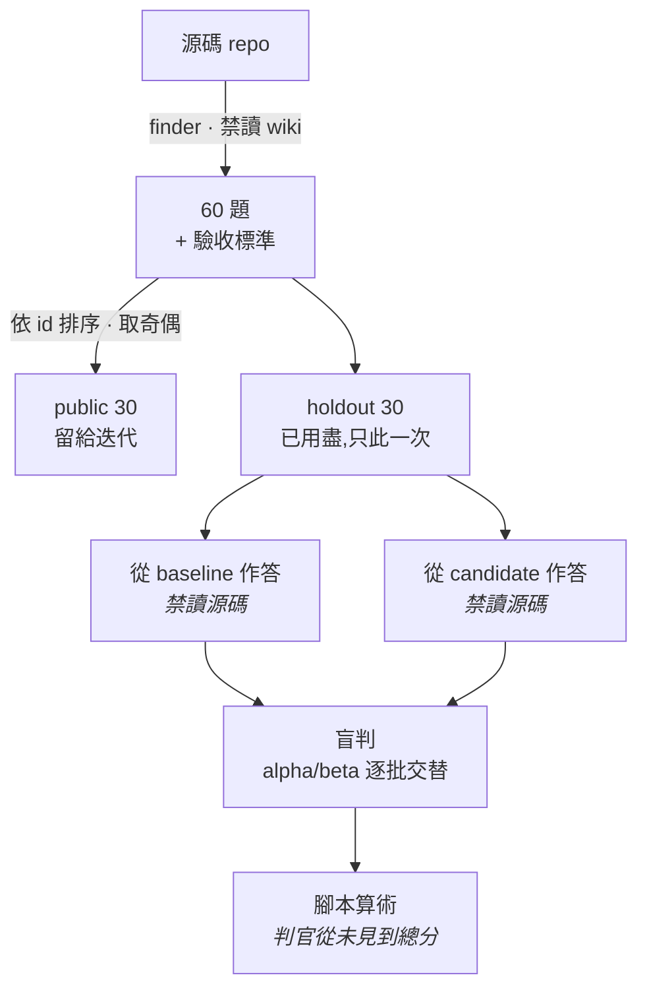

<div align="right">

[English](STAGES.md) · **繁體中文**

</div>

# 造成差異的推理階段

不是一份被照著走的計畫。11 個階段，其中 **6 個推翻了它前一個階段**。每階段的代價都寫出來；四件
沒人預料到的事在最後，那才是這份文件存在的理由。



---

## S1 · 動手之前先量測

最初的直覺是 phase gate + retry budget + circuit breaker，理由是「N 個階段各 80% 成功率的鏈條
會崩，局部 retry 救得回來」。

**先量測既有 wiki，殺掉了這個順序。** 它有**零**半成品頁、**零**壞鏈，每個 frontmatter 都合
規。format 層的成功率**已經是 1.0**，而在一個從不失敗的階段上做 `k` 次 retry，收益精確為零。

它真正有的是：29,451 字裡有 236 條指名源碼檔的 claim，和 5 個行號引用。

> **斷言就是閘本身。** 沒有可供斷言的 claim 結構，circuit breaker 什麼都沒守。
> **資料結構先於機制。**

## S2 · anchor 的形式，由官方提示詞決定

原訂是 `(src: path:line \`quote\`)`。讀 `init.system.md` 殺掉了行號：

> *prefer stable paths and symbol names over line numbers*

Baseline 的零行號錨是**服從，不是疏漏**，而這個 port 自己的不變量禁止編輯官方文字。官方的理由
本身也站得住：**行號在下一個 commit 就過期，引文才是證據本體。**

引文不是選配。裸 `(src: path)` 只主張「某檔存在」——**幾乎不可證偽**。這個 codebase 裡有一個已退
役的前身，把路徑與引文分開檢查，所以裸錨會過；那正是這個形式**由構造上**堵掉的 hollow-anchor
缺口。

## S3 · claim 分級，與一個刻意不設閘的類別



設計理由——*為什麼*要這樣建——通常沒有逐字源碼。對它也要求 anchor，wiki 就變成 API reference：
**機械上完美，不再值得讀**。C5 豁免、標 `(inferred)`，並由另一側的下限（頁面仍須有多少比例是可
查的）反向約束。

**代價：** `(inferred)` **由構造上不可證偽**。一頁可以把一個錯誤的理由藏在這個標籤後面。下限限
制的是「多少」，不是「有沒有」。

## S4 · 錨定只是一半

| 方向 | 不變量 | 防什麼 | baseline |
|---|---|---|---|
| **A soundness** | 每條 claim → 一個源碼位置 | 捏造 | 0 anchor |
| **B completeness** | 每個實質單元 → 至少一條 claim | 靜默漏講 | 無機制 |

沒有 B，你會得到一份「每句都可查、但半個 repo 不見了」的 wiki。單元是**有 gate 語義的
entrypoint**——`__main__`、hook、console script——因為它機械可枚舉、**數量固定所以灌不了水**，而
且對齊 agent 真正會問的問題：哪支腳本管這個、怎麼跑、失敗回什麼。

用「每個 export 符號」會直接邀請灌水頁面；用 git 改動頻率會讓分母在輪與輪之間漂移，兩次量測就
不可比。

## S5 · 在量測之前凍結門檻

六條門檻在第一個數字存在**之前**就 commit 了。**看到結果之後才定的門檻，會被定在結果剛好落到的
地方**，還會附上一個聽起來很合理的理由——那移動的是**判準**而不是指標，而且事後看不出來。

有一條門檻後來被**調高**、從未調低：覆蓋率在實測值出來後，從 90% 改成 baseline 的 30/32。

## S6 · 重演之前先讀前科

這個 codebase 裡存著一個月前對**這個完全相同的改動**做過的實測 A/B：同 repo、同 pin、單一變因。
捏造歸零——**而 round-1 覆蓋從 6 頁掉到 3 頁**，總分只 +4，作者耗時 +40%。

**機制不是偷懶。** 錨定拉高了每條 claim 的單位成本，而**有界的作者會用縮小範圍來吸收成本上升，
不會用工作更久**。叫它別縮沒有用。

兩個後果，現在都被強制：

1. 覆蓋門檻與錨定要求**同時**上，絕不在之後才上。
2. 錨定以 **update over finished pages** 執行，絕不重新生成。重生會丟掉一份覆蓋率 93.8%、已過三
   道閘的資產，並讓比較同時含有「重擲一次生成骰子」這第二個變因。

## S7 · 建好 gate，然後證明它不是空殼

```
good   → anchor 真實、引文相符                    → exit 0
hollow → 路徑真實、引文不在該檔                    → exit 2,且理由必須是「引文找不到」
```

**只斷言 exit code 不夠**；一個因為錯誤理由而失敗的 gate，之後會因為錯誤理由而放行。fixture 斷
言的是**理由**。

**負控不可綁在活資料上。** 它一開始就是——耗盡路徑用一個真實頁面示範，而**那頁一旦被錨好，這個
負控就靜默地不再測任何東西**。它靠自己轉紅才被發現。現在它跑的是一個**永久錨不了**的 fixture。

## S8 · Breaker 是降級，不是回滾



程式碼重構 rollback 回到「已知 good 的舊碼」。**wiki 生成沒有那種東西**——rollback 意味著那頁消
失。而一個被刪掉的頁面會因為**分母變小而拉高**錨定率，同時拉低覆蓋率。

> 放著不管，breaker 的預設行為就是**刪掉最難寫的那些頁，好讓儀表板變綠**——而最難寫的頁，正是讀
> 者最需要的。

頁內的相同作弊由**字數地板**（不得低於 baseline）擋掉。降級頁超過 5 就中止整輪，因為那已經不是
運氣不好而是系統性故障，燒完剩下的語料買不到任何資訊。

## S9 · 三類 context，而且它們本來就存在

這個 codebase 的 dispatch 契約裡本來就有這三個通道，什麼都不用發明。

| 類別 | 載體 | 內容 |
|---|---|---|
| **fixed** | 被動上下文 + 任務契約（指針） | 什麼是 anchor、哪些 claim 必須帶 |
| **iteration-auto** | 每次嘗試重生 | **這一頁**的未錨 claim，**由 gate 產生、絕不自報** |
| **emergent** | 前科檔 + packet 欄位 | 前幾輪用代價換來的發現 |

**emergent 是唯一完全沒有載體的那一類。** 像「靶裡裝著這份 wiki 的副本，所以錨到那裡是循環證
據」這種發現，只活在某一個 session 的腦袋裡——**於是每個 fresh agent 都要用全價重新踩一次**。

**任務契約用指針傳、不貼全文。** 被餵完整宣告式契約的 driver 會把它讀成規範而不動手——這個失效
模式早已記錄在 dispatch 腳本自己的註解裡。

## S10 · 分輪，以及「攜帶教訓」實際買到了什麼

| 輪 | 頁數 | 帶入教訓 | 被引用為有用 | 找到的錯誤主張 |
|---|---|---|---|---|
| 1 | 4 | 4 條種子 | — | 2 |
| 2 | 5 | 17 | 17 條中 14 條 | 9 |
| 3 | 24 | 19 | **24 個 agent 共 189 次引用** | 42 |

有三條教訓被 24 個 agent 中的 21–22 個**各自獨立**引用：稽核器到底把什麼算成 claim、區塊怎麼形
成、以及全域失敗不代表你自己那頁有問題。

**這不是因果證據。** 沒有未帶教訓的對照臂。問的是「你用了哪幾條」，不是「這份清單有沒有幫助」
——而它們收斂到同樣幾條。

**三輪下來從未發生的事：單次執行內的第二輪。** 每一批都在一輪內清光，所以「帶著更大的 context
重試失敗頁」這條路徑**除了 fixture 之外執行次數為零**。breaker 被測過了；**它外圈的迴圈沒有**。

## S11 · Holdout，只跑一次



每一道隔離都對應一個「這個數字可能變得毫無意義」的具體途徑：

- **finder 從不看 wiki** → 沒有人會寫出「wiki 剛好答得出來」的題。
- **answerer 從不看源碼** → 從程式碼重建的答案量的是模型，不是這份文檔。
- **judge 看匿名答案、對應逐批交替** → 沒有位置偏誤，也無法靠文風偏袒。
- **計分是腳本裡的算術** → 判官無法朝偏好的結論四捨五入。

---

# 四件沒人預料到的事

## 1 · 指標偷渡了提示詞明令要避免的那個 Goodhart

C5 豁免寫進了**提示詞**。它**沒有寫進分母**——標了 `(inferred)` 的區塊仍被算成欠 anchor 的
claim。一頁**因為誠實寫了理由而被判失敗**，而「把解釋刪掉」的壓力會從計分板來，指示卻還說著相
反的話。

> **規則寫在提示詞、被指標否定，最後算數的是指標。**

## 2 · 三個靜默通過洞，全在 verifier 自己身上

| 洞 | 症狀 |
|---|---|
| 同一括號塞兩個 anchor | regex 零匹配，子字串檢查卻算它已錨 → `anchors=0, invalid=0, rate=1, status=passed` |
| anchor 缺左括號 | 對人讀起來像證據、實際價值為零；同區塊若另有真錨就完全隱形 |
| 錨進 wiki 自己的產物 | 靶裡裝著這份 wiki 的副本與 review 逐字稿；錨到那裡循環，且被判綠 |

第一個是 gate 能有的最糟的一種 bug：它對一個**唯一的 anchor 根本無法解析**的頁面回報
**passed**。「是否已錨」由子字串檢查決定，驗證卻走 regex，**兩者不一致**。

> **一個會靜默通過的 gate 比沒有 gate 更糟**，因為它在沒有任何人做決定的情況下，把「未驗證」轉
> 成了「已驗證」。

三個之中**沒有一個是設計評審找到的**。兩個是幹活的 agent 找到的。

## 3 · 兩個指標原來共用證據

entrypoint 覆蓋率是對整份 wiki 做子字串搜尋。而 anchor 的**路徑**就是一個子字串。所以錨定一個
證據落在未覆蓋 entrypoint 上的頁面，**會免費補上那個覆蓋缺口**——覆蓋率 30/32 → 32/32，沒有為
它多寫一頁。

在這裡是好事，同時是警告：**兩個方向並不獨立**，所以「兩個都改善了」比它讀起來的份量弱。未來的
門檻組合要嘛明確接受這個耦合，要嘛改用 anchor 無法順帶滿足的方式量覆蓋。

## 4 · 儀器在量到任何東西之前，錯了兩次

- **粒度。** claim 按行計數，但 markdown 會折行，所以 anchor 經常落在它支撐的那條 claim 的**下
  一行**。第一次讀數 22.2%，真值遠高於此。claim 現在以**區塊**計。
- **路徑解析。** 像 `` `git_gate.py` `` 這種裸檔名只從 repo 根解析，於是第一次執行報出
  **67 個捏造引用**。真實數字是 **6**，而且六個全是跨 repo 或泛用檔名。**報 67 就會犯下這道
  gate 正要抓的那種未經查證的主張。**

> **一個新儀器產出的每個數字，先是關於儀器的主張，才是關於世界的主張。第一個令人驚訝的讀數，是
> 量測 bug 的機率遠高於是發現。**

---

## 另外值得知道的，來自更正本身

**一個錯數字傳染到十頁。** push gate 跑 22 個；wiki 在十頁裡寫 23，出現在 frontmatter、標題，以
及一張 mermaid 圖裡。原因是肉眼數一個中間夾著註解區塊的 Python list literal。**pipeline 從不比
對兩頁**，所以單一誤數會靜默複製，事後看起來像佐證——**十頁一致不是十份證據**。

**「wiki 沒寫」從 12 腰斬到 6。** 錨定 pass 從未被要求增加覆蓋。逼每條 claim 面對它的源碼，似乎
會讓周圍的頁面更可回答——這是副作用。

**有一題變差了。** 錨定後的改寫丟掉了原版提到的一個分支。**把一個句子改寫成可查的，可能丟掉某個
原本就是真的東西。**
