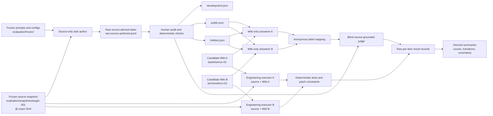
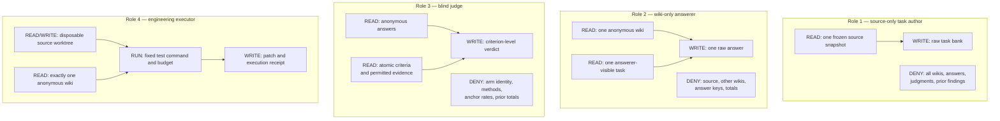

<div align="right">

**English** · [繁體中文](OPENWIKI_EVALUATION_CONTRACT_USER_GUIDE.zh-TW.md)

</div>

# OpenWiki Evaluation Contract User Guide

**Repository:** `ed3c/openwiki-source-anchoring`  
**Contract version:** `openwiki-evaluation/v1`

This guide explains how to use the repository's executable and reusable OpenWiki evaluation contract, how to organize a study workspace, how information moves between isolated roles, and what a passing contract does—and does not—prove.

The primary evaluation question is:

> Can an agent that may read one generated OpenWiki tree, but not the source repository, answer repository questions, navigate to the right source locations, reason about changes, and complete controlled engineering tasks more accurately than an agent reading another wiki?

---

## 1. Current execution boundary

The repository contains two layers.

### 1.1 Fully executable deterministic contract

Run these commands directly:

```sh
bun run evaluation/src/validate_manifest.mjs \
  evaluation/manifest.local.json

bun run evaluation/src/validate_manifest.mjs \
  evaluation/manifest.local.json \
  --root . \
  --check-paths

sh evaluation/selftest.sh
```

This layer validates:

- manifest schema and version;
- exact 40-character source commit SHAs;
- unique repository and output IDs;
- source/output path separation;
- non-overlapping candidate output roots;
- distinct development, public, and holdout split paths;
- repository-relative path confinement;
- symlink realpath confinement;
- complete provenance requirements;
- `repository_generation_run` as the top-level experimental unit.

Stable exit codes:

| Code | Meaning |
|---:|---|
| `0` | Contract passed |
| `2` | Contract or path validation failed |
| `64` | Invalid invocation |

### 1.2 Reusable model-backed evaluation protocol

The repository also defines prompts and result contracts for:

1. source-only task authors;
2. wiki-only answerers;
3. source-plus-one-wiki engineering executors;
4. blind source-grounded judges;
5. human calibration and statistical analysis.

These roles are not yet orchestrated by one built-in CLI. Run them through separate processes, containers, Agent CLIs, promptfoo, or a custom runner. **Prompt instructions are not an access boundary.** Enforce read boundaries with process isolation, filesystem permissions, containers, or disposable worktrees.

---

## 2. Core evaluation model

One evaluation sample is the complete tuple:

```text
source repository
+ exact source commit
+ one OpenWiki document tree
+ one independent generation run
+ prompt/config/model provenance
```

The top-level experimental unit is:

```text
repository × generation run
```

The following are nested observations, not independent experiments:

```text
page
claim
question
answer sample
judge verdict
```

Do not report 40 pages or 300 claims as 40 or 300 independent replications.

---

## 3. Contract files already in the repository

```text
openwiki-source-anchoring/
├── .github/
│   └── workflows/
│       └── openwiki-evaluation.yml
│
├── evaluation/
│   ├── README.md
│   ├── README.zh-TW.md
│   ├── manifest.example.json
│   ├── selftest.sh
│   ├── RESULT_SCHEMA.md
│   ├── PRIMARY_OUTCOMES.md
│   ├── ANALYSIS_PLAN.md
│   ├── HUMAN_CALIBRATION.md
│   ├── CONTAMINATION_CHECKLIST.md
│   ├── STOPPING_RULE.md
│   ├── VERSIONING.md
│   ├── LICENSE_POLICY.md
│   ├── TOOLING.md
│   ├── NON_GOALS.md
│   ├── DECISION_LOG.md
│   ├── prompts/
│   │   └── OPENWIKI_EVALUATION_PROMPTS.md
│   └── src/
│       └── validate_manifest.mjs
│
├── wiki/
│   ├── arm-a-baseline/
│   ├── arm-b-retrofit/
│   ├── arm-b-stripped/
│   ├── arm-c-generated/
│   └── arm-d-gate-driven/
│
└── docs/
    ├── OPENWIKI_EVALUATION_CONTRACT_USER_GUIDE.md
    ├── OPENWIKI_EVALUATION_CONTRACT_USER_GUIDE.zh-TW.md
    ├── OPEN_SOURCE_REVIEW_PROMPT_V2.md
    └── OPEN_SOURCE_REVIEW_PROMPT_V2.zh-TW.md
```

---

## 4. Recommended reusable study workspace

Some paths are local study artifacts and normally should not be committed. `evaluation/.gitignore` already excludes `manifest.local.json`, `outputs/`, `snapshots/`, and `results/`.

```text
evaluation/
├── manifest.local.json
│
├── frozen/
│   ├── prompts/
│   │   ├── generation.md
│   │   ├── task-author.md
│   │   ├── answerer.md
│   │   └── judge.md
│   └── configs/
│       ├── generation.json
│       ├── answerer.json
│       └── judge.json
│
├── snapshots/
│   ├── target-001/
│   │   └── ... exact source checkout at one full SHA
│   └── target-002/
│       └── ...
│
├── outputs/
│   ├── target-001/
│   │   ├── baseline/
│   │   │   ├── run-01/
│   │   │   └── run-02/
│   │   └── source-anchored-with-gate/
│   │       ├── run-01/
│   │       └── run-02/
│   └── target-002/
│       └── ...
│
├── tasks/
│   ├── target-001/
│   │   ├── raw-source-authored.jsonl
│   │   ├── audited-all.jsonl
│   │   ├── development.json
│   │   ├── public.json
│   │   ├── holdout.json
│   │   ├── repository-qa.json
│   │   ├── navigation.json
│   │   ├── change-impact.json
│   │   └── implementation.json
│   └── target-002/
│       └── ...
│
├── runs/
│   ├── task-author/
│   ├── answerer/
│   ├── judge/
│   └── executor/
│
├── reviews/
│   └── human-calibration/
│
└── results/
    ├── raw/
    │   ├── answers/
    │   ├── judgments/
    │   └── executions/
    ├── mappings/
    ├── receipts/
    ├── per-item/
    └── derived/
        ├── summary.json
        ├── transitions.json
        └── uncertainty.json
```

---

## 5. End-to-end data flow



---

## 6. Role isolation data flow



The manifest's `isolation` section declares forbidden roots. The validator checks path legality and existence when `--check-paths` is enabled, but it does not create a sandbox. The runner must enforce the declared boundaries.

---

## 7. Minimal executable setup

### 7.1 Requirements

- Bun `1.3.13`, pinned by `.bun-version`;
- POSIX shell;
- Git;
- a source repository that may legally be evaluated;
- one or more OpenWiki outputs.

```sh
bun --version
```

Expected:

```text
1.3.13
```

### 7.2 Verify the contract implementation

```sh
sh evaluation/selftest.sh
```

Expected final line:

```text
evaluation selftest: PASS
```

The self-test includes positive and adversarial controls for malformed SHAs, duplicate IDs, overlapping output roots, reused split paths, and symlink escape.

### 7.3 Create a local manifest

```sh
cp evaluation/manifest.example.json \
  evaluation/manifest.local.json
```

### 7.4 Materialize an exact source snapshot

```sh
SOURCE_URL="<source-repository-url>"
SOURCE_SHA="<40-character-full-sha>"
SOURCE_ID="target-001"

mkdir -p evaluation/snapshots

git clone "$SOURCE_URL" \
  "evaluation/snapshots/$SOURCE_ID"

git -C "evaluation/snapshots/$SOURCE_ID" \
  checkout --detach "$SOURCE_SHA"

test "$(git -C "evaluation/snapshots/$SOURCE_ID" rev-parse HEAD)" \
  = "$SOURCE_SHA"
```

Do not use `main`, `latest`, a release name, or a short SHA in the contract.

### 7.5 Materialize candidate OpenWiki trees

To evaluate the repository's published arms as study candidates:

```sh
mkdir -p \
  evaluation/outputs/target-001/arm-a/run-01 \
  evaluation/outputs/target-001/arm-b/run-01 \
  evaluation/outputs/target-001/arm-bs/run-01 \
  evaluation/outputs/target-001/arm-c/run-01 \
  evaluation/outputs/target-001/arm-d/run-01

cp -R wiki/arm-a-baseline/. \
  evaluation/outputs/target-001/arm-a/run-01/
cp -R wiki/arm-b-retrofit/. \
  evaluation/outputs/target-001/arm-b/run-01/
cp -R wiki/arm-b-stripped/. \
  evaluation/outputs/target-001/arm-bs/run-01/
cp -R wiki/arm-c-generated/. \
  evaluation/outputs/target-001/arm-c/run-01/
cp -R wiki/arm-d-gate-driven/. \
  evaluation/outputs/target-001/arm-d/run-01/
```

A fixed copy is preferable when building a versioned study bundle because later wiki edits cannot silently mutate a historical candidate.

### 7.6 Create task and result paths

```sh
mkdir -p \
  evaluation/tasks/target-001 \
  evaluation/results/raw/answers \
  evaluation/results/raw/judgments \
  evaluation/results/raw/executions \
  evaluation/results/mappings \
  evaluation/results/receipts \
  evaluation/results/per-item \
  evaluation/results/derived \
  evaluation/reviews/human-calibration \
  evaluation/frozen/prompts \
  evaluation/frozen/configs

for file in \
  development public holdout \
  repository-qa navigation change-impact implementation
do
  printf '[]\n' > "evaluation/tasks/target-001/$file.json"
done
```

Every path listed in a manifest must exist when `--check-paths` is used.

### 7.7 Freeze prompt and configuration provenance

Linux:

```sh
sha256sum evaluation/frozen/prompts/generation.md
sha256sum evaluation/frozen/configs/generation.json
```

macOS:

```sh
shasum -a 256 evaluation/frozen/prompts/generation.md
shasum -a 256 evaluation/frozen/configs/generation.json
```

Use `"provenance": "complete"` only when all of the following exist:

- immutable model ID;
- provider;
- `model.immutable: true`;
- 64-character prompt SHA-256;
- 64-character configuration SHA-256.

Use `partial` or `unknown` for historical runs with incomplete provenance. Do not infer exact model snapshots from family labels such as `sonnet` or `opus`.

### 7.8 Validate the manifest

Structure only:

```sh
bun run evaluation/src/validate_manifest.mjs \
  evaluation/manifest.local.json
```

Structure plus filesystem boundaries:

```sh
bun run evaluation/src/validate_manifest.mjs \
  evaluation/manifest.local.json \
  --root . \
  --check-paths
```

Use `--root .` when manifest paths are repository-root-relative. Without it, the validator defaults to the manifest's directory and may resolve `evaluation/...` as `evaluation/evaluation/...`.

---

## 8. Manifest field guide

### Top level

```json
{
  "schema_version": "openwiki-evaluation/v1",
  "study_id": "openwiki-target-001-v1",
  "experimental_unit": "repository_generation_run",
  "primary_outcomes": [
    "source_grounded_task_success",
    "atomic_claim_support_rate"
  ],
  "repositories": []
}
```

Required invariants:

- `schema_version` is `openwiki-evaluation/v1`;
- `experimental_unit` is `repository_generation_run`;
- `primary_outcomes` includes `source_grounded_task_success`;
- `repositories` is non-empty.

### Repository record

Each repository record identifies:

- stable repository ID;
- source repository identifier;
- exact full commit SHA;
- local source snapshot path;
- candidate OpenWiki outputs;
- task splits and categories;
- role-specific forbidden roots.

### Candidate output record

```json
{
  "id": "target-001-arm-d-run-01",
  "method": "source-anchored-with-gate",
  "path": "evaluation/outputs/target-001/arm-d/run-01",
  "run_id": "run-01",
  "generation": {
    "provenance": "complete",
    "model": {
      "id": "<immutable-model-id>",
      "provider": "<provider>",
      "immutable": true
    },
    "prompt_sha256": "<64-character-hex>",
    "config_sha256": "<64-character-hex>"
  }
}
```

### Evaluation splits

```text
development — may guide prompt and implementation changes
public      — may support published iteration, then becomes spent
holdout     — used once for the preregistered comparison, then becomes spent
```

The validator requires distinct split paths. Mark `spent: true` after a split has influenced a candidate or a published decision.

### Task categories

| Category | Purpose | Preferred oracle |
|---|---|---|
| `repository_qa` | Facts, defaults, failures, side effects | source evidence or command |
| `navigation` | Correct file and symbol in top-k | exact path/symbol |
| `change_impact` | Affected components, tests, contracts | source rubric plus tests |
| `implementation` | Controlled patch success | isolated test suite |

---

## 9. Complete evaluation phases

### Phase 0 — Freeze and preregister

Before scoring any candidate, freeze:

- source repository and commit;
- candidate methods and run IDs;
- generation prompts and config hashes;
- task split rule;
- primary and secondary outcomes;
- exclusion roots and measured set;
- judge rubric;
- repeat count and stopping rule;
- equivalence margin for any no-material-difference claim.

### Phase 1 — Source-only task author

Use `evaluation/prompts/OPENWIKI_EVALUATION_PROMPTS.md`.

The author may read only the frozen source snapshot and repository-native tests/configuration. It must not read any candidate wiki, prior correction, answer, judgment, or aggregate result.

Create source-derived tasks for:

- factual repository QA;
- file and symbol navigation;
- configuration, fallback, failure, and side-effect behavior;
- change-impact reasoning;
- small executable engineering tasks.

Prefer deterministic or executable oracles.

### Phase 2 — Human audit and split

Audit tasks for:

- ambiguity;
- source drift;
- impossible criteria;
- accidental candidate knowledge;
- reliance on private history or undocumented author intent;
- non-atomic acceptance criteria.

Apply the preregistered split rule. Never move a failed item between splits after seeing candidate results.

### Phase 3 — Wiki-only answerer

Each answer run receives:

```text
one anonymous OpenWiki tree
+ one task
+ one immutable answerer configuration
```

It must not receive source code, another candidate, answer keys, arm identity, prior findings, or aggregate totals.

When the wiki lacks the requested fact, the answer should return `NOT_DOCUMENTED` rather than filling the gap from model memory.

### Phase 4 — Blind source-grounded judge

The judge receives:

- anonymous answers;
- frozen atomic acceptance criteria;
- only the source evidence or executable receipt allowed by the grading protocol;
- no candidate identity, generation method, anchor rate, or previous totals.

Grade each criterion before assigning `PASS`, `PARTIAL`, `FAIL`, or `CANNOT_DETERMINE`.

### Phase 5 — Engineering executor

Every candidate must receive the same:

- source snapshot;
- task;
- model and configuration;
- tools;
- test command;
- time/token budget.

The only experimental difference is the anonymous documentation tree. Use a disposable worktree or container and score the final patch with tests and patch constraints.

### Phase 6 — Preserve per-item result records

Follow `evaluation/RESULT_SCHEMA.md`. Preserve:

- raw answer path;
- anonymous label mapping;
- exact answerer and judge IDs/config hashes;
- criterion-level grades;
- unsupported assertions;
- test receipts;
- elapsed time, tokens, and cost where available.

Derived totals must be reproducible from the raw per-item records. Keep aggregate totals out of judge inputs.

### Phase 7 — Aggregate and analyze

At minimum report:

1. raw counts;
2. paired per-item transitions;
3. results by repository and independent generation run;
4. cluster-aware uncertainty;
5. answerer and judge variance;
6. human/judge criterion agreement;
7. correct abstentions and unsupported assertions;
8. token, latency, cost, and document-size tradeoffs.

Use the repository-generation run as the cluster unit. Equal aggregate PASS totals in one run are not an equivalence test.

---

## 10. CI integration

The public workflow already runs the example contract and adversarial controls:

```text
.github/workflows/openwiki-evaluation.yml
```

For a public study manifest, add:

```yaml
- name: Validate actual OpenWiki study contract
  run: |
    bun run evaluation/src/validate_manifest.mjs \
      evaluation/manifest.study-v1.json \
      --root . \
      --check-paths
```

For private source snapshots:

- validate the actual manifest in private CI;
- keep the public example contract and self-test in public CI;
- publish hashes, neutral receipts, and provenance gaps where rights permit;
- do not imply full public reproducibility.

---

## 11. Reuse patterns

### Add another wiki for the same repository

1. create a new output directory;
2. use a unique output ID and generation run ID;
3. record provenance without filling gaps by inference;
4. run the same frozen task bank against all candidates;
5. rerun the manifest validator.

### Add another repository

1. create a new exact source snapshot;
2. create repository-specific source-derived tasks;
3. use distinct split paths;
4. generate independent wiki runs;
5. keep repository-generation runs as the top-level units;
6. analyze cross-repository robustness rather than pooling pages as independent samples.

### Release a new benchmark version

1. freeze a new study ID and task schema version;
2. preserve the previous task bank and results;
3. document why an item changed;
4. never silently repair a spent holdout;
5. publish a migration note for result consumers.

---

## 12. Common failures

| Failure | Meaning | Fix |
|---|---|---|
| `source.commit must be a 40-character hexadecimal SHA` | Mutable or short source reference | Use the full commit SHA |
| `duplicate openwiki output id` | Two candidates cannot be distinguished | Give every output a stable unique ID |
| `openwiki output paths overlap` | Candidate trees are nested or share a root | Copy candidates into isolated directories |
| `evaluation split paths must be distinct` | Development/public/holdout leakage risk | Use separate immutable files |
| `path does not exist` | Manifest and workspace disagree | Materialize all declared paths or fix the path |
| `resolves outside root through a symlink` | Filesystem boundary escape | Remove the symlink or move the target inside the study root |
| `complete provenance ... incomplete` | Provenance is overstated | Add immutable identifiers/hashes or downgrade to `partial` |
| valid paths resolve under `evaluation/evaluation/...` | Wrong validator root | Run with `--root .` |

---

## 13. What a contract PASS means

A passing deterministic contract establishes that:

- the manifest follows `openwiki-evaluation/v1`;
- source SHAs and declared provenance are structurally valid;
- candidate IDs and roots are separable;
- split paths are not reused;
- declared paths stay inside the selected root;
- symlink realpaths do not escape the root;
- all checked paths exist.

A contract PASS does **not** establish that:

- task authors truly avoided every wiki;
- answerers truly avoided source code;
- the task bank is unambiguous;
- a quote semantically supports a claim;
- one model judge is correct;
- a candidate understands its source repository;
- results generalize across repositories or models;
- equal totals establish equivalence.

Those require enforced isolation, deterministic test oracles, human calibration, repeated paired runs, cluster-aware uncertainty, and preferably external reproduction.

---

## 14. Release-ready checklist

### Contract

- [ ] Every source uses an exact full SHA
- [ ] Every candidate has a unique output ID and run ID
- [ ] Source and output roots are isolated
- [ ] Candidate roots do not overlap
- [ ] Development, public, and holdout paths are distinct
- [ ] Provenance gaps remain visible
- [ ] `sh evaluation/selftest.sh` passes
- [ ] Manifest passes with `--root . --check-paths`

### Task bank

- [ ] Tasks were authored from source only
- [ ] Acceptance criteria are atomic
- [ ] A human-audited calibration subset exists
- [ ] Split assignment follows a frozen rule
- [ ] Spent splits are marked
- [ ] At least one deterministic or executable task exists per repository

### Execution

- [ ] Roles run in separate processes or sandboxes
- [ ] Every candidate receives identical tasks, models, tools, and budgets
- [ ] Anonymous mappings are hidden until grading completes
- [ ] Raw answers, judgments, executions, and receipts are preserved
- [ ] Implementation success requires the declared test command to pass

### Analysis

- [ ] Raw per-item transitions are reported
- [ ] Repository-generation runs are treated as clusters
- [ ] Answerer and judge variance is reported
- [ ] Human/judge agreement is reported
- [ ] Correct abstentions and unsupported assertions are included
- [ ] No causal or equivalence claim exceeds the design

---

## 15. Short command runbook

```sh
# 1. Verify the contract implementation
sh evaluation/selftest.sh

# 2. Create a local manifest
cp evaluation/manifest.example.json \
  evaluation/manifest.local.json

# 3. Materialize exact source snapshots, candidate wikis,
#    task files, result paths, and isolation roots.

# 4. Validate structure
bun run evaluation/src/validate_manifest.mjs \
  evaluation/manifest.local.json

# 5. Validate paths and filesystem boundaries
bun run evaluation/src/validate_manifest.mjs \
  evaluation/manifest.local.json \
  --root . \
  --check-paths

# 6. Run isolated roles:
#    source-only author → wiki-only answerers
#    → blind judge / engineering executors

# 7. Store one neutral record per item using RESULT_SCHEMA.md

# 8. Recompute all aggregate results from the per-item records
```

## Key rules

- The deterministic validator is the contract trust boundary.
- `repository × generation run` is the experimental unit.
- A prompt is not a sandbox.
- Preserve raw per-item evidence before computing totals.
- `anchor_rate` is a process diagnostic, not the main reader-quality outcome.
- Reader-facing outcomes should prioritize engineering task success, navigation, source-grounded QA, correct abstention, and semantic support.
