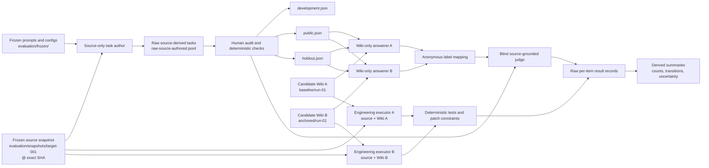
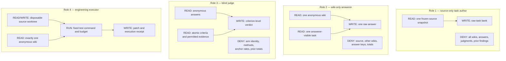

<div align="right">

[English](OPENWIKI_EVALUATION_CONTRACT_USER_GUIDE.md) · **繁體中文**

</div>

# OpenWiki 評測契約使用說明書

**適用 Repository：** `ed3c/openwiki-source-anchoring`  
**契約版本：** `openwiki-evaluation/v1`

本文件說明如何執行與重複使用 repository 內的 OpenWiki evaluation contract、如何安排 study workspace、資料如何在隔離角色之間流動，以及 contract PASS 能證明與不能證明什麼。

主要評測問題是：

> 一個只能讀取一份生成式 OpenWiki、不能讀原始碼的 Agent，是否能比讀取另一份 wiki 的 Agent 更準確地回答 repository 問題、定位 source file/symbol、推理改動影響，並完成受控的工程任務？

---

## 1. 目前可執行的邊界

Repository 目前包含兩個層次。

### 1.1 已完全可執行的 deterministic contract

可以直接執行：

```sh
bun run evaluation/src/validate_manifest.mjs \
  evaluation/manifest.local.json

bun run evaluation/src/validate_manifest.mjs \
  evaluation/manifest.local.json \
  --root . \
  --check-paths

sh evaluation/selftest.sh
```

這一層會驗證：

- manifest schema 與版本；
- exact 40-character source commit SHA；
- repository 與 output ID 唯一性；
- source/output path 隔離；
- candidate output roots 不互相重疊或 nested；
- development、public、holdout split paths 不重用；
- repository-relative path 不逃出 root；
- symlink realpath 不逃出 root；
- complete provenance 的必要欄位；
- top-level experimental unit 是 `repository_generation_run`。

穩定 exit codes：

| Code | 意義 |
|---:|---|
| `0` | Contract 通過 |
| `2` | Contract 或 path validation 失敗 |
| `64` | Command 使用方式錯誤 |

### 1.2 可重複使用的 model-backed evaluation protocol

Repository 也已定義以下 prompts 與 result contracts：

1. source-only task author；
2. wiki-only answerer；
3. source-plus-one-wiki engineering executor；
4. blind source-grounded judge；
5. human calibration 與 statistical analysis。

目前尚未由內建單一 CLI 完成 orchestration。應透過不同 process、container、Agent CLI、promptfoo 或自訂 runner 執行。**Prompt instruction 不是 access boundary。** 必須用 process isolation、filesystem permission、container 或 disposable worktree 落實 read boundaries。

---

## 2. 核心 evaluation model

一個 evaluation sample 是完整 tuple：

```text
source repository
+ exact source commit
+ one OpenWiki document tree
+ one independent generation run
+ prompt/config/model provenance
```

Top-level experimental unit 是：

```text
repository × generation run
```

以下都只是 nested observations，不是獨立實驗：

```text
page
claim
question
answer sample
judge verdict
```

不能將 40 頁或 300 個 claims 報成 40 或 300 次獨立 replication。

---

## 3. Repository 已有的契約檔案

```text
openwiki-source-anchoring/
├── .github/
│   └── workflows/
│       └── openwiki-evaluation.yml
│
├── evaluation/
│   ├── README.md
│   ├── README.zh-TW.md
│   ├── manifest.example.json
│   ├── selftest.sh
│   ├── RESULT_SCHEMA.md
│   ├── PRIMARY_OUTCOMES.md
│   ├── ANALYSIS_PLAN.md
│   ├── HUMAN_CALIBRATION.md
│   ├── CONTAMINATION_CHECKLIST.md
│   ├── STOPPING_RULE.md
│   ├── VERSIONING.md
│   ├── LICENSE_POLICY.md
│   ├── TOOLING.md
│   ├── NON_GOALS.md
│   ├── DECISION_LOG.md
│   ├── prompts/
│   │   └── OPENWIKI_EVALUATION_PROMPTS.md
│   └── src/
│       └── validate_manifest.mjs
│
├── wiki/
│   ├── arm-a-baseline/
│   ├── arm-b-retrofit/
│   ├── arm-b-stripped/
│   ├── arm-c-generated/
│   └── arm-d-gate-driven/
│
└── docs/
    ├── OPENWIKI_EVALUATION_CONTRACT_USER_GUIDE.md
    ├── OPENWIKI_EVALUATION_CONTRACT_USER_GUIDE.zh-TW.md
    ├── OPEN_SOURCE_REVIEW_PROMPT_V2.md
    └── OPEN_SOURCE_REVIEW_PROMPT_V2.zh-TW.md
```

---

## 4. 建議的可重複使用 study workspace

部分路徑屬於 local study artifacts，通常不應 commit。`evaluation/.gitignore` 已排除 `manifest.local.json`、`outputs/`、`snapshots/` 與 `results/`。

```text
evaluation/
├── manifest.local.json
│
├── frozen/
│   ├── prompts/
│   │   ├── generation.md
│   │   ├── task-author.md
│   │   ├── answerer.md
│   │   └── judge.md
│   └── configs/
│       ├── generation.json
│       ├── answerer.json
│       └── judge.json
│
├── snapshots/
│   ├── target-001/
│   │   └── ... exact source checkout at one full SHA
│   └── target-002/
│       └── ...
│
├── outputs/
│   ├── target-001/
│   │   ├── baseline/
│   │   │   ├── run-01/
│   │   │   └── run-02/
│   │   └── source-anchored-with-gate/
│   │       ├── run-01/
│   │       └── run-02/
│   └── target-002/
│       └── ...
│
├── tasks/
│   ├── target-001/
│   │   ├── raw-source-authored.jsonl
│   │   ├── audited-all.jsonl
│   │   ├── development.json
│   │   ├── public.json
│   │   ├── holdout.json
│   │   ├── repository-qa.json
│   │   ├── navigation.json
│   │   ├── change-impact.json
│   │   └── implementation.json
│   └── target-002/
│       └── ...
│
├── runs/
│   ├── task-author/
│   ├── answerer/
│   ├── judge/
│   └── executor/
│
├── reviews/
│   └── human-calibration/
│
└── results/
    ├── raw/
    │   ├── answers/
    │   ├── judgments/
    │   └── executions/
    ├── mappings/
    ├── receipts/
    ├── per-item/
    └── derived/
        ├── summary.json
        ├── transitions.json
        └── uncertainty.json
```

---

## 5. End-to-end 資料流圖



---

## 6. Role isolation 資料流圖



Manifest 的 `isolation` 區段只宣告 forbidden roots。Validator 會在 `--check-paths` 模式檢查 path legality 與 existence，但不會建立 sandbox；runner 必須實際執行隔離。

---

## 7. 最小可執行設定

### 7.1 Requirements

- Bun `1.3.13`，由 `.bun-version` 固定；
- POSIX shell；
- Git；
- 具備合法評測權利的 source repository；
- 一份或多份 OpenWiki outputs。

```sh
bun --version
```

預期：

```text
1.3.13
```

### 7.2 驗證 contract implementation

```sh
sh evaluation/selftest.sh
```

預期最後一行：

```text
evaluation selftest: PASS
```

Self-test 會驗證正控制，以及 malformed SHA、duplicate ID、overlapping roots、split reuse 與 symlink escape 等 adversarial controls。

### 7.3 建立 local manifest

```sh
cp evaluation/manifest.example.json \
  evaluation/manifest.local.json
```

### 7.4 Materialize exact source snapshot

```sh
SOURCE_URL="<source-repository-url>"
SOURCE_SHA="<40-character-full-sha>"
SOURCE_ID="target-001"

mkdir -p evaluation/snapshots

git clone "$SOURCE_URL" \
  "evaluation/snapshots/$SOURCE_ID"

git -C "evaluation/snapshots/$SOURCE_ID" \
  checkout --detach "$SOURCE_SHA"

test "$(git -C "evaluation/snapshots/$SOURCE_ID" rev-parse HEAD)" \
  = "$SOURCE_SHA"
```

Contract 不可使用 `main`、`latest`、release name 或 short SHA。

### 7.5 Materialize candidate OpenWiki trees

要把 repository 目前公開的 arms 當作 study candidates：

```sh
mkdir -p \
  evaluation/outputs/target-001/arm-a/run-01 \
  evaluation/outputs/target-001/arm-b/run-01 \
  evaluation/outputs/target-001/arm-bs/run-01 \
  evaluation/outputs/target-001/arm-c/run-01 \
  evaluation/outputs/target-001/arm-d/run-01

cp -R wiki/arm-a-baseline/. \
  evaluation/outputs/target-001/arm-a/run-01/
cp -R wiki/arm-b-retrofit/. \
  evaluation/outputs/target-001/arm-b/run-01/
cp -R wiki/arm-b-stripped/. \
  evaluation/outputs/target-001/arm-bs/run-01/
cp -R wiki/arm-c-generated/. \
  evaluation/outputs/target-001/arm-c/run-01/
cp -R wiki/arm-d-gate-driven/. \
  evaluation/outputs/target-001/arm-d/run-01/
```

Versioned study bundle 建議使用固定 copy，避免後續文件修改悄悄改變歷史 candidate。

### 7.6 建立 task 與 result paths

```sh
mkdir -p \
  evaluation/tasks/target-001 \
  evaluation/results/raw/answers \
  evaluation/results/raw/judgments \
  evaluation/results/raw/executions \
  evaluation/results/mappings \
  evaluation/results/receipts \
  evaluation/results/per-item \
  evaluation/results/derived \
  evaluation/reviews/human-calibration \
  evaluation/frozen/prompts \
  evaluation/frozen/configs

for file in \
  development public holdout \
  repository-qa navigation change-impact implementation
do
  printf '[]\n' > "evaluation/tasks/target-001/$file.json"
done
```

使用 `--check-paths` 時，manifest 宣告的每個 path 都必須存在。

### 7.7 Freeze prompt/config provenance

Linux：

```sh
sha256sum evaluation/frozen/prompts/generation.md
sha256sum evaluation/frozen/configs/generation.json
```

macOS：

```sh
shasum -a 256 evaluation/frozen/prompts/generation.md
shasum -a 256 evaluation/frozen/configs/generation.json
```

只有在下列條件全部成立時才能使用 `"provenance": "complete"`：

- immutable model ID；
- provider；
- `model.immutable: true`；
- 64-character prompt SHA-256；
- 64-character config SHA-256。

歷史 run 的 provenance 不完整時使用 `partial` 或 `unknown`。不能從 `sonnet`、`opus` 等 family labels 推測 exact model snapshot。

### 7.8 Validate manifest

只檢查結構：

```sh
bun run evaluation/src/validate_manifest.mjs \
  evaluation/manifest.local.json
```

檢查結構與 filesystem boundaries：

```sh
bun run evaluation/src/validate_manifest.mjs \
  evaluation/manifest.local.json \
  --root . \
  --check-paths
```

Manifest paths 若以 repository root 為基準，必須使用 `--root .`。省略時 validator 預設以 manifest 所在目錄為 root，可能把 `evaluation/...` 解析成 `evaluation/evaluation/...`。

---

## 8. Manifest 欄位說明

### Top-level

```json
{
  "schema_version": "openwiki-evaluation/v1",
  "study_id": "openwiki-target-001-v1",
  "experimental_unit": "repository_generation_run",
  "primary_outcomes": [
    "source_grounded_task_success",
    "atomic_claim_support_rate"
  ],
  "repositories": []
}
```

必要 invariants：

- `schema_version` 是 `openwiki-evaluation/v1`；
- `experimental_unit` 是 `repository_generation_run`；
- `primary_outcomes` 包含 `source_grounded_task_success`；
- `repositories` 非空。

### Repository record

每個 repository record 需要指定：

- stable repository ID；
- source repository identifier；
- exact full commit SHA；
- local source snapshot path；
- candidate OpenWiki outputs；
- task splits 與 categories；
- role-specific forbidden roots。

### Candidate output record

```json
{
  "id": "target-001-arm-d-run-01",
  "method": "source-anchored-with-gate",
  "path": "evaluation/outputs/target-001/arm-d/run-01",
  "run_id": "run-01",
  "generation": {
    "provenance": "complete",
    "model": {
      "id": "<immutable-model-id>",
      "provider": "<provider>",
      "immutable": true
    },
    "prompt_sha256": "<64-character-hex>",
    "config_sha256": "<64-character-hex>"
  }
}
```

### Evaluation splits

```text
development — 可用於 prompt 與 implementation iteration
public      — 可用於公開迭代，使用後成為 spent
holdout     — 只用於 preregistered comparison，使用後成為 spent
```

Validator 要求三個 split paths 彼此不同。Split 已影響 candidate 或公開決策後，必須標記 `spent: true`。

### Task categories

| Category | 用途 | Preferred oracle |
|---|---|---|
| `repository_qa` | Facts、defaults、failures、side effects | source evidence 或 command |
| `navigation` | 正確 file/symbol 是否進入 top-k | exact path/symbol |
| `change_impact` | 受影響 components、tests、contracts | source rubric + tests |
| `implementation` | Controlled patch 是否成功 | isolated test suite |

---

## 9. 完整 evaluation phases

### Phase 0 — Freeze / preregister

在任何 candidate scoring 前固定：

- source repository 與 commit；
- candidate methods 與 run IDs；
- generation prompts/config hashes；
- task split rule；
- primary/secondary outcomes；
- exclusion roots 與 measured set；
- judge rubric；
- repeat count 與 stopping rule；
- 任何 no-material-difference claim 的 equivalence margin。

### Phase 1 — Source-only task author

使用 `evaluation/prompts/OPENWIKI_EVALUATION_PROMPTS.md`。

Task author 只能讀 frozen source snapshot 與 repository-native tests/configuration，不得讀 candidate wiki、prior correction、answer、judgment 或 aggregate result。

建立以下 source-derived tasks：

- factual repository QA；
- file/symbol navigation；
- configuration、fallback、failure、side-effect behavior；
- change-impact reasoning；
- small executable engineering tasks。

優先使用 deterministic 或 executable oracle。

### Phase 2 — Human audit and split

Human audit 檢查：

- ambiguity；
- source drift；
- impossible criteria；
- accidental candidate knowledge；
- private history 或 undocumented author intent；
- non-atomic acceptance criteria。

按照 preregistered rule 分割資料。看到 candidate results 後不得移動失敗題目。

### Phase 3 — Wiki-only answerer

每個 answer run 取得：

```text
one anonymous OpenWiki tree
+ one task
+ one immutable answerer configuration
```

不得取得 source code、其他 candidate、answer key、arm identity、prior findings 或 aggregate totals。

Wiki 沒有支持 requested fact 時，應回傳 `NOT_DOCUMENTED`，不能用 model memory 補上。

### Phase 4 — Blind source-grounded judge

Judge 取得：

- anonymous answers；
- frozen atomic acceptance criteria；
- grading protocol 允許的 source evidence 或 executable receipt；
- 不含 candidate identity、generation method、anchor rate 或 previous totals。

先逐 criterion 評分，再給 `PASS`、`PARTIAL`、`FAIL` 或 `CANNOT_DETERMINE`。

### Phase 5 — Engineering executor

每個 candidate 必須取得相同的：

- source snapshot；
- task；
- model/config；
- tools；
- test command；
- time/token budget。

唯一 experimental difference 是 anonymous documentation tree。應使用 disposable worktree/container，並以 tests 與 patch constraints 評分。

### Phase 6 — 保存 per-item result records

依 `evaluation/RESULT_SCHEMA.md` 保存：

- raw answer path；
- anonymous label mapping；
- exact answerer/judge IDs 與 config hashes；
- criterion-level grades；
- unsupported assertions；
- test receipts；
- elapsed time、tokens、cost。

Derived totals 必須能從 raw per-item records 重算，aggregate totals 不得出現在 judge input。

### Phase 7 — Aggregate and analyze

至少報告：

1. raw counts；
2. paired per-item transitions；
3. repository 與 independent generation run 分層結果；
4. cluster-aware uncertainty；
5. answerer/judge variance；
6. human/judge criterion agreement；
7. correct abstentions 與 unsupported assertions；
8. token、latency、cost、document-size tradeoffs。

Cluster unit 應是 repository-generation run。單次 run 的相同 aggregate PASS 不構成 equivalence test。

---

## 10. CI 整合

Public workflow 已執行 example contract 與 adversarial controls：

```text
.github/workflows/openwiki-evaluation.yml
```

Public study manifest 可以加入：

```yaml
- name: Validate actual OpenWiki study contract
  run: |
    bun run evaluation/src/validate_manifest.mjs \
      evaluation/manifest.study-v1.json \
      --root . \
      --check-paths
```

Private source snapshot 的處理方式：

- actual manifest 在 private CI 驗證；
- public CI 保留 example contract 與 self-test；
- 權利允許時公開 hashes、neutral receipts 與 provenance gaps；
- 不宣稱 full public reproducibility。

---

## 11. 重複使用模式

### 同一 repository 增加另一份 wiki

1. 建立新的 output directory；
2. 使用唯一 output ID 與 generation run ID；
3. 忠實記錄 provenance，不自行補齊缺口；
4. 所有 candidates 使用同一 frozen task bank；
5. 重新執行 manifest validator。

### 增加另一個 repository

1. 建立新的 exact source snapshot；
2. 建立 repository-specific source-derived tasks；
3. 使用不同 split paths；
4. 產生 independent wiki runs；
5. 保持 repository-generation run 為 top-level unit；
6. 評估 cross-repository robustness，不將 pages 當成獨立樣本 pooled analysis。

### 發布新 benchmark version

1. 固定新的 study ID 與 task schema version；
2. 保存舊 task bank 與 results；
3. 記錄每個 item 改動原因；
4. 不悄悄修補 spent holdout；
5. 為 result consumers 提供 migration note。

---

## 12. 常見失敗

| Failure | 意義 | 修正方式 |
|---|---|---|
| `source.commit must be a 40-character hexadecimal SHA` | 使用 mutable/short source ref | 改用完整 commit SHA |
| `duplicate openwiki output id` | 兩個 candidates 無法區分 | 為每個 output 建立 stable unique ID |
| `openwiki output paths overlap` | Candidate trees nested 或共用 root | Copy 到互相隔離的 directories |
| `evaluation split paths must be distinct` | Development/public/holdout 有 leakage 風險 | 使用不同 immutable files |
| `path does not exist` | Manifest 與 workspace 不一致 | 建立宣告的 paths 或修正 path |
| `resolves outside root through a symlink` | Filesystem boundary escape | 移除 symlink 或把 target 移回 study root |
| `complete provenance ... incomplete` | Provenance 被誇大 | 補 immutable IDs/hashes 或改為 `partial` |
| path 被解析到 `evaluation/evaluation/...` | Validator root 錯誤 | 使用 `--root .` |

---

## 13. Contract PASS 代表什麼

Deterministic contract PASS 可以建立：

- manifest 符合 `openwiki-evaluation/v1`；
- source SHA 與 declared provenance 結構合法；
- candidate IDs 與 roots 可分離；
- split paths 沒有重用；
- declared paths 留在 selected root；
- symlink realpaths 沒有逃出 root；
- checked paths 全部存在。

Contract PASS **不能**建立：

- task author 真的沒有讀 wiki；
- answerer 真的沒有讀 source；
- task bank 沒有 ambiguity；
- quote 語意上支持 claim；
- 單一 model judge 是正確的；
- candidate 真正理解 source repository；
- 結果可泛化到其他 repository/model；
- 相同 totals 代表 equivalence。

這些需要 enforced isolation、deterministic test oracle、human calibration、repeated paired runs、cluster-aware uncertainty，以及最好有 external reproduction。

---

## 14. Release-ready checklist

### Contract

- [ ] 所有 source 使用 exact full SHA
- [ ] 每個 candidate 有 unique output ID 與 run ID
- [ ] Source/output roots 隔離
- [ ] Candidate roots 不重疊
- [ ] Development/public/holdout paths 不同
- [ ] Provenance gaps 保持可見
- [ ] `sh evaluation/selftest.sh` 通過
- [ ] Manifest 以 `--root . --check-paths` 通過

### Task bank

- [ ] Tasks 由 source-only author 建立
- [ ] Acceptance criteria 是 atomic
- [ ] 有 human-audited calibration subset
- [ ] Split assignment 遵循 frozen rule
- [ ] Spent splits 已標記
- [ ] 每個 repository 至少有一個 deterministic/executable task

### Execution

- [ ] Roles 在不同 process/sandbox 執行
- [ ] 所有 candidates 取得相同 tasks、models、tools、budgets
- [ ] Grading 完成前 anonymous mappings 不可見
- [ ] Raw answers、judgments、executions、receipts 已保存
- [ ] Implementation success 必須由 declared test command 通過

### Analysis

- [ ] 報告 raw per-item transitions
- [ ] Repository-generation runs 視為 clusters
- [ ] 報告 answerer/judge variance
- [ ] 報告 human/judge agreement
- [ ] 納入 correct abstentions 與 unsupported assertions
- [ ] 不做超出 design 的 causal/equivalence claim

---

## 15. 最短 command runbook

```sh
# 1. 驗證 contract implementation
sh evaluation/selftest.sh

# 2. 建立 local manifest
cp evaluation/manifest.example.json \
  evaluation/manifest.local.json

# 3. Materialize exact source snapshots、candidate wikis、
#    task files、result paths 與 isolation roots。

# 4. 驗證結構
bun run evaluation/src/validate_manifest.mjs \
  evaluation/manifest.local.json

# 5. 驗證 paths 與 filesystem boundaries
bun run evaluation/src/validate_manifest.mjs \
  evaluation/manifest.local.json \
  --root . \
  --check-paths

# 6. 在隔離環境執行：
#    source-only author → wiki-only answerers
#    → blind judge / engineering executors

# 7. 使用 RESULT_SCHEMA.md 為每個 item 保存 neutral record

# 8. 從 per-item records 重算所有 aggregate results
```

## 核心規則

- Deterministic validator 是 contract trust boundary。
- `repository × generation run` 是 experimental unit。
- Prompt 不是 sandbox。
- 計算 totals 前先保存 raw per-item evidence。
- `anchor_rate` 是 process diagnostic，不是主要 reader-quality outcome。
- Reader-facing outcomes 應優先看 engineering task success、navigation、source-grounded QA、correct abstention 與 semantic support。
