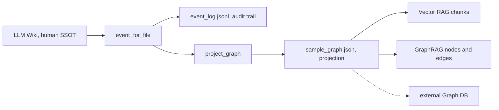

# Wiki Graph Sync Architecture

`PROJECT-SSOT.md` fixes the ownership: *"Wiki-to-Graph sync is local-first Event Sourcing: Markdown is
human SSOT, event log is audit trail, graph JSON is default projection, external Graph DB write is
opt-in."* Everything below follows from that sentence. The **LLM Wiki** — the Markdown under
`openwiki/` that humans and agents read — is upstream of everything else here; the graph is derived and
disposable.



*The dotted edge is opt-in only and requires both the CLI flag and the environment variable.*

## Event Sourcing

`scripts/sync_wiki_to_graph.py::event_for_file()` turns one Markdown file into one
`wiki_page_indexed` event carrying `event_id`, `schema_version` (from
`data/wiki_graph/schema.json::event_schema_version`), `source_path`, `heading_path`, `commit_sha`,
`content_sha256`, `occurred_at`, and a payload with the title, the full heading tree, outbound links,
code-block count, and a license block.

Two properties matter and are easy to misread:

- **`event_id` is deterministic**, not random: `"evt:" + sha256(f"{relative}:{commit_sha}:{content_hash}")[:24]`.
  The same page at the same commit with the same bytes always produces the same id.
- **`occurred_at` is a fixed constant**, `GENERATED_EVENT_TIMESTAMP = "2026-07-23T00:00:00Z"`. It is not
  a clock reading. Do not treat event ordering by timestamp as meaningful.

## Overwrite semantics — this log is not append-only

Despite the Event Sourcing framing, `main()` rebuilds the whole set each run and calls
`args.event_log.write_text(...)` and `args.graph_out.write_text(...)`. Both files are **batch
overwritten**, not appended. Consequences a reader must know:

- The event log reflects only the wiki as it existed at the last run. History is not accumulated.
- Until the next run, a checked-in projection can reference pages that no longer exist, or omit pages
  that do. A stale projection is normal between runs, not a corruption.
- `.github/workflows/wiki_graph_sync.yml` runs the projection and **uploads it as a build artifact**;
  it does not commit the regenerated files back to the repository.

## Projection: Vector RAG and GraphRAG from one pass

`project_graph()` emits three collections plus a retrieval descriptor:

| Output | Shape |
|---|---|
| nodes | one `WikiDocument` per page; one `WikiSection` per heading |
| edges | `HAS_SECTION` (doc→section), `LINKS_TO` (doc→raw href), `USES_SCHEMA` (doc→schema version) |
| chunks | one per heading, text = the joined heading path, tagged with `embedding_model_id` |

The `retrieval` block declares both retrieval modes over the same local artifacts: **Vector RAG**
(`vector_store: local-json`, using the schema's `local-hash-embedding@0.1.0`) and **GraphRAG**
(`graph_store: local-json`, `external_write_enabled: false`), with a `fusion.required_fields` list of
`source_path`, `heading_path`, `commit_sha`, `schema_version` so a fused result can always be traced
back to a page and a commit.

`LINKS_TO` edges use the raw href string as the destination, so a link to a page that does not exist
still produces an edge to a dangling id. Link correctness is a wiki-side concern, not a graph-side one.

## How a page becomes an event, field by field

`event_for_file()` derives every payload field mechanically:

| Field | Rule |
|---|---|
| `headings` | `extract_headings()` walks the lines; for an ATX heading of level *n* it truncates the running stack to *n-1* entries and appends the title, so each heading carries its full ancestor path. A deeper heading after a shallower one therefore inherits the shallower one's path. |
| `title` | first `meta["title"]` from front matter; else the **first heading's** title; else `path.stem`. All three fall back in that order, so a page with neither front matter nor any heading is titled by its filename. |
| `links` | `extract_links()` regex-matches every Markdown inline link and returns the sorted unique set of destinations — hrefs only, link text discarded. |
| `code_block_count` | `body.count("```") // 2` — a count of fence *pairs*. An unbalanced fence therefore undercounts rather than erroring. |
| `content_sha256` | hash of the **whole file including front matter**, not just the body. |
| `event_id` | `"evt:" + sha256(f"{relative}:{commit_sha}:{content_hash}")[:24]` |

## Front matter constraint

`parse_frontmatter()` in this script is deliberately minimal: it accepts a leading `---` block and
splits each line on the first `": "` only. Keys whose value is on a following line, nested mappings, and
block lists are not parsed. Page front matter that must survive this projection has to be flat
`key: value` pairs. This is why the `title` used for a node falls back to the first heading when the
front matter cannot supply one.

## License provenance carried on every node

`license_payload()` attaches five provenance fields to each `WikiDocument`, reading them from the page's
front matter and falling back to a fixed default when the page says nothing:

| Field | Default when the page declares nothing |
|---|---|
| `code_license` | `MIT` |
| `model_license` | `N/A-deterministic-local-hash-no-model-weights` |
| `data_license` | `local-project-docs` |
| `commercial_use` | `allowed-local-artifact` |
| `copyleft_risk` | `none` |

`data/wiki_graph/schema.json::commercial_license_allowlist` is `MIT`, `Apache-2.0`, `BSD-2-Clause`,
`BSD-3-Clause`, `ISC`, and `required_provenance_fields` lists exactly the five fields above, so a node
missing any of them is a schema violation rather than a silent gap.

The condition to recognise is a page that carries no license front matter at all:

| Condition | Behavior | Disposition | Why |
|---|---|---|---|
| `W3.license_unknown` | the five defaults above are applied | track | acceptable default — these artifacts are local project documentation, and the embedding model has no model weights to license |
| declared license outside the allowlist | recorded on the node as written | review | the allowlist expresses what is safe for commercial reuse, not what the projector will accept |

Tracking rather than failing is deliberate: the projector's job is to record provenance faithfully, and
a wiki page with no license header is the normal case in this repository.

## External graph write is opt-in and needs both switches

`write_external_graph_if_enabled()` returns immediately unless `ENABLE_GRAPH_DB_WRITE == "true"` in the
environment, and it is only reached when the CLI was given `--write-external-graph`. **Both** are
required; setting the environment variable alone does nothing, and passing the flag alone does nothing.
`data/wiki_graph/schema.json` records the stance as `external_graph_write_policy: disabled-by-default`.

When both are set, the missing-secret path is the failure mode to recognise —
`W5.graph_secrets_missing`: the function collects `GRAPH_DB_URI`, `GRAPH_DB_USER`, `GRAPH_DB_PASSWORD`
and raises `external graph write requested but missing secrets: ...` naming exactly which are absent,
rather than attempting a partial write. Two transports are supported, selected by `GRAPH_DB_KIND`:

- `GRAPH_DB_KIND=generic-http-json` — one POST of `{"graph": …}` to `GRAPH_DB_URI`, Basic auth from
  `GRAPH_DB_USER`/`GRAPH_DB_PASSWORD`, 30 s timeout.
- `GRAPH_DB_KIND=neo4j-http` — three `MERGE` statements (nodes, chunks, edges) posted to
  `<GRAPH_DB_URI>/db/<GRAPH_DB_DATABASE|neo4j>/tx/commit`; a non-empty `errors` array in the response
  raises rather than being logged.

Both transports share `post_json()`, which sends Basic auth built from `GRAPH_DB_USER` /
`GRAPH_DB_PASSWORD` with a 30-second timeout. A non-2xx response raises `urllib.error.HTTPError`, which
is caught and re-raised as `external graph write failed HTTP <code>: <body>` — the response body is
included, so a gateway's own diagnostic survives. The Neo4j transport additionally inspects the parsed
response for a non-empty `errors` array and raises `neo4j graph write returned errors: …`; a 200 with
embedded errors is a failure, not a success.

Any other value raises `unsupported GRAPH_DB_KIND`. The workflow's opt-in job is gated on the
repository variable `vars.ENABLE_GRAPH_DB_WRITE == 'true'` and reads the three secrets from repository
secrets.

## Validation

```sh
python3 scripts/sync_wiki_to_graph.py            # writes event log + graph from openwiki/
python3 scripts/check_wiki_graph_sync.py         # validates schema contract and artifacts
```

Schema field-by-field detail is in [Schema standards](schema-standards.md). The gate's own required
files and provenance fields are enumerated there.
