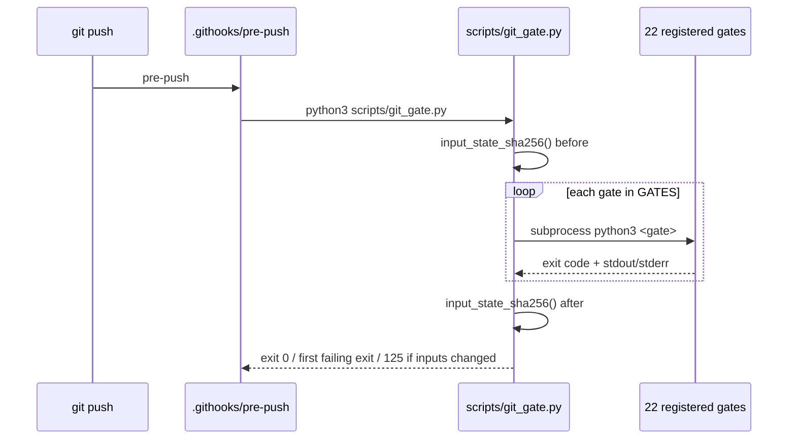

# Code Call Lifecycle

Who calls what, in order, and what each call currently reports. Every number on this page was
reproduced by running the script named beside it; where a number depends on which dataset is passed,
the dataset is named.

## Local hook path



`.githooks/pre-push` → `scripts/git_gate.py` (src: .githooks/pre-push `python3 "$ROOT/scripts/git_gate.py"`)
→ the 22 entries of `GATES`, sequentially, stopping at the first nonzero exit; 22 is the length of that
list literal, not a number written anywhere in the file. `.githooks/commit-msg` →
`scripts/validate_commit_message.py` with the message file as its argument
(src: .githooks/commit-msg `scripts/validate_commit_message.py" "$1"`).

`scripts/check_openwiki.py` is one of those 22 gates
(src: scripts/git_gate.py `"scripts/check_openwiki.py",`), which is why a documentation change can fail a
push. `scripts/check_wiki_graph_sync.py` (src: scripts/git_gate.py `"scripts/check_wiki_graph_sync.py",`)
and `scripts/render_lifecycle_openwiki.py`
(src: scripts/git_gate.py `"scripts/render_lifecycle_openwiki.py",`) are also in the list.

## CI path

- `.github/workflows/skill_ci.yml` — on pull requests touching `skills/**` or `scripts/**`, runs
  `python scripts/git_gate.py` (src: .github/workflows/skill_ci.yml `- run: python scripts/git_gate.py`).
  Same chain as the hook, clean checkout.
- `.github/workflows/wiki_graph_sync.yml` — on push/PR touching `openwiki/**/*.md`,
  `data/wiki_graph/schema.json`, `scripts/sync_wiki_to_graph.py`, or `scripts/check_wiki_graph_sync.py`.
  Runs `scripts/sync_wiki_to_graph.py` with explicit `--wiki-root openwiki`, `--schema`, `--event-log`,
  `--graph-out`, `--commit-sha "$GITHUB_SHA"`, then `scripts/check_wiki_graph_sync.py`, then uploads the
  projection as an artifact. It does not commit the projection: its only write is that upload
  (src: .github/workflows/wiki_graph_sync.yml `name: wiki-graph-local-projection`) and its token is
  read-only (src: .github/workflows/wiki_graph_sync.yml `contents: read`).
- `.github/workflows/autoresearch_eval.yml` — runs
  `scripts/eval_autoresearch_composer.py --dataset data/autoresearch_golden/pr_golden_set.json`
  (src: .github/workflows/autoresearch_eval.yml `--dataset data/autoresearch_golden/pr_golden_set.json`),
  `scripts/sample_autoresearch_traces.py`, and `python -m pytest -q -m evals`
  (src: .github/workflows/autoresearch_eval.yml `- run: python -m pytest -q -m evals`).
- `.github/workflows/weekly_audit.yml` — Monday cron
  (src: .github/workflows/weekly_audit.yml `cron: '0 3 * * 1'`), runs only `scripts/ablation_engine.py`.

Not reached by any of the above: `scripts/check_plan_package_compat.py`,
`scripts/check_prompt_trace_assets.py`, and `scripts/real_driver_ablation.py` — grepping the three names
across `.githooks/`, `.github/workflows/` and the `GATES` list returns nothing. They are invoked
deliberately, from the README and from tests
(src: README.md `python3 scripts/check_plan_package_compat.py`).
See [Entrypoint matrix](../operations/entrypoint-matrix.md).

## Autoresearch-Composer Eval Call Graph

```text
data/autoresearch_golden/pr_golden_set.json
  -> eval_autoresearch_composer.py::load_cases()
  -> validate_case_schema()            # REQUIRED_CASE_FIELDS
  -> simulate_autoresearch_plan()      # route + states + text
  -> deterministic_guardrails()        # route equality, must_include, must_not_include
  -> local_llm_as_judge()              # heuristic; PASS at score >= 0.85 and zero guardrail failures
  -> stdout telemetry
```

`local_llm_as_judge()` is the default judge. `cloud_judge()` is the alternative branch and returns
`verdict: SKIP` with `judge_mode: cloud-placeholder-disabled-in-seed`; it issues no API call. It
activates only when `ENABLE_LLM_JUDGE` equals the string `"1"`, while
`.github/workflows/autoresearch_eval.yml` passes the string `true` — so the workflow's cloud job would
not activate it even if enabled.

`scripts/llm_judge.py` is the separate double-lock parser used when an external judge response must be
accepted: it extracts JSON from an XML-shielded payload, rejects non-finite scores, and rejects unless
`verdict == PASS`, `score >= 0.85`, and the reasoning contains no `breach detected`
(src: scripts/llm_judge.py `if verdict != "PASS" or score < 0.85 or "breach detected" in reasoning:`).

## Measured values

Reproduced by running each command in the repository root:

| Command | Reported |
|---|---|
| `python3 scripts/eval_autoresearch_composer.py` | `pr_golden_set.json: cases=4 passed=4`, `mode=local`, `cloud_judge_enabled=false` |
| `python3 scripts/sample_autoresearch_traces.py` | `sample_count=3 observed_state_count=5` |
| `python3 scripts/ablation_engine.py --cases skills/autoresearch_composer/cases.json` | `delta=1.0 verdict=PASS`, `case_count=12`, `success_rate=1.0` |
| `python3 scripts/ablation_engine.py` (default gemini cases) | `delta=0.50 case_count=10 success_rate=1.0 verdict=PASS` |
| `python3 scripts/synthetic_case_generator.py` | `synthetic_cases=117 typescript=59 python=58` |
| `python3 scripts/interactions_patch_assert_runner.py` | `total_cases_evaluated=117 passed_cases=117 zero_llm_api_calls=0` |
| `python3 scripts/local_regex_runner.py` | `case_count=10 total_trials=50 zero_llm_api_calls=0` |
| `python3 scripts/benchmark_runner.py` | `task_count=100 delta_high_quality=0.15 delta_low_quality=-0.2` |
| `python3 scripts/validate_molecular_commit_lineage.py` | `PASS: molecular commit lineage` (ledger/receipt structure only) |

The two ablation rows are the same script on different datasets: with no `--cases` flag it reads the
gemini set (src: scripts/ablation_engine.py `default=ROOT / "skills" / "gemini_interactions" / "cases.json"`).
Quoting `delta=1.0` without naming `skills/autoresearch_composer/cases.json` misreports the default
behavior.

## Commit lineage: authoritative counts, and a stale validator expectation

The `REQUIRED_LITERALS` entry for this page in `scripts/check_openwiki.py` still expects it to contain
the literal string `gcr_molecular_commits.json: protected_history=157 compensated=157 failed=0 schema=v0.2`
(src: scripts/check_openwiki.py `"gcr_molecular_commits.json: protected_history=157 compensated=157 failed=0 schema=v0.2",`).
That expectation is **stale**. The authoritative evidence in this repository is:

- `data/verification_runs/gcr_three_surface_commit_traceability_2026-07-27.json` —
  `commit_count=235` (src: data/verification_runs/gcr_three_surface_commit_traceability_2026-07-27.json `"commit_count": 235,`),
  `compensated_commit_count=235`, `failed_commit_count=0`,
  `schema_version=molecular-commit-verification-run@0.2.0`, `status=pass`, `strict_message_count=20`.
- `data/commit_lineage/gcr_molecular_commits.json` — `schema_version=molecular-commit-lineage@0.2.0`
  (src: data/commit_lineage/gcr_molecular_commits.json `"schema_version": "molecular-commit-lineage@0.2.0",`),
  and, as list lengths with no literal in the file, 235 entries in `compensated_commits`, 7 in
  `legacy_detailed_commits`, 13 `protected_paths`.

The string `157` appears in those two files only as an incidental substring of hex digests — commit
SHAs and `message_sha256` values
(src: data/verification_runs/gcr_three_surface_commit_traceability_2026-07-27.json `b8a4e578824fb65135030157db6a8179bb1dafea`).
The correct current statement is **protected_history=235 compensated=235 failed=0 schema=v0.2**. The
quoted sentence above is reproduced solely because `check_openwiki.py` matches by substring containment
(src: scripts/check_openwiki.py `if literal not in text:`) and still expects it; nothing on this page
asserts 157 as a measurement. Correcting that one `REQUIRED_LITERALS` entry to 235 is a one-value change
and is tracked in the Backlog of [Quickstart](../quickstart.md).

## Validation

- Whole chain: `python3 scripts/git_gate.py`
- This page's own gate: `python3 scripts/check_openwiki.py`
- Graph projection: `python3 scripts/sync_wiki_to_graph.py` then `python3 scripts/check_wiki_graph_sync.py`
