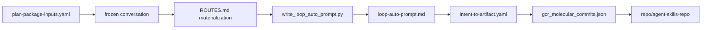

# Prompt Trace Assets

This repository records *which prompt produced which artifact*. The record is machine-readable and
gated; the page you are reading is its display layer, not its source of truth.

## Artifacts

- `data/prompt_trace/prompt_trace_dataset.json` — `schema_version` (`prompt-trace-dataset@0.2.0`) and
  `dataset_version`
  (src: data/prompt_trace/prompt_trace_dataset.json `"dataset_version": "prompt-trace-assets@2026-07-27"`),
  the `input_to_terminal_trace` (dataflow nodes, directory roots,
  auto-prompt snapshot, next route node and conditional edge), `records`, `selection_actors`,
  `selection_question`, and a `privacy_policy`.
- `data/prompt_trace/golden_prompt_trace_eval.json` — the golden evaluation the dataset is scored
  against (src: data/prompt_trace/golden_prompt_trace_eval.json `"case_id": "prompt-slot-separation"`).
- `scripts/check_prompt_trace_assets.py` — the gate
  (src: scripts/check_prompt_trace_assets.py `"""Validate prompt trace assets, golden evals, and OpenWiki display."""`).

## The three prompt slots

`check_prompt_trace_assets.py` requires exactly three records whose `prompt_slot` values, taken as a
set, equal `REQUIRED_SLOTS`
(src: scripts/check_prompt_trace_assets.py `REQUIRED_SLOTS = {"fixed_prompt", "iteration_auto_prompt", "emergent_prompt"}`)
— one record per slot, not all three slots inside one record:

| Slot | What it holds |
|---|---|
| `fixed_prompt` | the stable instruction text that did not vary across the loop |
| `iteration_auto_prompt` | the machine-generated per-iteration prompt derived from loop state |
| `emergent_prompt` | what actually emerged in the run and had to be captured after the fact |

Keeping the three separate is the whole point: a single merged "the prompt" makes it impossible to tell
a designed instruction from an emergent one, which is the same conflation
[Stateful workflow](stateful-workflow.md) refuses at the node level. The molecular commit message
contract mirrors these slots — `Fixed-Prompt-Context:`, `Iteration-Auto-Context:` and
`Emergent-Prompt-Context:` are three of the eleven required fields in
`scripts/validate_commit_message.py`
(src: scripts/validate_commit_message.py `"Emergent-Prompt-Context:",`), so the same three-way split
is enforced at commit time. See
[Molecular commit lineage](../governance/molecular-commit-lineage.md).

## Required actors

`REQUIRED_ACTORS` is `{codex, agy, external-verify, judge-loop-chooser, openwiki}`. Each actor carries
exactly one evidence role rather than being left as an unresolved choice — the policy
`skills/autoresearch_composer/skills.md` states as *"Actor routing follows judge-loop-chooser:
Opus/Codex/agy are assigned one evidence role each, never left as an unresolved choice."* An actor
that did not run is surfaced as a gate, never inferred as success; see
[Semantic arbitration](../validation/semantic-arbitration.md).

## Directory Structure and Dataflow

The trace spans three directory roots, recorded in `input_to_terminal_trace.directory_roots`:
`loop_wiki/evolve-unknown-discovery-plan-truth/`,
`prototype/unknown-discovery-gcr-order/agent-skills-repo/small-loop/`, and `repo/agent-skills-repo/`.
Only the third is this repository; the first two are upstream and absent from this checkout.

### Input Content Through the Small Loop

`input_to_terminal_trace.dataflow_nodes` records the path an input takes from a frozen conversation to
this repository:



*Node names are shortened; the full paths are the `dataflow_nodes` list above.*

The `auto_prompt_snapshot` records where that loop currently stands:
`packet_state: measured`, `missing_production_file_count: 0`,
`next_route_node: human-admit-readiness`, and
`next_conditional_edge: production-equivalence-improved -> human-admit-surface`. The next loop it asks
for is to present the exact production-equivalence evidence bundle, preserve candidate/provider-truth
boundaries, and rerun the small-loop, materialization, final-repo and SSOT gates. The terminal state is
a human admit, not an automatic promotion.

### Intent → Git Commit → Terminal Implementation

Each record in `records[]` carries `trace_id`, `prompt_slot`, `context_role`, `route`, `state_node`,
`source_path`, `lineage_edge`, `evidence_gate`, `must_preserve`, `training_eligibility` and
`typescript_target` — enough to walk from an intent slice, through the commit that carried it, to the
file that implements it. The commit half of that chain is recoverable with:

```sh
git log --all --format='%H%x09%s%x09%b' --grep='Intent-Slice: GCR-SLICE-'
```

which is the same `GCR-SLICE-\d{2}` marker `scripts/validate_commit_message.py` requires on every
commit (src: scripts/validate_commit_message.py `failures.append("Intent-Slice must be GCR-SLICE-XX")`).
Note that this repository directory has no `.git` of its own
(src: scripts/git_gate.py `this repository has no .git of its own`), so the command must be run
against the enclosing repository or one supplied via `--commit-repo`
(src: scripts/check_prompt_trace_assets.py `--commit-repo must be an existing absolute Git repository`).

## Privacy stance: metadata-local prompt traces

The dataset carries its own `privacy_policy` block. The separate ledger
`data/lifecycle/trace_privacy_classification.json` does **not** list this dataset: its `datasets` array
holds the two autoresearch trace sample files, under a workspace-wide default
(src: data/lifecycle/trace_privacy_classification.json `"default_policy": "local-only-until-human-admit"`).
The prompt traces are classified inside the dataset itself as **metadata-local prompt traces**:
`classification: local-structured-prompt-metadata`
(src: data/prompt_trace/prompt_trace_dataset.json `"classification": "local-structured-prompt-metadata"`),
`cloud_upload_allowed: false` and `raw_external_model_outputs_stored: false`, and the gate fails the
dataset if either flag flips
(src: scripts/check_prompt_trace_assets.py `failures.append("prompt trace cloud_upload_allowed must be false")`).
The `terms_guard` states the boundary exactly — store
prompt/context metadata, route decisions and verdicts; do not store proprietary Opus/Codex/agy full
answers without a separate admit
(src: data/prompt_trace/prompt_trace_dataset.json `do not store proprietary Opus/Codex/agy full answers without separate admit`).

Cloud upload and model training use require a later human-admit record. `model_training_use` is
`local_or_private_finetune_candidate_after_human_admit`
(src: data/prompt_trace/prompt_trace_dataset.json `"model_training_use": "local_or_private_finetune_candidate_after_human_admit"`),
i.e. eligibility is a decision that has not
been made, not a default. No trace is shipped to a cloud judge in any case — the cloud path in
`scripts/eval_autoresearch_composer.py` performs no API call at all
(src: scripts/eval_autoresearch_composer.py `cloud/API call path is intentionally not activated in the local-first seed`),
as documented in
[Behavioral eval and judge](../validation/behavioral-eval-and-judge.md).

## What the gate proves here, and what it does not

| Claim | Origin |
|---|---|
| dataset and golden eval parse, all three slots present, all five actors present | **verifiable in this checkout** — `python3 scripts/check_prompt_trace_assets.py` |
| frozen input files, external terminal artifacts, and commit subjects match | **requires explicit external input** — only re-checked when `--workspace-root` and/or `--commit-repo` are passed, and each must be an absolute existing directory (`--workspace-root` must contain `loop_wiki/evolve-unknown-discovery-plan-truth`; `--commit-repo` must contain `.git`) |
| the recorded run happened as described | **receipt claim only** — the dataset is an imported record, not something this checkout replays |

A push runs only the fixed list `scripts/git_gate.py` declares
(src: scripts/git_gate.py `for gate in GATES:`), and no entry in that list names
`scripts/check_prompt_trace_assets.py` — grepping that file for `prompt_trace` returns nothing — so a
routine push does not run it. Invoke it deliberately; see
[Entrypoint matrix](../operations/entrypoint-matrix.md).

The dataset's `dataflow_nodes` and `directory_roots` contain absolute paths outside this repository
(for example `loop_wiki/evolve-unknown-discovery-plan-truth/...`), so the record is not portable to a
different workspace without supplying those roots explicitly.

## Validation

```sh
python3 scripts/check_prompt_trace_assets.py
python3 scripts/check_prompt_trace_assets.py --workspace-root /abs/workspace --commit-repo /abs/repo
```
