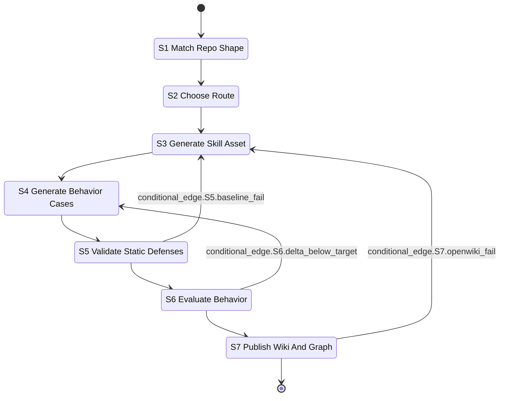

# Stateful Workflow

Authoring a skill asset in this repository is a state machine, not a single prompt.
Matching, generation, and validation are separate nodes on purpose: collapsing them lets a compressed
context turn into an unexamined route decision, which is exactly the failure the
`autoresearch_composer` asset exists to prevent (`skills/autoresearch_composer/skills.md`).

## S1 Match Repo Shape

Decide whether the task matches this repository's archetype at all. `PROJECT-SSOT.md` fixes it:
`project_archetype: skill-asset-governance-repo`
(src: PROJECT-SSOT.md `project_archetype: skill-asset-governance-repo`), and explicitly
*"not a LangGraph application seed"* (src: PROJECT-SSOT.md `not a LangGraph application seed`).
`README.md` states the ownership boundary — this repo owns skill assets, defense scripts, hooks,
provenance lock and compatibility guards (src: README.md `## What This Repo Owns`), and does **not**
own plan packets, small-loop routes, or template drafts
(src: README.md `## What This Repo Does Not Own`). `scripts/check_plan_package_compat.py` enforces the
negative half, but from a hardcoded list of its own
(src: scripts/check_plan_package_compat.py `forbidden = ["small-loop", "packets", "templates/skill-defense-governance"]`),
not by reading `final_repo_forbidden_paths` — that key is only declared in the manifest
(src: plan-package.compat.yaml `final_repo_forbidden_paths: small-loop,packets,templates/skill-defense-governance`)
and the script never reads it back; any listed path that exists fails the check
(src: scripts/check_plan_package_compat.py `FAIL: final repo contains small-loop path`).

## S2 Choose Route

Pick the routing decision before generating anything. For the `autoresearch_composer` asset this is
modelled explicitly by `simulate_autoresearch_plan()` in `scripts/eval_autoresearch_composer.py`
(src: scripts/eval_autoresearch_composer.py `def simulate_autoresearch_plan(`), which
emits one of five routes — `native-yield:diagnose`, `native-yield:security-review`,
`native-yield:tdd`, `/autoresearch:evals`, or `/autoresearch:plan`
(src: scripts/eval_autoresearch_composer.py `route = "/autoresearch:plan"`). The native-yield routes are the
"this belongs to an existing native skill" answer
(src: scripts/eval_autoresearch_composer.py `native-yield diagnose conditional_edge.S2.native_skill_better`);
a route mismatch is a hard guardrail failure, not a judge opinion, because route equality is compared
before any judging runs (src: scripts/eval_autoresearch_composer.py `if route != case["expected_route"]:`).

## S3 Generate Skill Asset

Write `skills/<slug>/skills.md` with the four sections (WHY, HOW, WHEN, WHEN NOT) and move deployment
or reference detail into `references/` so the router stays dense. `scripts/skill_description_linter.py`
demands those four tokens (src: scripts/skill_description_linter.py `REQUIRED = ("WHY:", "HOW:", "WHEN:", "WHEN NOT:")`)
and additionally caps the file at 200 words (src: scripts/skill_description_linter.py `if len(words) > 200`);
`scripts/validate_progressive_disclosure.py` demands the same signals plus an actual `references/`
directory next to the skill (src: scripts/validate_progressive_disclosure.py `missing references directory`);
`scripts/validate_goal_constraints.py` requires goal/constraint phrasing rather than brittle step lists
(src: scripts/validate_goal_constraints.py `REQUIRED_BLOCKS = ("GOAL:", "CONSTRAINTS:")`).

## S4 Generate Behavior Cases

Write `skills/<slug>/cases.json` to the baseline in `scripts/validator.py`: 10–20 cases
(src: scripts/validator.py `if not 10 <= len(cases) <= 20:`), each with
`id` / `prompt` / `should_trigger` / `expected_checks`
(src: scripts/validator.py `for field in ("id", "prompt", "should_trigger", "expected_checks"):`),
no weak check patterns (src: scripts/validator.py `WEAK_PATTERNS = {"", ".*", ".+", "^.*$", "^.+$"}`),
at least five positive and five negative cases
(src: scripts/validator.py `if positives < 5 or negatives < 5:`), and no two lowercased prompts above a
0.85 `SequenceMatcher` similarity ratio (src: scripts/validator.py `.ratio() > 0.85:`). See
[Skill asset contract](../skill-assets/contract.md).

## S5 Validate Static Defenses

Run the deterministic validators. In practice this is `python3 scripts/git_gate.py`, which runs every
entry of its `GATES` list — 22 entries, a list length carrying no literal in the file — and stops at
the first failure (src: scripts/git_gate.py `FAIL: gate failed:`). The mirrored `GIT_GATE_ORDER` in
`scripts/check_plan_package_compat.py` holds one more, because
`scripts/validate_molecular_commit_lineage.py` is listed there yet deliberately kept out of the gate
(src: scripts/git_gate.py `scripts/validate_molecular_commit_lineage.py is deliberately NOT gated here.`).
A failure here routes back to S3 or S4
(`conditional_edge.S5.baseline_fail`) rather than forward; the gate is not advisory.

Two of those gates run argument-less under git_gate and therefore prove only their own selftest path —
see [Entrypoint matrix](../operations/entrypoint-matrix.md).

## S6 Evaluate Behavior

Deterministic guardrails plus a judge. `scripts/eval_autoresearch_composer.py` checks route equality
and `must_include` / `must_not_include` literals before any judging
(src: scripts/eval_autoresearch_composer.py `for literal in case["must_include"]:`), then applies the
local heuristic judge (src: scripts/eval_autoresearch_composer.py `"judge_mode": "local-heuristic",`).
`scripts/ablation_engine.py` measures the with-skill/without-skill delta and passes only when it
strictly exceeds `TARGET_DELTA = 0.05`
(src: scripts/ablation_engine.py `"verdict": "PASS" if delta > TARGET_DELTA else "FAIL",`).
A delta below target routes back to S4
(`conditional_edge.S6.delta_below_target`) because the usual cause is a weak case corpus, not a weak
asset — the concrete instance of that diagnosis is recorded in
[gemini_interactions](../skill-assets/gemini-interactions.md).

## S7 Publish Wiki And Graph

Update the wiki, then project it. `scripts/check_openwiki.py` validates that the required pages exist
and carry their required literals (src: scripts/check_openwiki.py `REQUIRED_LITERALS = {`) — this page
is one of them, and of the three conditional edges drawn above only this one is named by the
repository, as a literal the checker demands from this very page
(src: scripts/check_openwiki.py `"conditional_edge.S7.openwiki_fail",`).
`scripts/sync_wiki_to_graph.py` projects the Markdown into an event log and graph
(src: scripts/sync_wiki_to_graph.py `Local-first Wiki -> Event Log -> Graph projection.`), and
`scripts/check_wiki_graph_sync.py` validates the result
(src: scripts/check_wiki_graph_sync.py `Validate Wiki -> Event Log -> GraphRAG/Vector RAG sync artifacts.`).
`conditional_edge.S7.openwiki_fail` routes a documentation failure back to S3, because in this
repository a missing or stale page is treated as an asset defect rather than a cosmetic one — the wiki
is a contract surface, not decoration.

## Why the separation matters

(inferred) Each node answers a different question and produces a different artifact. Matching answers *should this
exist here*; generation answers *what does it say*; validation answers *does it hold*. A single fused
prompt returns one confident answer to all three, and the repository's own evidence shows what that
costs: a green static gate coexisting with a failed real-driver ablation and a quarantined asset.
