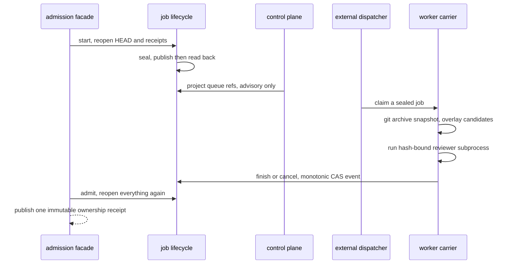
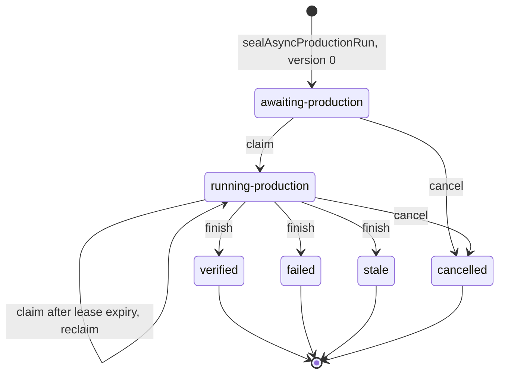

# Async Lifecycle

Four modules, four different authorities. The distinction that matters most: **`async-worker-carrier.ts`
really does execute work** — it is the only one of the four that awaits a real subprocess
(src: .agents/skills/repo-terminal-operator/async-worker-carrier.ts `await runOwnedProfileCommand(`) —
while the lifecycle, control plane and facade around it do not, each being forbidden by name in the
skill's per-CLI rules: the lifecycle
(src: .agents/skills/repo-terminal-operator/SKILL.md `It does not launch an Agent, mutate the live checkout`),
the control plane
(src: .agents/skills/repo-terminal-operator/SKILL.md `must not discover implicit work, execute workers`),
and the facade, whose `start` seals and then stops
(src: .agents/skills/repo-terminal-operator/SKILL.md `it never launches a worker`).

## Sequence



## State machine

Durable state is a seal file plus append-only event files. `version` is the CAS counter; every
transition publishes an event at `expectedVersion + 1` and never rewrites an earlier one.



### How `sealSha256` is computed and fixed

`buildSeal()` first validates and **normalizes** the input: run id and job id must match the run-id
token pattern, `expectedHead` must be a git OID, `targetRepo` must be a safe relative path, the
deadline must parse, `candidateFiles` must be non-empty with no duplicate path
(`duplicate-candidate-path:<path>`), and each candidate is stored as
`{path, sha256(bytes), contentBase64}` with the list **sorted by path**. Normalization is what makes
the hash reproducible — the same candidate set in a different order produces the same bytes.

`sealSha256` is then simply **`sha256` of the seal file's bytes as read back from disk**, computed by
`sealRecord()`:

```ts
const bytes = readAnchoredRecord(recordPath(root, `${runId}.seal.json`));
return { record: parseObject(bytes), sealSha256: sha256(bytes) };
```

It is never computed from the in-memory record. Every consumer therefore hashes the same durable
artifact, and `record.runId !== runId` is itself an error (`seal-run-id-mismatch`).

`sealAsyncProductionRun()` writes `<runId>.seal.json`, **reopens it**, and throws
`published-seal-readback-mismatch` if the re-read `candidateSha256` differs. It returns
`repo-async-production-foreground-outcome@v2` with `status: awaiting-production`, `version: 0`, and
`admissionEligible: false` — a seal is never admissible by itself.

Events are named `<runId>.event.<version padded to 12>.json`, so lexical sort equals version order,
and `inspectAsyncProductionRun()` rejects any event whose `sealSha256` disagrees with the seal file.

## Rejection rules, verbatim

Every guard below throws a typed message. They are worth reading as a list because each one closes a
specific race.

**Shared**
- `assertExpected()` → `cas-version-mismatch:<expected>-><actual>` when the durable version moved.
- `inspectAsyncProductionRun()` → `event-seal-hash-mismatch` when the latest event's `sealSha256`
  disagrees with the seal file, i.e. events and seal have diverged.
- `openAsyncProductionSeal()` → `seal-hash-mismatch` unless the caller's `expectedSealSha256` matches.

**`claimAsyncProductionRun()`**

| Condition | Error |
|---|---|
| `leaseExpiresAt <= now` | `lease-must-expire-after-claim` |
| `workerId` or `fencingToken` not a valid run-id token | `invalid-worker-or-fencing-token` |
| version moved | `cas-version-mismatch:…` |
| seal hash differs | `seal-hash-mismatch` |
| `now >= deadlineAt` | `run-deadline-expired` |
| `leaseExpiresAt > deadlineAt` | `lease-exceeds-run-deadline` |
| status is neither `awaiting-production` nor an expired `running-production` | `job-not-claimable:<status>` |

The reclaim path is precise: a `running-production` run is claimable **only** when it has a
`leaseExpiresAt` and `now >= leaseExpiresAt`. That is the fencing rule — a worker whose lease lapsed
loses the run to the next claimer, and its own later `finish` will be rejected.

**`finishAsyncProductionRun()`**

| Condition | Error |
|---|---|
| `terminalStatus` not in `verified` / `failed` / `stale` | `invalid-terminal-status` |
| bad `fencingToken` or `resultSha256` shape | `invalid-finish-binding` |
| `transactionParentDev` / `Ino` present but not safe non-negative integers | `invalid-transaction-parent-binding` |
| version moved | `cas-version-mismatch:…` |
| `now >= deadlineAt` | `run-deadline-expired` |
| status is not `running-production`, or no lease recorded | `job-not-running:<status>` |
| `fencingToken` differs from the recorded one | `fencing-token-mismatch` |
| `now >= leaseExpiresAt` | `expired-fencing-token` |

So a stale worker fails **twice over** — wrong token, or right token but lapsed lease. Neither can
publish a terminal event.

**`cancelAsyncProductionRun()`**
- empty reason → `cancel-reason-required`
- version moved → `cas-version-mismatch:…`
- status not `awaiting-production` or `running-production` → `job-not-cancellable:<status>`

Cancel and finish therefore race on the CAS version: whichever publishes `expectedVersion + 1` first
wins, and the loser sees a version mismatch rather than corrupting state.

## The worker is the one that executes

`async-worker-carrier.ts::executeAsyncWorker()` materializes a `git archive` snapshot of the bound
commit, overlays the candidate bytes onto it, and runs the **hash-bound reviewer subprocess** against
that isolated tree. It persists `AsyncWorkerProgress` through an `AsyncWorkerProgressSink`, watches for
cancellation, enforces lease and deadline (`minimumAsyncWorkerLeaseMs()`), commits the result
transaction, and recovers a transaction that was interrupted after commit but before the public result
was published (`recoverCommittedResult`).

Treating the async layer as uniformly passive is the error to avoid: `SKILL.md`'s per-CLI prohibitions
describe the *facade*, *lifecycle* and *control plane*, not the carrier.

Requests and jobs go through strict parsers — `parseAsyncWorkerRequest()`, `parseAsyncWorkerJob()` — so
a worker never starts from a partially understood payload.

### The result transaction, step by step

`commitResultTransaction()` publishes the result in an order chosen so that **no crash point can leave
a terminal event without recoverable bytes**:

1. `prepareResultTransaction()` writes the immutable result to
   `transactions/<run_id>/<fencing_token>.result.json` and captures that directory's `dev`/`ino`.
2. `pauseResultTransaction()` — an injection seam.
3. `finishAsyncProductionRun()` at `expectedVersion = request.expected_version + 1`, carrying
   `resultRef`, `resultSha256`, and the captured `transactionParentDev` / `transactionParentIno`. The
   terminal event therefore records *where the pending bytes are* before they are public.
4. **If step 3 throws**, the run is re-inspected and the transaction is discarded. If the current status
   is `cancelled`, this is not an error — the worker returns
   `{status: "cancelled", diagnostic: current.diagnostic ?? "foreground cancellation won finish CAS"}`.
   Any other failure is rethrown. This is the cancel/finish race resolved explicitly: the CAS loser
   stands down and says who won.
5. `REPO_ASYNC_WORKER_FAIL_STAGE=after-finish` — a second injection seam, simulating a crash between
   the terminal event and publication.
6. `publishCommittedResult()` writes the public result at `job.result_ref`.

The window between 3 and 6 is exactly what recovery exists for.

### `recoverCommittedResult()`

Runs only when the current status is `verified` / `failed` / `stale`. Before touching anything it
requires **all four** bindings, else `committed-result-recovery-binding-mismatch`:

- `current.version === request.expected_version + 2` — the seal plus a claim plus a finish;
- `current.fencingToken === request.fencing_token`;
- `current.resultRef === job.result_ref`;
- `current.resultSha256` is defined.

Then:

- if the public result already exists, recovery is a no-op — the crash was after step 6;
- otherwise it reads the pending transaction file. Absent → `committed-result-recovery-source-missing`;
- present but `sha256(bytes) !== current.resultSha256` →
  `committed-result-recovery-hash-mismatch`;
- only then does it `publishCommittedResult()` the recovered bytes.

Recovery never re-derives a result. It republishes bytes whose hash the terminal event already
committed to, or it fails.

## Control-plane disposition matrix

`projectAsyncControl()` classifies each run and never executes it. `classify()`:

| Run state | Disposition |
|---|---|
| `verified` / `failed` / `stale` | delegate to `terminalDisposition()` |
| `cancelled` | `closed` |
| `now >= deadlineAt` | `repair-or-close` |
| `awaiting-production`, or `nextAction == verification-lease-expired-reclaimable` | `dispatch` |
| `running-production` | `await` |
| anything else | `repair-or-close` |

`terminalDisposition()` decides whether a finished run is admissible or needs repair:

| Condition | Disposition |
|---|---|
| no `resultRef` / `resultSha256` | `repair-or-close` |
| the public result artifact exists and matches its hash | `foreground-admission` |
| missing `fencingToken`, `transactionParentDev` or `transactionParentIno` | `repair-or-close` |
| the transactions directory's `dev`/`ino` differ from the recorded binding | **throws** `transaction-parent-binding-mismatch:<runId>` |
| a pending `<fencingToken>.result.json` matches the hash | recover |
| otherwise | `repair-or-close` |

The inode binding check is a hard throw rather than a disposition: a transactions directory that is not
the one the run committed into means the state root was swapped underneath, which is not something to
classify around.

## Deterministic identities and lease bounds

The lease window is computed, not chosen:

```ts
minimumAsyncWorkerLeaseMs(seal) = parseJob(seal).timeout_ms + MIN_LEASE_FINISH_BUDGET_MS
                                                             // MIN_LEASE_FINISH_BUDGET_MS = 15_000
remaining                       = Date.parse(view.deadlineAt) - now.getTime()
```

so the caller's `worker_lease_ms` must sit in `[job timeout + 15 s, time left on the run]`. The lower
bound is the job's own timeout **plus** a fixed 15-second finish budget — a lease that expired exactly
when the job did would fence the worker out of publishing its own result.

**The concrete lease timestamps are derived at claim time by the worker, not by the projection.** The
projection only carries a duration (`lease_ms`); `executeAsyncWorker()` turns it into an interval:

```ts
const claimTime = new Date();                                   // wall clock at claim
claimAsyncProductionRun(stateRoot, {
  now:            claimTime,
  leaseExpiresAt: new Date(claimTime.getTime() + request.lease_ms),
  ...
});
```

So `leaseExpiresAt = claimTime + lease_ms`, with `claimTime` read **once** and reused for both fields
so the two cannot drift apart. `claimAsyncProductionRun()` then re-checks that interval against durable
state — `leaseExpiresAt > claimTime`, `claimTime < deadlineAt`, and `leaseExpiresAt <= deadlineAt` —
which is why a lease that was legal when projected can still be rejected if the run's deadline drew
nearer between projection and claim.

Reclaim uses the same arithmetic: the fencing rule compares `now >= leaseExpiresAt` against this stored
timestamp, and `finishAsyncProductionRun()` rejects with `expired-fencing-token` on the same
comparison. One clock read, one interval, three checks against it.

| | `projectDispatch()` | `projectRecovery()` |
|---|---|---|
| lease lower bound | `minimumAsyncWorkerLeaseMs(seal)` → `worker-lease-insufficient:<runId>` | same |
| lease upper bound | `remaining` → `worker-lease-exceeds-run-deadline:<runId>` | *not bounded above* |
| extra precondition | — | `version >= 2` **and** a `fencingToken`, else `terminal-recovery-binding-missing:<runId>` |
| `expected_version` | `view.version` — the current version | `view.version - 2` — the state before claim+finish |
| identity | `sha256("<sealSha256>:<version>")` | `sha256("<sealSha256>:<expectedVersion>:<fencingToken>:recover")` |
| `worker_id` | `redrive-<identity[0:16]>` | `recover-<identity[0:16]>` |
| `fencing_token` | `fence-<identity[0:24]>` — newly derived | **the existing `view.fencingToken`**, reused |
| queue ref | `queue/<runId>.v<version>.json` | `queue/<runId>.recover.v<version>.json` |

Two details carry weight. A dispatch mints a **new** fence, so a redrive fences out any stale worker; a
recovery **reuses** the original fence, because it is finishing that worker's transaction rather than
replacing it. And both identities are pure functions of durable state, so re-projecting the same run at
the same version is idempotent — the same queue ref with the same bytes.

## Progress binding

`progressProjection()` accepts a progress record only when `run_id` and `seal_sha256` match the view,
and — when the view carries one — the record's `fencing_token` matches. Records from a fenced-out
worker are dropped rather than merged.

The accepted `expected_version` depends on the current status:

| Status | Accepted expected versions |
|---|---|
| `running-production` | `version - 1` |
| `verified` / `failed` / `stale` | `version - 2` |
| `cancelled` | `version - 2` and `version - 1`, clamped at 0 |
| otherwise | `version` |

The accepted version is the **first** entry in that list for which a bound record actually exists. If
there are bound records but none matches any accepted version, it throws
`progress-expected-version-invalid:<runId>` rather than silently projecting nothing. With no bound
records at all, the projection is simply `undefined`.

Surviving candidates are then sorted by `sequence` and must satisfy every one of:

| Rule | Detail |
|---|---|
| single fence | every candidate carries the **same** `fencing_token` as the first |
| valid start | `sequence` of the first candidate must be `1` — **or** `7` when the run is terminal (`verified`/`failed`/`stale`), which is the terminal-recovery entry point |
| legal transitions | consecutive sequences must be in `{1:2, 2:3, 3:4, 4:5, 4:7, 5:6, 5:7, 6:7, 7:8}` |

The transition set is not `n → n+1`: `4:7`, `5:7` and `6:7` are the shortcuts into the terminal
sequence, so a worker that skipped optional intermediate stages still projects, while an arbitrary jump
does not.

## Orphans are classified, never deleted

`classifyOrphans()` builds the **expected** set first: for every run whose disposition is `recover`
*and* which carries a `fencingToken`, `transactionParentDev` and `transactionParentIno`, the expected
path is `transactions/<runId>/<fencingToken>.result.json`. That is the one pending transaction a
recovery is entitled to consume.

It then walks each run's transactions directory for `*.result.json` entries. Anything that is not a
regular file throws `orphan-transaction-not-regular-file:<runId>/<name>` — a directory or symlink in
that position is a hard error, not an orphan. Each remaining file is read under a size bound and
parsed; whatever is not in the expected set is reported as an orphan.

The function returns **identifiers only**, and only when orphan classification is enabled. There is no
delete path anywhere in the control plane: an orphaned transaction is surfaced for an operator, because
deleting it would destroy the only copy of a result whose terminal event may still be recoverable.

## Activation flags prove nothing was enabled

Every projection carries, literally:

```json
"activation": {
  "workers_executed": false,
  "background_admission_enabled": false,
  "forgejo_enabled": false,
  "cloud_enabled": false
},
"admission_eligible": false
```

The projection is published through `publishWriterArtifact()`, then re-read and compared byte for byte
(`projection-readback-mismatch` on failure). A projection that claims work happened would itself be a
contract violation; these constants are what makes "project-only" checkable rather than asserted.

## The facade is the only public seam

`async-admission-facade-cli.ts --request <request.json>`:

| Verb | Behavior |
|---|---|
| `start` | reopens HEAD, bounded candidate refs, a complete `small-loop-run-receipt@v1` assertion and the shared worker-job parser, then seals. **Never launches a worker.** |
| `inspect` | read-only |
| `cancel` | appends exactly one monotonic lifecycle event |
| `admit` | reopens HEAD, candidate bytes, foreground receipt, job, lifecycle result, cleanup, isolation and reviewer bindings, then publishes one immutable ownership receipt |

Two admitters converge and **only the first owns publication**; `cwd-only-degraded` is advisory and
never admissible. `async-admission-verifier.ts::assertWorkerResult()` is the fail-closed check the
admit path runs over the worker result, cleanup, reviewer and isolation bindings.

## Evidence boundary

Read from vendored source; there is no Bun toolchain or test suite in this checkout, so none of the
above has been executed here. See [Terminal operator overview](overview.md). All persistence goes
through [writer publication](writer-publication.md).
