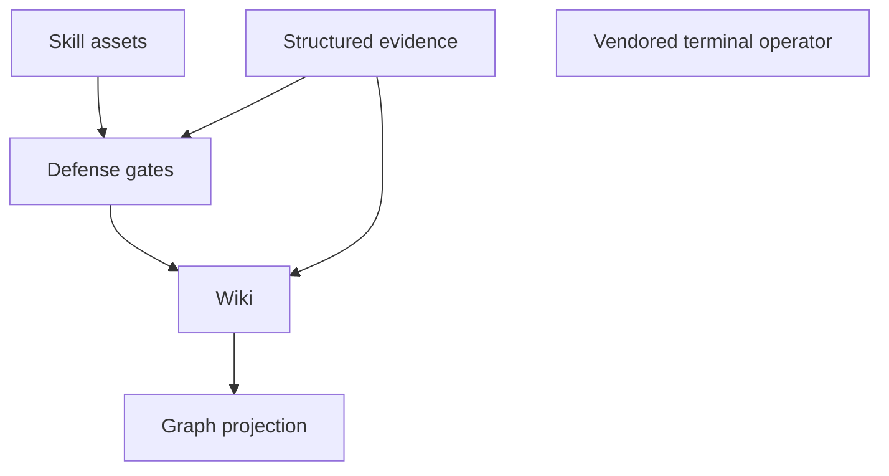

# Architecture Overview

`PROJECT-SSOT.md` fixes what this repository is: `project_archetype: skill-asset-governance-repo`,
explicitly *"not a LangGraph application seed"*. It is the **final repo** half of a two-part system —
the prototype half owns the small-loop control plane and lives elsewhere.

## Five planes

*The five planes. The operator sits apart because nothing in this repository triggers it.*

1. **Skill assets** — `skills/<slug>/{skills.md,cases.json,references/}`. Two slugs today, and they
   record their promotion decision in different places: `gemini_interactions` carries a per-slug
   `status.json`, while
   `autoresearch_composer` has no `status.json` at all — its status lives only in the shared lifecycle
   registry.
   Contract in [Skill asset contract](../skill-assets/contract.md).
2. **Deterministic defense gates** — 30 Python scripts under `scripts/`, 22 of them sequenced by
   `scripts/git_gate.py`. That 22 is the length of the
   `GATES` list literal, not a number written anywhere in the file. No network, no model calls, no
   third-party dependency — even the gate named after a model only parses text
. See
   [Defense gate chain](defense-gate-chain.md).
3. **Structured evidence** — `data/`, holding lifecycle registries, golden datasets, traces, prompt-trace
   records, commit lineage, and verification receipts. Ownership per artifact in
   [Data authority](data-authority.md).
4. **Wiki and graph projection** — this wiki is a contract surface that gates read, and
   `scripts/sync_wiki_to_graph.py` projects it into an event log and retrieval graph. See
   [Wiki graph sync architecture](../nonofficial/wiki-graph-sync-architecture.md).
5. **Vendored terminal operator** — `.agents/skills/repo-terminal-operator/`, ~9.7k lines of Bun
   TypeScript. It is source vendored into this tree, not a runnable component here. See
   [Terminal operator overview](../terminal-operator/overview.md).

## How they compose

Assets are the input. Gates are the only thing that grants passage, and they read structured evidence
rather than judging text. The wiki is where evidence becomes legible — and because
`scripts/check_openwiki.py` is itself listed among those 22 gates
, a stale wiki fails a push. The graph is a
derived, disposable view of the wiki.

The unusual property to internalise: **documentation is load-bearing here.** Four gates read pages under
`openwiki/` and one requires a page to be byte-equal to a generator's output. Editing a page is a code
change in this repository.

## Ownership boundary

`README.md` states it directly. This repository owns skill assets, behavior cases, local defense hooks,
the production gate entry, the compensated commit lineage, the protected-history verification run, the
wiki-graph sync entry, the openwiki entry, and the plan compatibility lock.

It does **not** own plan packets, small-loop routes, template drafts, or antigravity `kb-ingest` / KG
ingestion. The negative half is enforced: `scripts/check_plan_package_compat.py` fails if any of
`small-loop`, `packets`, or `templates/skill-defense-governance` exists at the repository root
,
and `plan-package.compat.yaml` records the same list as `final_repo_forbidden_paths`
. See
[Plan package compatibility](../governance/plan-package-compatibility.md).

## What the composition does not give you

Every plane is deterministic and local. Nothing in the default chain calls a model, so nothing in the
default chain measures agent behavior. The only component that does — `scripts/real_driver_ablation.py`

— is deliberately outside `git_gate.py` and outside every workflow: it cannot start at all unless a
human hands it an agent command
. Read
[Production bottlenecks](../nonofficial/production-bottlenecks.md) before treating a green run as a capability claim.
