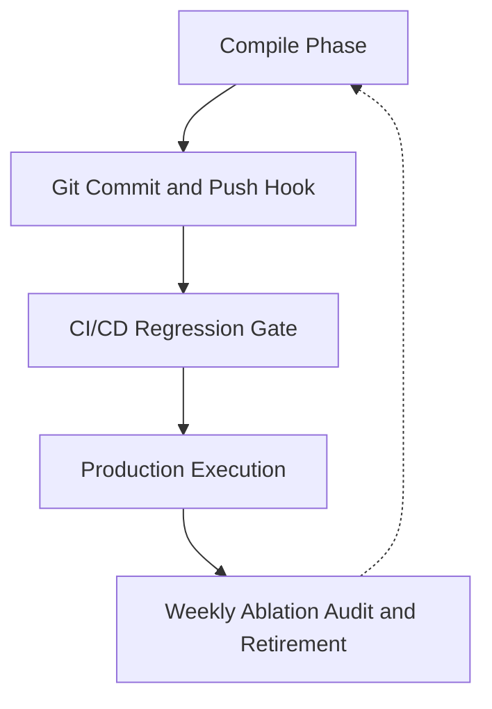

# Asset Lifecycle Map

A skill asset in this repository moves through five phases. Each phase has a different owner, a
different failure mode, and — importantly — a different *strength of claim*. Confusing a green phase
for a stronger claim than it makes is the main documented hazard here; see
[Production Bottlenecks](production-bottlenecks.md).

*The dotted edge is retirement feedback: a delta below target sends the asset back to authoring.*

## Compile Phase

The author writes `skills/<slug>/skills.md` (WHY / HOW / WHEN / WHEN NOT) and
`skills/<slug>/cases.json`, plus any `references/` page held back for progressive disclosure. Nothing
is executed; the asset is text. The contract this phase must satisfy is described in
[Skill asset contract](../skill-assets/contract.md).

What this phase proves: nothing about behavior. It only produces the artifact the later phases judge.

## Git Commit/Push Hook

`.githooks/commit-msg` runs `scripts/validate_commit_message.py` against the message file
.
`.githooks/pre-push` runs `scripts/git_gate.py`,
which iterates its `GATES` list in order and breaks at the first non-zero exit
.
That list holds 22 entries — a Python list length, so there is no literal count in the file to quote.
Both hooks require `git config core.hooksPath .githooks`
; they are opt-in per
clone and are not enforced server-side.

`scripts/git_gate.py` also hashes the entire repository input state before and after the run
 and exits
125 if any gate mutated a tracked input,
so a "gate" that writes files is itself a failure. Details in
[Defense gate chain](../architecture/defense-gate-chain.md).

What this phase proves: the static asset contract holds and the deterministic runners reproduce their
expected telemetry. It does not prove an agent behaves better with the skill than without it.

## CI/CD Regression Gate

`.github/workflows/skill_ci.yml` re-runs `scripts/git_gate.py`
 on any pull request touching `skills/**`
or `scripts/**`.
Three further workflows carry their own narrower triggers —
`wiki_graph_sync.yml`, `autoresearch_eval.yml`, and `weekly_audit.yml`. Their exact argv, path filters,
and environment-variable formats are tabulated in
[Entrypoint matrix](../operations/entrypoint-matrix.md), including two cases where a workflow's value does
not match what the script accepts.

What this phase proves: the same deterministic gates, on a clean checkout, without local state.

## Production Execution

Whether an asset may actually be routed in production is decided by `skills/<slug>/status.json`, not by
a green gate. `gemini_interactions` is currently `status: quarantined`, `production_routable: false`,
on the authority of a failing real-driver receipt — see
[gemini_interactions](../skill-assets/gemini-interactions.md). No gate enforces that binding, so the file
is a decision record rather than a control.

Behavioral judgement in this phase is local-first: `scripts/eval_autoresearch_composer.py` applies
deterministic guardrails and then a local heuristic judge
, and `scripts/llm_judge.py` implements the
double-lock parse used to accept or reject a judge verdict — verdict, score floor, and a breach
substring, all in one condition
.
The cloud judge path exists but returns a placeholder instead of calling an API
; see
[Behavioral eval and judge](../validation/behavioral-eval-and-judge.md).

## Weekly Ablation Audit & Retirement

`.github/workflows/weekly_audit.yml` runs `scripts/ablation_engine.py` on a Monday 03:00 UTC cron
. The
engine simulates the same cases with and without skill context and requires a delta above
`TARGET_DELTA = 0.05`
.
The delta is dataset-dependent: the default `skills/gemini_interactions/cases.json`

yields `delta=0.50 case_count=10`, while `--cases skills/autoresearch_composer/cases.json` yields
`delta=1.00 case_count=12` — both observed by running the script, not quotable out of it.
Any page quoting a delta must name its dataset.

Retirement is the intended terminal edge: an asset whose delta collapses is a candidate for removal
rather than repair. The real-driver counterpart `scripts/real_driver_ablation.py`

runs an actual agent command and is **not** part of this weekly workflow, whose only step is the
simulator;
it is invoked deliberately, and its last
recorded run is the failure that quarantined `gemini_interactions`
.

What this phase proves: a deterministic simulated delta. Only `real_driver_ablation.py` produces
evidence about a real agent — it refuses any command with no task placeholder
 —
and that evidence is what promotion decisions must cite.

## Where to go next

- Call graph and measured values → [Code call lifecycle](code-call-lifecycle.md)
- Authoring state machine → [Stateful workflow](stateful-workflow.md)
- Command runbook → [Usage](usage.md)
