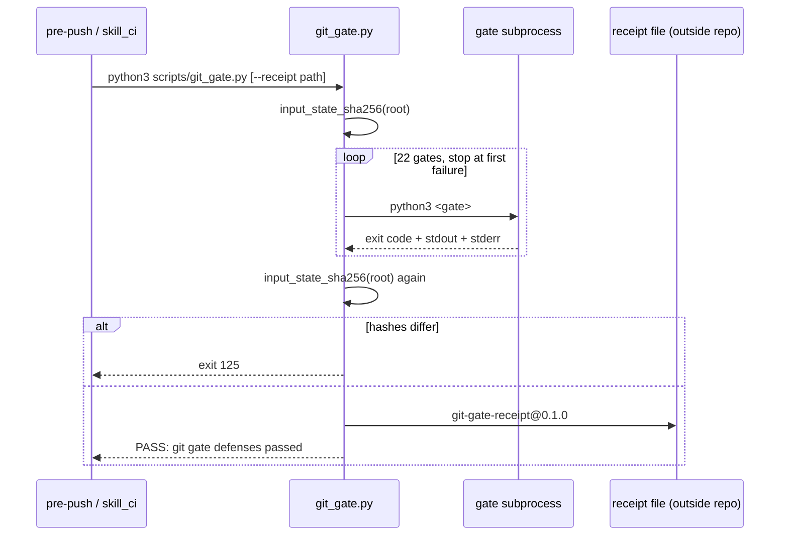

# Defense gate chain

`scripts/git_gate.py` is the one command a developer or CI job runs
(src: scripts/git_gate.py `"""Run local regression gates for skill asset changes."""`). Both the
pre-push hook (src: .githooks/pre-push `python3 "$ROOT/scripts/git_gate.py"`) and the pull-request
workflow (src: .github/workflows/skill_ci.yml `- run: python scripts/git_gate.py`) call it with no
arguments. The commit-message hook is separate and calls a different validator
(src: .githooks/commit-msg `python3 "$ROOT/scripts/validate_commit_message.py" "$1"`).

## What it runs

The gate list is a literal ordered array of **22** script paths
(src: scripts/git_gate.py `GATES = [`), each executed as its own subprocess from the repository root
with no arguments (src: scripts/git_gate.py `[sys.executable, str(root / gate)],`). Execution stops
at the first non-zero exit (src: scripts/git_gate.py `print(f"FAIL: gate failed: {gate}", file=sys.stderr)`),
so a later gate's silence means "not reached", not "passed".

Observed on a clean checkout at `5d3c42f`:

```text
$ python3 scripts/git_gate.py ; echo exit=$?
... (stderr) FAIL: openwiki validation failed
... (stderr) missing file: openwiki/quickstart.md
... (stderr) FAIL: gate failed: scripts/check_openwiki.py
exit=2
```

(inferred) That failure is the normal state of a checkout whose wiki has not been generated yet: the
wiki is an input to the gate, not an output of it. Generating `openwiki/quickstart.md` is what turns
that gate green — see [Entrypoint matrix](../operations/entrypoint-matrix.md).

### One gate is deliberately absent

`scripts/validate_molecular_commit_lineage.py` is *not* in `GATES`
(src: scripts/git_gate.py `# scripts/validate_molecular_commit_lineage.py is deliberately NOT gated here.`).
Two reasons are recorded in the source: this directory has no `.git` of its own, so the validator's
root discovery climbed into the enclosing checkout, and — more damagingly — the no-argument path it
would have been invoked on is a schema check that never walks history
(src: scripts/git_gate.py `# schema check that never walks history at all (0.07s vs 19s), so the gate reported`).
The validator therefore lives here but is run from the workspace that holds the commits; see
[Molecular commit lineage](../governance/molecular-commit-lineage.md).

(inferred) This is the clearest example in the repository of removing a gate to make the suite
*stronger*. A gate that always passes because it was handed no work is worse than no gate, because it
converts an unmeasured area into a green tick.

## The input-state guarantee

Before and after the run, the gate hashes the entire working tree
(src: scripts/git_gate.py `def input_state_sha256(root: Path) -> str:`) — every non-excluded regular
file and symlink, feeding relative path, permission bits, and either the link target or the file
bytes into one SHA-256. Caches are excluded
(src: scripts/git_gate.py `EXCLUDED_INPUT_PARTS = {".git", "__pycache__", ".pytest_cache"}`).

If the two hashes differ, the run fails with a dedicated exit code
(src: scripts/git_gate.py `exit_code = 125`) and the message
(src: scripts/git_gate.py `print("FAIL: git gate changed receipt-bound repo inputs", file=sys.stderr)`).

(inferred) This is the invariant that makes every downstream claim reusable: a validator that
rewrites the artifact it is validating can always report success. Several gates in this repository
*could* write — `render_lifecycle_openwiki.py` has a `--write` mode — so the guarantee is enforced
mechanically rather than by reviewing each script.

For the same reason a receipt may not be written inside the tree
(src: scripts/git_gate.py `parser.error("--receipt must be outside --repo-root so it cannot change the input-state hash")`).

## The receipt

With `--receipt <path>` the gate writes a typed JSON document
(src: scripts/git_gate.py `"schema_version": "git-gate-receipt@0.1.0",`) containing both input-state
hashes, the expected and actual gate counts, and one record per gate with its argv, elapsed time,
exit code, and the full stdout/stderr plus their SHA-256 digests. The file is created exclusively and
`os.replace`d into position with mode `0o600`
(src: scripts/git_gate.py `temporary.chmod(0o600)`).



## The receipt fast path is currently unusable

`scripts/check_plan_package_compat.py` can consume a receipt instead of re-running six expensive
gates (src: scripts/check_plan_package_compat.py `def load_gate_receipt(path: Path, root: Path) -> dict[str, SimpleNamespace]:`).
It verifies the file is a private regular file
(src: scripts/check_plan_package_compat.py `raise ValueError(f"gate receipt must be a private regular file: {path}")`),
requires the receipt's `repo_root` to equal the resolved repository root it is checking — a receipt
produced for a different checkout is rejected even if every gate inside it passed
(src: scripts/check_plan_package_compat.py `or payload.get("repo_root") != str(root)`), requires the two
recorded input-state hashes to agree with each other *and* with the tree as it stands now
(src: scripts/check_plan_package_compat.py `or payload.get("input_state_sha256") != input_state_sha256(root)`),
re-hashes every recorded stream
(src: scripts/check_plan_package_compat.py `or gate.get("stdout_sha256") != hashlib.sha256(gate["stdout"].encode()).hexdigest()`),
and requires the recorded gate list to equal its own order exactly.

That order is **23** entries — it still contains the lineage validator that `git_gate.py` removed
(src: scripts/check_plan_package_compat.py `"scripts/validate_molecular_commit_lineage.py",`), and the
count is asserted twice (src: scripts/check_plan_package_compat.py `or payload.get("expected_gate_count") != len(GIT_GATE_ORDER)`).
`git_gate.py` writes its own length into that field
(src: scripts/git_gate.py `"expected_gate_count": len(GATES),`), which is 22.

**Consequence:** no receipt this repository's own gate produces can satisfy its own consumer. Any
`--gate-receipt` invocation fails with
(src: scripts/check_plan_package_compat.py `raise ValueError("gate receipt contract or input state mismatch")`)
before any content is inspected. The slow path — re-running each gate as a subprocess — is the only
path that works, and it is the default when `--gate-receipt` is omitted.

(inferred) The two lists were plainly written as one list and then edited on one side only. Recording
it here rather than "fixing it in the docs" matters because the compatibility guard is the artifact a
future reader would trust to tell them what the gate order *is*; the drift is the fact, and the
one-line correction belongs in source, not in this page.

## Related

- What each gate actually checks: [Static validators](../validation/static-validators.md),
  [Behavioral eval and judge](../validation/behavioral-eval-and-judge.md),
  [Ablation and benchmark](../validation/ablation-and-benchmark.md).
- What triggers the gate: [Entrypoint matrix](../operations/entrypoint-matrix.md).
- The consumer's other assertions: [Plan-package compatibility](../governance/plan-package-compat.md).
- Measured values each gate currently reports: [Code call lifecycle](../nonofficial/code-call-lifecycle.md).
