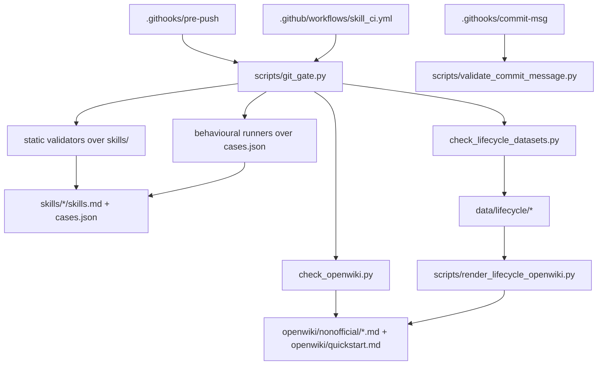

# Repository architecture

This repository is not an application. It is a **governance seed for skill assets**: it holds two
prompt-shaped assets, a set of deterministic scripts that refuse to let those assets drift, the
structured evidence those scripts read and re-derive, and a wiki that the same scripts treat as a
typed contract surface.

`PROJECT-SSOT.md` states the archetype in one line
(src: PROJECT-SSOT.md `This project is a GCR skill-asset governance repo, not a LangGraph application seed.`)
and the package identity is deliberately minimal
(src: pyproject.toml `name = "agent-skills-repo"`), with no dependency list at all — every gate runs
on the Python standard library.

## The five layers

| Layer | Lives in | Owning page |
|---|---|---|
| Skill assets | `skills/<slug>/` | [Skill asset contract](../skill-assets/contract.md) |
| Deterministic defenses | `scripts/`, `.githooks/`, `.github/workflows/` | [Defense gate chain](defense-gate-chain.md), [Entrypoint matrix](../operations/entrypoint-matrix.md) |
| Structured evidence | `data/` | [Structured lifecycle datasets](../lifecycle/structured-datasets.md), [Data authority](data-authority.md) |
| Vendored terminal operator | `.agents/skills/repo-terminal-operator/` | [Terminal operator overview](../terminal-operator/overview.md) |
| Wiki as contract | `openwiki/` | [Non-official provenance map](../nonofficial/provenance.md) |

The single local entrypoint is `scripts/git_gate.py`; the repository README names the whole chain as
its usage entry (src: README.md `runtime assets and validation scripts only.`). How that gate is
composed, and where its count drifts from its consumer, is in
[Defense gate chain](defense-gate-chain.md).

## Boundaries that are physically enforced

This repository is the **final repo** half of a two-output plan package. The prototype half owns the
small-loop control plane, and the final half must not
(src: PROJECT-SSOT.md `Final repo output must not contain small-loop control assets, exchange packets, or template drafts.`).
That is not left to discipline: two gates fail if the paths reappear
(src: scripts/check_openwiki.py `"small-loop", "packets", "templates/skill-defense-governance"`),
and the same three names are declared in the compatibility manifest
(src: plan-package.compat.yaml `final_repo_forbidden_paths: small-loop,packets,templates/skill-defense-governance`)
and restated as policy in the lock file
(src: .plan-package.lock.yaml `final_repo_small_loop_policy: forbidden`).

(inferred) The split exists so that a reader who finds an exchange packet or a route file in this
tree knows immediately that something upstream leaked, rather than having to reason about whether
this repository was *supposed* to own it. A forbidden-path list is a cheaper invariant than a naming
convention because it fails loudly on the next commit.

## Evidence grading is a first-class concept

Almost every claim in this repository carries a status rather than a verdict. `PROJECT-SSOT.md` sets
the default (src: PROJECT-SSOT.md `External claims remain candidate until verified or human-admitted.`)
and refuses to let a green local run stand in for capability
(src: PROJECT-SSOT.md `real synthetic case quality remains insufficient until a persisted admitted corpus and quality gates exist.`).
The mechanics live in three places:

- **Promotion state** — `data/lifecycle/promotion_records.json` is pinned to
  `candidate_until_human_admit`, described in [Structured lifecycle datasets](../lifecycle/structured-datasets.md).
- **Adversarial coverage** — an actor that did not run is surfaced as a pending gate, never inferred
  as success; see [Semantic arbitration](../validation/semantic-arbitration.md).
- **Corpus honesty** — the 117/117 headline is scoped as a regex canary, not behaviour; see
  [Synthetic corpus](../validation/synthetic-corpus.md) and
  [Production bottlenecks](../nonofficial/production-bottlenecks.md).

(inferred) The reason grading is spread across data files rather than prose is that prose cannot be
gated. A status string in `promotion_records.json` can be asserted by a script; a paragraph saying
"this is only a candidate" cannot.

## Provenance

Every artifact here traces back to one conversation and one plan package
(src: .plan-package.lock.yaml `source_conversation: <home>/antigravity/gemini_research/gcr/047d548af8f8e34c-conversation.md`),
with the requirement that each production file map to an intent slice, route, template, validator and
molecular commit (src: PROJECT-SSOT.md `Every production file must trace to an intent slice, route, draft template, validator, and molecular commit.`).
The commit-side half of that is [Molecular commit lineage](../governance/molecular-commit-lineage.md);
the manifest-side half is [Plan-package compatibility](../governance/plan-package-compat.md).

Those absolute paths are also this repository's biggest portability limit — they are recorded as a
`root-local-runtime` dependency in [Production bottlenecks](../nonofficial/production-bottlenecks.md).

## Scope boundary

Wiki→graph projection (`scripts/sync_wiki_to_graph.py`, `data/wiki_graph/`) is documented by the two
gate-pinned pages [Wiki graph sync architecture](../nonofficial/wiki-graph-sync-architecture.md) and
[Schema standards](../nonofficial/schema-standards.md); this section does not duplicate them.
