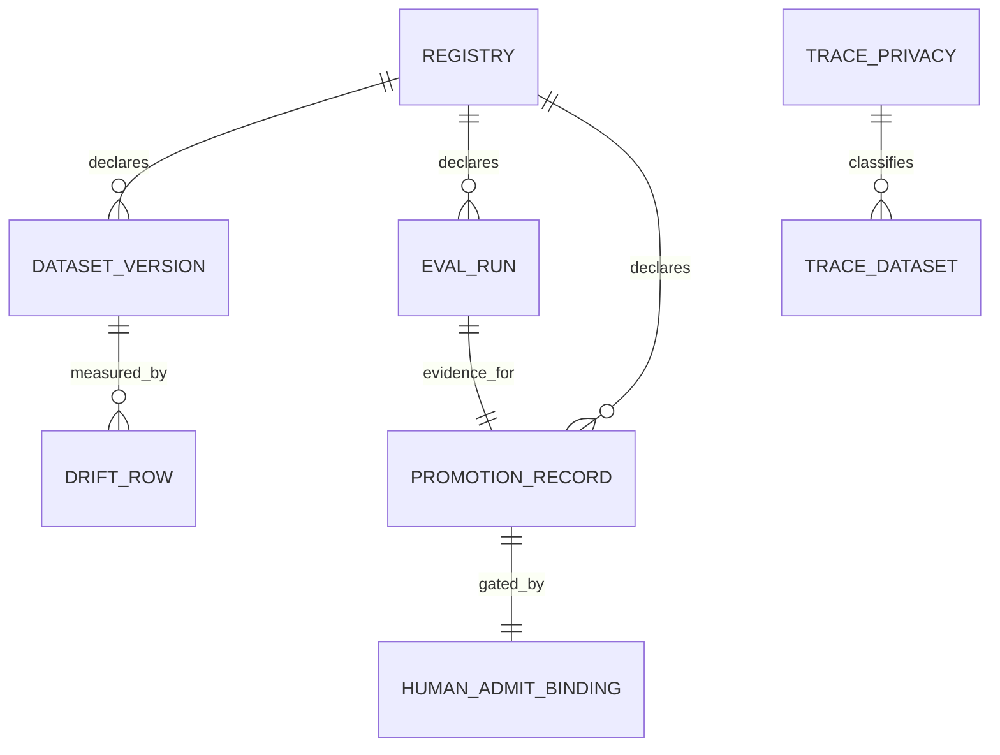

# Structured lifecycle datasets

`data/lifecycle/` is the machine-readable record of what a skill has been measured to do and whether a
human has admitted it. Markdown never carries these numbers: the rendered page is derived and
byte-compared (see [Data authority](../architecture/data-authority.md)), and the display page itself is
[structured-lifecycle-data.md](../nonofficial/structured-lifecycle-data.md).



## The six files

| File | Schema | Holds |
|---|---|---|
| `skill_optimization_registry.json` | `skill-lifecycle-registry@0.1.0` | one row per governed skill and the nine artifacts it must declare |
| `golden_dataset_versions.json` | `golden-dataset-versions@0.1.0` | dataset id, path, case count, required fields, rollback rule |
| `eval_runs/autoresearch_composer_2026-07-23.json` | `skill-lifecycle-eval-run@0.1.0` | the four commands run and their result summary |
| `promotion_records.json` | `skill-lifecycle-promotion-records@0.1.0` | the promotion decision and its unsigned human-admit binding |
| `dataset_drift_history.jsonl` | one row per dataset version | pass rate, judge score, sample counts, route distribution |
| `trace_privacy_classification.json` | `trace-privacy-classification@0.1.0` | per-dataset cloud policy and prerequisites |

The registry names what each skill must supply
(src: data/lifecycle/skill_optimization_registry.json `"required_per_skill_artifacts": [`) and is currently
restricted to exactly one skill by the gate
(src: scripts/check_lifecycle_datasets.py `failures.append("registry must contain autoresearch_composer as a managed skill")`).

## What the gate cross-checks

`scripts/check_lifecycle_datasets.py` does not validate the files in isolation; almost every rule spans
two of them.

- **Dataset versions must match declared case counts.** Both ids are pinned with their counts
  (src: scripts/check_lifecycle_datasets.py `"autoresearch-nightly-golden@2026-07-23": 3,`), so adding a
  case to `pr_golden_set.json` without minting a new dataset version fails.
- **The eval run's summary is pinned field by field**, including the ablation delta
  (src: scripts/check_lifecycle_datasets.py `"ablation_delta": 1.0,`).
- **The promotion record must stay a candidate**
  (src: scripts/check_lifecycle_datasets.py `failures.append("promotion record must remain candidate_until_human_admit")`)
  and must require a human
  (src: scripts/check_lifecycle_datasets.py `failures.append("promotion record must require human admit")`).
- **Trace privacy must be off at both levels** — the root policy and every dataset entry
  (src: scripts/check_lifecycle_datasets.py `failures.append(f"trace dataset cloud_allowed must be false: {dataset.get('path')}")`).
- **Drift rows must be internally consistent**: the route distribution has to sum to the case count
  (src: scripts/check_lifecycle_datasets.py `failures.append(f"drift route_distribution must sum to case_count: {row.get('dataset_version')}")`).
- **Failure traces must actually be failures**
  (src: scripts/check_lifecycle_datasets.py `failures.append(f"failure trace must be FAIL and local-only: {trace.get('trace_id')}")`).
- **The display page must equal the renderer's output** and contain sixteen literals
  (src: scripts/check_lifecycle_datasets.py `failures.append(f"structured lifecycle openwiki missing literal: {literal}")`).

(inferred) The route-distribution sum is the one rule here that cannot be satisfied by copying a number
from somewhere else — it forces the drift row to describe the same set of cases the dataset version
declares. Most of the other assertions are equality against a constant, which catches edits but not
fabrication; this one catches an internally incoherent row.

## The human-admit binding

The promotion record's most detailed structure is a binding that is *prepared but unsigned*
(src: data/lifecycle/promotion_records.json `"binding_status": "prepared_unsigned",`), and the gate
requires it to stay that way
(src: scripts/check_lifecycle_datasets.py `failures.append("human_admit_binding must be prepared_unsigned before human admit")`).

Six keys are mandatory
(src: scripts/check_lifecycle_datasets.py `for key in ("dataset_versions", "molecular_commit", "plan_package_input_ids", "route", "routes_edge_id", "lineage_edge_id"):`),
two of them must equal the outer record
(src: scripts/check_lifecycle_datasets.py `failures.append("human_admit_binding dataset_versions must match promotion record")`),
and the remaining ones are pinned to exact values — all four plan-package inputs
(src: scripts/check_lifecycle_datasets.py `failures.append("human_admit_binding must bind all plan-package input ids")`),
the materialization route
(src: scripts/check_lifecycle_datasets.py `failures.append("human_admit_binding must bind ROUTES plan-package-materialization route")`),
and one lineage edge
(src: scripts/check_lifecycle_datasets.py `failures.append("human_admit_binding must bind final lineage edge id")`),
recorded in the data as
(src: data/lifecycle/promotion_records.json `"lineage_edge_id": "EDGE-066",`).

(inferred) The binding is a pre-committed statement of *what exactly would be admitted*, written before
anyone can admit it. Its value is that the admitting human cannot later be told the decision covered a
different dataset version or commit: the scope was frozen and gated while it was still cheap to argue
about. `prepared_unsigned` being an enforced value, rather than a default, is what stops the record from
drifting toward "approved" one field at a time.

## Extending to a second skill

The rendered page states the data side of the requirement
(src: openwiki/nonofficial/structured-lifecycle-data.md `For every new optimized skill, add exactly one registry row, at least one Golden`),
but adding JSON rows alone cannot pass. Four surfaces must change together:

1. **The validator's hard-coded expectations.** The registry must have exactly one entry, and it must be
   `autoresearch_composer` (src: scripts/check_lifecycle_datasets.py `if len(skills) != 1 or skills[0].get("skill_id") != "autoresearch_composer":`);
   the two dataset versions and their counts are literals
   (src: scripts/check_lifecycle_datasets.py `"autoresearch-pr-golden@2026-07-23": 4,`); the eval summary
   is a literal dict; the drift history must hold exactly two seed rows
   (src: scripts/check_lifecycle_datasets.py `failures.append("drift history must contain 2 seed rows")`)
   whose pass rate and failure-trace count are fixed
   (src: scripts/check_lifecycle_datasets.py `if row.get("pass_rate") != 1.0 or row.get("failure_trace_sample_count") != 2:`);
   the failure-trace dataset must hold exactly two rows
   (src: scripts/check_lifecycle_datasets.py `failures.append("failure trace dataset must contain exactly 2 seed rows")`);
   and the promotion records list must have length one
   (src: scripts/check_lifecycle_datasets.py `if len(records) != 1 or records[0].get("promotion_status") != "candidate_until_human_admit":`).
2. **The renderer.** It iterates the collections, so a second skill appears automatically — but it emits
   only the *last* eval run id per skill
   (src: scripts/render_lifecycle_openwiki.py `latest_eval_run_id = eval_run_ids[-1] if isinstance(eval_run_ids, list) and eval_run_ids else ""`),
   and its Dated Eval Run section renders a **single** run from one hard-coded file
   (src: scripts/render_lifecycle_openwiki.py `eval_run = read_json("data/lifecycle/eval_runs/autoresearch_composer_2026-07-23.json")`).
   A second skill's run would not appear until that read becomes a loop.
3. **The sixteen required literals** in `check_lifecycle_datasets.py`, which name the current skill's ids.
4. **The focused test**, which asserts the gate's exact PASS line
   (src: tests/test_skill_asset_governance.py `assert "PASS: lifecycle datasets and openwiki display" in lifecycle.stdout`), and
   `scripts/check_autoresearch_lifecycle.py`, whose `REPORT` path is bound to this one skill's page.

(inferred) Pinning seed-row counts rather than validating shape makes the dataset a fixture as much as a
record — good for detecting an accidental edit, actively hostile to growth. The extension rule printed on
the generated page describes only step 1's data half, which is the part a reader is most likely to
mistake for the whole job.

## Narrow validation

```sh
python3 scripts/render_lifecycle_openwiki.py --write
python3 scripts/check_lifecycle_datasets.py
```

Observed at `5d3c42f`: `PASS: lifecycle datasets and openwiki display`.

## Related

- [autoresearch_composer](../skill-assets/autoresearch-composer.md) — the only skill in the registry.
- [Behavioral eval and judge](../validation/behavioral-eval-and-judge.md) — the commands the dated eval run recorded.
- [Data authority](../architecture/data-authority.md) — the byte-equality contract and the stale registry path.
- [Molecular commit lineage](../governance/molecular-commit-lineage.md) — what `molecular_commit` and `lineage_edge_id` point at.
