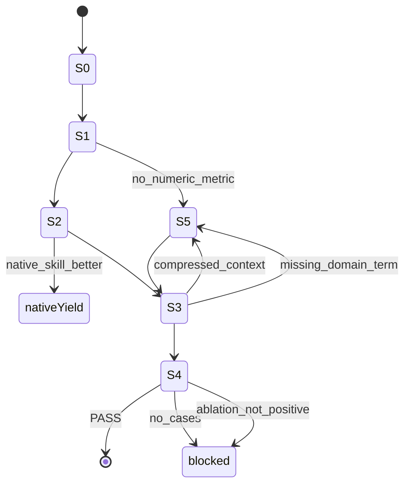

# `autoresearch_composer`

The asset that plans bounded, metric-driven optimization loops without collapsing matching,
generation and validation into one prompt
(src: skills/autoresearch_composer/skills.md `The asset prevents compressed context from becoming an ambiguous route decision.`).
Unlike [gemini_interactions](gemini-interactions.md) it is a **production-seed candidate**
(src: data/lifecycle/skill_optimization_registry.json `"current_status": "production-seed-candidate",`)
and it is the only asset wired into the lifecycle datasets.

Files: `skills.md` (router), `references/state_graph.md` (Layer 3), `cases.json` (twelve cases).

## The state graph

`references/state_graph.md` is the asset's real specification. Six nodes:

| Node | Responsibility | Output |
|---|---|---|
| S0 intake | preserve low-compression user context | context packet |
| S1 match | decide whether this is a real metric loop | route candidate or native yield |
| S2 route | choose the sub-command and the native-yield decision | route decision |
| S3 generate | create the Iteration-Loop Contract | contract block |
| S4 validate | check cases, A/B delta, metric, guard, missing terms | PASS/FAIL |
| S5 recover | repair missing information or Domain terms | clarified context |

(src: skills/autoresearch_composer/references/state_graph.md `| S5 recover | repair missing information or Domain terms | clarified context |`)



The six conditional edges are named, not implied — for example a loop with no numeric verifier yields
rather than proceeding
(src: skills/autoresearch_composer/references/state_graph.md `yield to grilling or SDLC planning.`)
and promotion is blocked until an A/B delta passes
(src: skills/autoresearch_composer/references/state_graph.md `fail promotion until A/B delta passes.`).

Eleven fields are required for promotion
(src: skills/autoresearch_composer/references/state_graph.md `required for production promotion.`).

## Semantic-truth actor routing

The reference forbids leaving an evidence question assigned to "one of several" actors
(src: skills/autoresearch_composer/references/state_graph.md `as an unresolved actor choice. The route`).
Each semantic question gets exactly one actor, one permitted output, and one named forbidden shortcut
— for instance implementation reality goes to a Codex engineering audit plus T0 scripts whose
forbidden shortcut is a name-only equivalence claim
(src: skills/autoresearch_composer/references/state_graph.md `no name-only technical_equivalent claim`),
and unresolved evidence stays graded
(src: skills/autoresearch_composer/references/state_graph.md `If evidence is missing, the state is candidate or [推論]. Promotion requires`).

(inferred) This table is the asset's transferable idea: an unresolved actor choice looks like
thoroughness ("Opus or Codex will check") but is functionally an unassigned task, and unassigned tasks
are the ones that silently do not happen. Naming one actor makes the absence detectable — which is
exactly the mechanic [Semantic arbitration](../validation/semantic-arbitration.md) then enforces on
data.

## The twelve cases and their dedicated ablation branch

`cases.json` carries six positive and six negative cases, each tagged with a slug
(src: skills/autoresearch_composer/cases.json `"skill_slug": "autoresearch_composer",`). That slug is a
dispatch key: `scripts/ablation_engine.py` branches on it
(src: scripts/ablation_engine.py `if skill_slug == "autoresearch_composer":`) and simulates a
*different* agent than for the Gemini asset — without the skill it emits a single-prompt shortcut, and
for a negative case with the skill it must emit a native-yield decision
(src: scripts/ablation_engine.py `"no slash command route selected; no contract generated"`).

The lifecycle gate pins that branch's telemetry exactly: 12 cases, 6 negatives, negative-with-skill
success rate of 1.0 and delta above 0.05
(src: scripts/check_autoresearch_lifecycle.py `or telemetry.get("negative_with_skill_success_rate") != 1.0`).

(inferred) Requiring perfect negative-case behaviour *with* the skill loaded is the sharper half of
the gate. A router that fires on everything can push the positive rate to 1.0 on its own; only the
negative arm distinguishes routing from enthusiasm.

## Literals the lifecycle gate pins

`scripts/check_autoresearch_lifecycle.py` asserts specific strings in four files rather than checking
that they merely exist — the four route signals plus the cloud-judge clause in `skills.md`
(src: scripts/check_autoresearch_lifecycle.py `"cloud/API judge hooks are present but disabled by default",`),
the node and edge names plus the actor table in `references/state_graph.md`
(src: scripts/check_autoresearch_lifecycle.py `"candidate / [推論] / human_required",`), and the report
headings in `openwiki/nonofficial/autoresearch-composer-lifecycle.md`
(src: scripts/check_autoresearch_lifecycle.py `"A/B ablation is a hard gate",`).

It also cross-checks the asset against its authoring copy outside this repository when that tree is
present (src: scripts/check_autoresearch_lifecycle.py `failures.append("source cases and production repo cases differ")`),
and silently reduces scope when it is not
(src: scripts/check_autoresearch_lifecycle.py `source_required_available = (PROJECT_ROOT / ".claude").exists()`).

(inferred) That silent reduction is the gate's weakest seam: absence of the authoring tree turns an
equality assertion into a no-op with the same green output, so a reader cannot tell from the exit code
which of the two checks actually ran.

Finally it re-runs the two golden datasets and the trace sampler as subprocesses and requires their
exact PASS lines (src: scripts/check_autoresearch_lifecycle.py `or "PASS: autoresearch trace sampler" not in trace.stdout`).

## Governance record

Registry, golden dataset versions, dated eval run, promotion record, drift rows and trace privacy for
this asset live in `data/lifecycle/` and are described in
[Structured lifecycle datasets](../lifecycle/structured-datasets.md). Its promotion is held at
`candidate_until_human_admit`.

## Narrow validation

```sh
python3 scripts/check_autoresearch_lifecycle.py
python3 scripts/ablation_engine.py --cases skills/autoresearch_composer/cases.json --json
```

Observed at `5d3c42f`: `PASS: autoresearch lifecycle optimization gate`.

## Related

- [Skill asset contract](contract.md) · [Behavioral eval and judge](../validation/behavioral-eval-and-judge.md)
- [Autoresearch-composer lifecycle](../nonofficial/autoresearch-composer-lifecycle.md) — the executed evidence and the hardening it still lacks.
- [Stateful workflow](../nonofficial/stateful-workflow.md) — the repository-level authoring state graph this asset mirrors.
