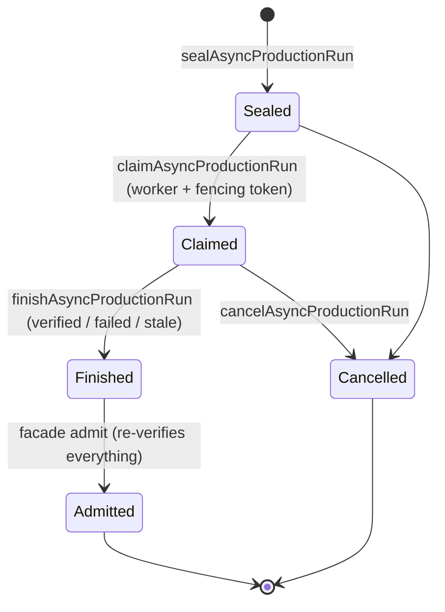

# Async production

Six modules and five CLIs implementing one durable state machine: move an expensive review off the
foreground **without** ever detaching it from the tree it was authorised against. The operator's own
contract states the boundary — this machinery is a prerequisite, not a dispatcher
(src: .agents/skills/repo-terminal-operator/SKILL.md `It does not launch an Agent, mutate the live checkout, admit a result, publish Git state, or enable background production.`).

## State-root layout and ownership

| Directory | Written by | Contains |
|---|---|---|
| `runs/<run-id>/` | job lifecycle only | the seal and its monotonic event log |
| `transactions/<run-id>/` | worker carrier | the private pre-commit result (src: .agents/skills/repo-terminal-operator/async-worker-carrier.ts `function transactionRoot(stateRoot: string, runId: string): string {`) |
| `queue/` | control plane | deterministic worker/redrive request refs (src: .agents/skills/repo-terminal-operator/async-control-plane.ts `queue/${view.runId}.recover.v${view.version}.json`) |
| `projections/` | control plane | one content-addressed projection per request |
| progress records | worker, via the progress store | bounded, name-checked, readback-verified |

The state root's shape is asserted, not assumed
(src: .agents/skills/repo-terminal-operator/async-job-lifecycle.ts `if (local !== "runs") throw new Error("invalid-state-root");`), and both it and
`runs/` must be real directories
(src: .agents/skills/repo-terminal-operator/async-job-lifecycle.ts `throw new Error("state-root-and-runs-must-be-real-directories");`).

## Lifecycle: seal → claim → finish

### What `start` accepts before it seals

`start` never launches anything; it decides whether a foreground run is admissible as the basis for a
background one. In order:

1. `expected_head` must be a 40-hex object id
   (src: .agents/skills/repo-terminal-operator/async-admission-facade.ts `throw new Error("expected-head-invalid");`) and must equal the
   observed HEAD now
   (src: .agents/skills/repo-terminal-operator/async-admission-facade.ts `head-stale:`).
2. Between 1 and 256 candidate refs
   (src: .agents/skills/repo-terminal-operator/async-admission-facade.ts `request.candidate_refs.length > 256`), each safe and inside the target
   repo (src: .agents/skills/repo-terminal-operator/async-admission-facade.ts `throw new Error("candidate-outside-target-repo");`); each one's
   **bytes** are read now and carried into the seal, not just its path.
3. The foreground receipt file is read and must satisfy the passing-receipt contract
   (src: .agents/skills/repo-terminal-operator/async-admission-verifier.ts `export function assertForegroundReceipt(`).
4. The production job must parse against the full worker-job parser
   (src: .agents/skills/repo-terminal-operator/async-admission-facade.ts `throw new Error("production-job-binding-invalid", { cause: error });`).
5. The seal must be the run's first version
   (src: .agents/skills/repo-terminal-operator/async-admission-facade.ts `if (sealed.version !== 0) throw new Error("initial-version-invalid");`).

**The foreground-receipt contract** is `assertPassingSmallLoopReceipt`, and it is exact rather than
permissive (src: .agents/skills/repo-terminal-operator/small-loop-receipt.ts `if (!valid) throw new Error("passing-small-loop-receipt-invalid");`).
It requires: exactly the known key set and `schema_version` `small-loop-run-receipt@v1`
(src: .agents/skills/repo-terminal-operator/small-loop-receipt.ts `receipt.schema_version === "small-loop-run-receipt@v1" &&`); the receipt's
`run_id` to equal the requested run; a non-empty `terminal_slice_id`; a `mode` drawn from seven values
(src: .agents/skills/repo-terminal-operator/small-loop-receipt.ts `"migration",`); `status === "passed"`; valid
`started_at`/`completed_at`; **both** `expected_head` and `actual_head` to equal the request's head, which
must itself be 40-hex
(src: .agents/skills/repo-terminal-operator/small-loop-receipt.ts `/^[a-f0-9]{40}$/u.test(expectedHead) &&`); non-empty changed paths; at
least one passed stage each for `code-quality` and `production-use`
(src: .agents/skills/repo-terminal-operator/small-loop-receipt.ts `object(stage)?.purpose === "production-use" &&`); both gate blocks to be
`{status: "passed", receipt_ref: <non-empty>}` and nothing else
(src: .agents/skills/repo-terminal-operator/small-loop-receipt.ts `exactKeys(gate, ["status", "receipt_ref"]) &&`); an **empty** failures array; a
`next_action` of exactly `{kind: "open-pr", prompt_packet_ref}`
(src: .agents/skills/repo-terminal-operator/small-loop-receipt.ts `nextAction?.kind === "open-pr" &&`); and a handoff object.

Those last two are produced by the runner's own derivation — `open-pr` only when the run passed, and
`stale` when the head moved (src: .agents/skills/repo-terminal-operator/small-loop-receipt.ts `if (input.actualHead !== input.expectedHead) return "stale";`)
(src: .agents/skills/repo-terminal-operator/small-loop-receipt.ts `return failures.some((failure) => failure.kind === "transient")`).

(inferred) `exactKeys` rather than a subset check is what makes this a *contract* and not a filter: a
receipt carrying an unknown extra field is rejected, so a future version cannot be silently accepted by
an older admitter that would ignore the field carrying the reason it should not have been.

**The handoff object is required but not structured.** The runner writes a three-part handoff — the
packet's own handoff block, the full preflight check list, and the two inline stage evidence records
(src: .agents/skills/repo-terminal-operator/small-loop-receipt.ts `stage_receipts: {`), where the packet's
handoff is just a run id (src: .agents/skills/repo-terminal-operator/small-loop-receipt.ts `handoff: { run_id: string };`) and the two
`receipt_ref` values are inline pointers into it
(src: .agents/skills/repo-terminal-operator/small-loop-receipt.ts `"inline://handoff/stage_receipts/code_quality",`). The verifier,
however, requires only that the field be an object
(src: .agents/skills/repo-terminal-operator/small-loop-receipt.ts `Boolean(object(receipt.handoff));`) — the preflight list, the stage
evidence and the inline refs are **not** validated at admission time.

**What is not cross-bound.** `start` reads three things from disk — candidate bytes, the foreground
receipt, the production job — and binds them into the seal, but it does not compare them with each
other:

- The receipt's `changed_paths` are not checked against the request's `candidate_refs`, and the receipt
  carries no digest of any candidate — `changed_paths` is a plain string list
  (src: .agents/skills/repo-terminal-operator/small-loop-receipt.ts `changedPaths.every(nonempty) &&`).
- The receipt's `next_action.prompt_packet_ref` is an absolute path to the packet that produced it
  (src: .agents/skills/repo-terminal-operator/small-loop-receipt.ts `prompt_packet_ref: resolve(input.inputPath),`), and `start` requires it
  to be non-empty but never opens it, so the packet itself is not re-read or hashed at seal time.
- `run_id` and the head are the only two values cross-checked between the request and the receipt
  (src: .agents/skills/repo-terminal-operator/small-loop-receipt.ts `receipt.run_id === runId &&`).

Everything the seal holds is then hashed together and re-verified on every later read
(src: .agents/skills/repo-terminal-operator/async-job-lifecycle.ts `throw new Error("seal-component-hash-mismatch");`), and `admit` re-reads
the candidates from disk and rejects any whose bytes moved. So the chain is
*bytes-at-seal-time → seal hash → admit-time re-read*, not *packet → receipt → candidate*.

(inferred) That is a real seam rather than an oversight to gloss: a foreground receipt for the same
`run_id` and the same HEAD, produced from a *different* packet or listing different changed paths, would
be accepted. The head equality does most of the work — it bounds how far the tree can have moved — but
the binding between "the run that was measured" and "the files being sealed" is by convention on the
caller's side, not by construction here.

**Seal** atomically binds candidate files, the foreground receipt and the production job
(src: .agents/skills/repo-terminal-operator/async-job-lifecycle.ts `export function sealAsyncProductionRun(root: string, input: AsyncSealInput) {`),
rejecting an empty candidate set
(src: .agents/skills/repo-terminal-operator/async-job-lifecycle.ts `throw new Error("candidate-files-empty");`), duplicate paths
(src: .agents/skills/repo-terminal-operator/async-job-lifecycle.ts `if (paths.has(path)) throw new Error(`), unsafe paths and empty components
(src: .agents/skills/repo-terminal-operator/async-job-lifecycle.ts `throw new Error("sealed-component-empty");`). The published seal is
re-read and compared (src: .agents/skills/repo-terminal-operator/async-job-lifecycle.ts `throw new Error("published-seal-readback-mismatch");`),
and every later reader re-derives the seal hash
(src: .agents/skills/repo-terminal-operator/async-job-lifecycle.ts `throw new Error("seal-hash-mismatch");`).

**Claim** requires a worker id and fencing token, a lease that expires after the claim and before the
run deadline (src: .agents/skills/repo-terminal-operator/async-job-lifecycle.ts `throw new Error("lease-exceeds-run-deadline");`), and a
claimable status (src: .agents/skills/repo-terminal-operator/async-job-lifecycle.ts `throw new Error(`).

**Finish** requires the run to be running, the fencing token to match and to be unexpired
(src: .agents/skills/repo-terminal-operator/async-job-lifecycle.ts `throw new Error("expired-fencing-token");`), and a valid transaction
parent binding (src: .agents/skills/repo-terminal-operator/async-job-lifecycle.ts `throw new Error("invalid-transaction-parent-binding");`).

Every transition is an append to an event log that must stay monotonic
(src: .agents/skills/repo-terminal-operator/async-job-lifecycle.ts `throw new Error("non-monotonic-event-log");`) under optimistic
concurrency (src: .agents/skills/repo-terminal-operator/async-job-lifecycle.ts `throw new Error(`).

(inferred) Lease *plus* fencing token is the pair that survives a stalled worker. The lease decides who
may act now; the token proves an action was authorised by the claim that is still current. Without the
token, a worker that was paused past its lease and then resumed would happily finish a run someone else
already reclaimed — the classic distributed-lock failure this design is written against.

## The worker carrier

`async-worker-carrier.ts` (the largest file, ~1,200 lines) builds an isolated view and runs the
reviewer:

1. **Snapshot from Git** — `git archive` then extract into a fresh 0700 directory
   (src: .agents/skills/repo-terminal-operator/async-worker-carrier.ts `mkdirSync(snapshot, { mode: 0o700 });`), failing on either step
   (src: .agents/skills/repo-terminal-operator/async-worker-carrier.ts `throw new Error(`).
2. **Overlay hash-bound candidates**, with every path re-contained
   (src: .agents/skills/repo-terminal-operator/async-worker-carrier.ts `throw new Error("candidate-path-escaped-snapshot");`), re-hashed
   (src: .agents/skills/repo-terminal-operator/async-worker-carrier.ts `throw new Error("candidate-reopen-hash-mismatch");`) and read back
   (src: .agents/skills/repo-terminal-operator/async-worker-carrier.ts `throw new Error("candidate-overlay-readback-mismatch");`).
3. **Choose containment** — a Darwin `sandbox-exec` profile when available
   (src: .agents/skills/repo-terminal-operator/async-worker-carrier.ts `mode: "darwin-sandbox" as const,`), otherwise a recorded degraded mode
   (src: .agents/skills/repo-terminal-operator/async-worker-carrier.ts `mode: "cwd-only-degraded" as const,`).
4. **Pin the executables** — both the runtime and the driver must match their expected digests
   (src: .agents/skills/repo-terminal-operator/async-worker-carrier.ts `if (digest !== job.driver_sha256) throw new Error("driver-hash-mismatch");`),
   with absolute paths only (src: .agents/skills/repo-terminal-operator/async-worker-carrier.ts `throw new Error("executable-path-not-absolute");`).
5. **Parse a strict reviewer verdict** — stdout must end in a newline and contain exactly one line
   (src: .agents/skills/repo-terminal-operator/async-worker-carrier.ts `if (lines.length !== 1) throw new Error("reviewer-final-line-count-invalid");`)
   that satisfies the final-stage contract
   (src: .agents/skills/repo-terminal-operator/async-worker-carrier.ts `throw new Error("reviewer-final-contract-invalid");`).
6. **Commit through a private transaction**: write the result under `transactions/`, verify the readback
   (src: .agents/skills/repo-terminal-operator/async-worker-carrier.ts `throw new Error("result-transaction-readback-mismatch");`), then win the
   finish CAS, then publish — with a bounded retry that fails loudly when exhausted
   (src: .agents/skills/repo-terminal-operator/async-worker-carrier.ts `throw new Error("committed-result-publication-exhausted", {`) and a
   recovery path for a crash after finish
   (src: .agents/skills/repo-terminal-operator/async-worker-carrier.ts `throw new Error("committed-result-recovery-contract-mismatch");`).

Progress events are a versioned schema
(src: .agents/skills/repo-terminal-operator/async-worker-carrier.ts `schema_version: "repo-async-production-worker-progress@v2",`) and each record is
read back after write (src: .agents/skills/repo-terminal-operator/async-progress-store.ts `if (!reopened.equals(bytes)) throw new Error("progress-readback-mismatch");`).

(inferred) Writing the result privately *before* winning the finish CAS is what makes the commit
recoverable rather than atomic-by-hope. If the process dies after the CAS but before publication, the
bytes already exist and can be republished; if it dies before the CAS, the transaction is an orphan that
the control plane classifies and no one mistakes for a result.

## The control plane projects, and only projects

`projectAsyncControl` classifies runs and writes queue and projection refs
(src: .agents/skills/repo-terminal-operator/async-control-plane.ts `schema_version: "repo-async-production-control-projection@v1",`) with the
projection read back before completion
(src: .agents/skills/repo-terminal-operator/async-control-plane.ts `if (!reopened.equals(bytes)) throw new Error("projection-readback-mismatch");`).
Redrives are bounded to at most three
(src: .agents/skills/repo-terminal-operator/async-control-plane.ts `max_redrives: boundedInteger(input.max_redrives, "max-redrives", 1, 3),`), and a
worker request is refused when the lease is too short or exceeds the run deadline
(src: .agents/skills/repo-terminal-operator/async-control-plane.ts `throw new Error(`).

Orphan transactions are **classified, never deleted**
(src: .agents/skills/repo-terminal-operator/async-control-plane.ts `"orphan-transaction",`), with a distinct reason per defect
(src: .agents/skills/repo-terminal-operator/async-control-plane.ts `orphan-transaction-run-binding-invalid:`).

(inferred) A sweeper that deletes what it cannot explain destroys the only evidence of the bug that
produced it. Classifying instead keeps `sweep_orphans` safe to run by default, at the cost of leaving
garbage a human must eventually look at — the right trade for a state machine whose whole purpose is
producing admissible evidence.

## Admission re-verifies everything

`async-admission-facade.ts` is the only public seam
(src: .agents/skills/repo-terminal-operator/SKILL.md `as the only public async lifecycle seam.`). `start` seals but never launches
a worker; `inspect` is read-only; `cancel` appends one event; `admit` re-opens HEAD
(src: .agents/skills/repo-terminal-operator/async-admission-facade.ts `throw new Error(`), each candidate's current bytes
(src: .agents/skills/repo-terminal-operator/async-admission-facade.ts `candidate-stale:`), the run's verified state
(src: .agents/skills/repo-terminal-operator/async-admission-facade.ts `throw new Error("run-not-currently-verified");`), the worker result hash
(src: .agents/skills/repo-terminal-operator/async-admission-facade.ts `throw new Error("worker-result-hash-stale");`), then publishes one
immutable ownership receipt
(src: .agents/skills/repo-terminal-operator/async-admission-facade.ts `schema_version: "repo-async-production-admission@v1",`) and verifies its own
readback (src: .agents/skills/repo-terminal-operator/async-admission-facade.ts `throw new Error("admission-readback-mismatch");`).

A degraded worker can never be admitted
(src: .agents/skills/repo-terminal-operator/async-admission-verifier.ts `if (degraded) throw new Error("degraded-worker-not-admissible");`) — the
`cwd-only-degraded` mode chosen when no sandbox is available produces a result that is inspectable but
not admissible, exactly as the operator's contract requires
(src: .agents/skills/repo-terminal-operator/SKILL.md `remains advisory rather than admissible.`).

## CLI surface

`async-job-lifecycle-cli.ts`, `async-worker-carrier-cli.ts`, `async-control-plane-cli.ts`,
`async-admission-facade-cli.ts` — each takes a request file and emits a typed error document on failure
(src: .agents/skills/repo-terminal-operator/async-admission-facade-cli.ts `schema_version: "repo-async-production-facade-error@v1",`).

## Evidence status

None of this runs here (see [Terminal operator overview](overview.md)), and the Bun suites that own it
— `repo-terminal-async-job-lifecycle.test.ts`, `repo-terminal-async-control-plane.test.ts`,
`repo-terminal-async-admission-facade.test.ts` — do not exist in this checkout. This page therefore
states contracts and invariants read from source, not observed behaviour.

## Related

- [Shared primitives](shared-primitives.md) · [Writer publication](writer-publication.md) — the transaction publisher.
- [Evidence cost](evidence-cost.md) — the cost axes a sealed review would report.
- [Production profiles and evidence](production-profiles-and-evidence.md)
