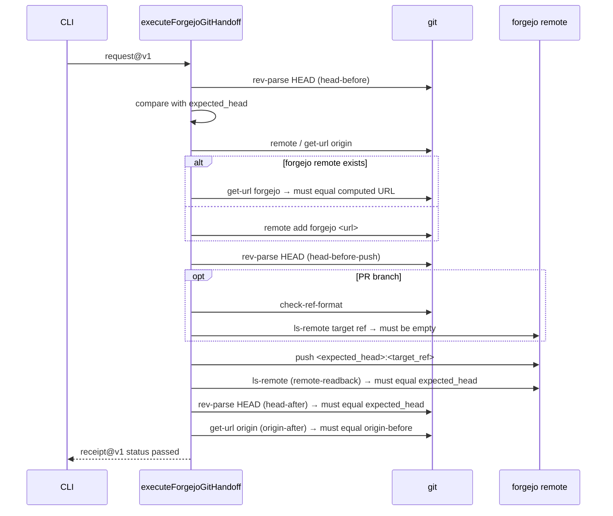

# Forgejo handoff

The only place in the operator that changes state outside the filesystem. Its scope is deliberately
tiny: push one exact commit to one ref on one local Forgejo instance and prove nothing else moved
(src: .agents/skills/repo-terminal-operator/SKILL.md `This narrow seam publishes Git state but does not create repositories, issues, PRs, merges, or cloud state.`).

## Two request schemas

Both pin their invariants as literal types rather than validating them at runtime
(src: .agents/skills/repo-terminal-operator/forgejo-git-handoff.ts `base_url: "http://127.0.0.1:3000";`):

| | `forgejo-git-handoff-request@v1` | `forgejo-pr-branch-handoff-request@v1` |
|---|---|---|
| operation | `configure_remote_and_push` | `create_pr_branch` |
| target ref | `refs/heads/main` (src: .agents/skills/repo-terminal-operator/forgejo-git-handoff.ts `target_ref: "refs/heads/main";`) | any `refs/heads/pr/*` |
| extra | — | `create_only: true` |
| never | `force_push: false`, `set_upstream: false`, `preserve_origin: true` | same |

The operator's contract bounds the PR path to a prefix
(src: .agents/skills/repo-terminal-operator/SKILL.md `only for a bounded `).

## The bounded stage list

Every git invocation goes through one helper that records a stage and enforces cleanliness
(src: .agents/skills/repo-terminal-operator/forgejo-git-handoff.ts `const runGit = async (id: string, args: string[]) => {`) with a longer
timeout for the push (src: .agents/skills/repo-terminal-operator/forgejo-git-handoff.ts `timeoutMs: id === "push" ? 60_000 : 10_000,`). A
non-zero exit *or* an incomplete cleanup fails the whole handoff
(src: .agents/skills/repo-terminal-operator/forgejo-git-handoff.ts `if (result.exitCode !== 0 || !cleanupComplete)`), and diagnostics are
redacted and truncated before they reach a receipt
(src: .agents/skills/repo-terminal-operator/forgejo-git-handoff.ts `.replace(/(https?:\/\/)[^/@\s]+@/g, "$1<redacted>@")`).

Stages in order: `head-before`, `remote-list-before`, `origin-before`, `forgejo-before` or
`remote-add`, `head-before-push`, (`target-ref-check`, `target-read-before`), `push`,
`remote-readback`, `head-after`, `remote-list-after`, `origin-after`.

## HEAD is checked three times

Before the remote work, immediately before the push
(src: .agents/skills/repo-terminal-operator/forgejo-git-handoff.ts `"head-drift-before-push",`), and after it
(src: .agents/skills/repo-terminal-operator/forgejo-git-handoff.ts `"head-drift-after-push",`). The remote is then read back and must
equal the same commit
(src: .agents/skills/repo-terminal-operator/forgejo-git-handoff.ts `"remote-head-mismatch",`).

(inferred) Three checks around one push is not paranoia about git; it is the same lease discipline the
rest of the operator uses. The window between "I verified the head" and "I pushed" is exactly where a
concurrent commit turns a correct handoff into publishing someone else's work under an admitted receipt.

## Origin is preserved by comparison, not by convention

The origin URL is captured before and after and compared as values
(src: .agents/skills/repo-terminal-operator/forgejo-git-handoff.ts `if (originAfter !== originBefore)`), with absence handled explicitly
(src: .agents/skills/repo-terminal-operator/forgejo-git-handoff.ts `${safeDetail(originBefore ?? "absent")} != ${safeDetail(originAfter ?? "absent")}`).
An existing `forgejo` remote pointing somewhere else is a conflict rather than something to overwrite
(src: .agents/skills/repo-terminal-operator/forgejo-git-handoff.ts `"remote-url-conflict",`).

## Rollback

If the remote was added by this run and anything afterwards fails, the remote is removed
(src: .agents/skills/repo-terminal-operator/forgejo-git-handoff.ts `await runGit("remote-remove-rollback", [`); a failed rollback is raised
with the original error preserved as cause
(src: .agents/skills/repo-terminal-operator/forgejo-git-handoff.ts `"remote-rollback-failed",`). A remote that was reused is left alone.

## The create-only path, precisely

The PR-branch path proves absence before pushing
(src: .agents/skills/repo-terminal-operator/forgejo-git-handoff.ts `"target-ref-exists",`), and the push argv it builds is *not* a bare
push: it adds a lease with an empty expected value
(src: .agents/skills/repo-terminal-operator/forgejo-git-handoff.ts `args.push(`).

(inferred) `--force-with-lease=<ref>:` with an empty expected value means "succeed only if the remote ref
does not exist" — so despite the flag's name it is the *opposite* of a force push, and it is what makes
create-only atomic. The `ls-remote` check alone would leave a window in which another client created the
ref first. Read literally, the operator's contract line "forbids force" describes the intent; the code
achieves it with a lease rather than by omitting the flag.

## Receipts

Both receipts fix `status: "passed"` in their type
(src: .agents/skills/repo-terminal-operator/forgejo-git-handoff.ts `status: "passed";`) and restate the negative guarantees as data
(src: .agents/skills/repo-terminal-operator/forgejo-git-handoff.ts `origin_unchanged: true,`), alongside the stage list and whether the
remote was `added` or `reused`. Failures are a dedicated error class
(src: .agents/skills/repo-terminal-operator/forgejo-git-handoff.ts `export class GitHandoffFailure extends Error {`) surfaced by the CLI as a
typed document (src: .agents/skills/repo-terminal-operator/forgejo-git-handoff-cli.ts `schema_version: "forgejo-git-handoff-error@v1",`).

(inferred) A receipt type that can only say `passed` is a deliberate choice: there is no such thing as a
partially successful publication here, so the success document has no failure variant to be misread.

## Related

- [Shared primitives](shared-primitives.md) — the bounded process every git call uses.
- [Terminal operator overview](overview.md) · [Code-quality profile](code-quality-profile.md) — the phase-4 Forgejo suites.
