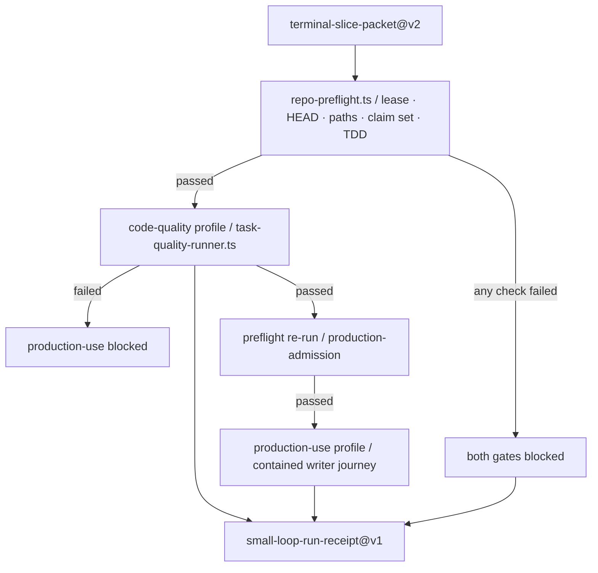

# Terminal operator overview

`.agents/skills/repo-terminal-operator/` is 47 TypeScript files, about 9,700 lines — the largest code
body in this repository and roughly twice the Python. It implements one job: apply a single leased
change inside a repository and produce physical evidence that the change was safe
(src: .agents/skills/repo-terminal-operator/SKILL.md `Apply one typed terminal slice inside this repository and own its code-quality and production-use verification.`).

**It cannot run here.** That is documented below and is the first thing to know before reading it.

## The flow

The entry point is `repo-adapter.ts` with four modes
(src: .agents/skills/repo-terminal-operator/repo-adapter.ts `console.error("usage: repo-adapter.ts --describe|--selftest|--preflight <packet>|--run <packet>");`):

| Mode | Emits | Exit |
|---|---|---|
| `--describe` | `repo-terminal-operator-description@v1` | 0 |
| `--selftest` | the same, after asserting both profiles hold a real command (src: .agents/skills/repo-terminal-operator/repo-adapter.ts `console.error("FAIL: both profiles require a real argv command");`) | 0 or 2 |
| `--preflight <packet>` | `repo-terminal-preflight-receipt@v1` | 0 or 2 |
| `--run <packet>` | `small-loop-run-receipt@v1` | 0 or 2 |

Its contract is declared, not inferred: input `terminal-slice-packet@v2` with v1 retained for
compatibility, output `small-loop-run-receipt@v1`
(src: .agents/skills/repo-terminal-operator/repo-adapter.ts `output_contract: "small-loop-run-receipt@v1",`).

## Ordering invariants in `--run`

`small-loop-runner.ts` enforces the sequence rather than trusting the caller:

1. **HEAD is observed before and after** the whole run, and any difference from the packet's expected
   head is a `stale` failure
   (src: .agents/skills/repo-terminal-operator/small-loop-runner.ts `{ stage: "git-head", kind: "stale", message:`).
2. **Preflight gates everything.** If it fails, both gates are recorded as `blocked` with zero attempts
   (src: .agents/skills/repo-terminal-operator/small-loop-runner.ts `function blockedStage(name: "code-quality" | "production-use"): Stage {`).
3. **Code quality runs first**, and production-use is blocked if it did not pass.
4. **Preflight runs a second time** before production-use, under a distinct stage name
   (src: .agents/skills/repo-terminal-operator/small-loop-runner.ts `failures: blocked.map((failure) => ({ ...failure, stage: "production-admission" })),`).
5. **A clean exit is not enough.** Every gate result must satisfy a process-hygiene predicate — reaped,
   timer cleared, both streams drained, no cleanup errors
   (src: .agents/skills/repo-terminal-operator/small-loop-runner.ts `return result.exitCode === 0 && !result.timedOut && !result.cancelled && result.processReaped`)
   — and then its typed receipt must validate.
6. **Profiles may not drift from the packet.** The on-disk profile must equal the commands the packet
   declared (src: .agents/skills/repo-terminal-operator/small-loop-gate-contract.ts `command drift from terminal packet`)
   and must contain exactly one argv command.

(inferred) Re-running preflight between the two gates is the load-bearing detail. Code quality can take
tens of seconds, and the lease or HEAD it was authorised against can expire in that window; without the
second check a run could publish production evidence for a tree that had already moved. Naming the
second failure `production-admission` rather than reusing `preflight` is what lets a reader tell "never
started" from "lost the lease mid-run".

Failures are typed by cause, not by stage
(src: .agents/skills/repo-terminal-operator/small-loop-runner.ts `return result.timedOut || result.cancelled ? "transient" : result.cleanupErrors.length > 0 ? "policy" : "deterministic";`).

## Sub-systems

| Page | Covers |
|---|---|
| [Packet and preflight](packet-and-preflight.md) | the packet schemas and every preflight check |
| [Code-quality profile](code-quality-profile.md) | the eight static/test stages and the sealed profile hash |
| [Writer publication](writer-publication.md) | the atomic artifact publisher and its failure taxonomy |
| [Async production](async-production.md) | the durable job lifecycle, worker carrier, control plane and admission facade |
| [Evidence cost](evidence-cost.md) | the cost cache projector and the trusted collector |
| [Forgejo handoff](forgejo-handoff.md) | the narrow Git publication seam |
| [Shared primitives](shared-primitives.md) | bounded subprocesses and anchored reads |
| [Production profiles and evidence](production-profiles-and-evidence.md) | which profile is authoritative and what each receipt proves |

## Why it cannot run here

Four independent reasons, each verifiable:

1. **No build or dependency configuration.** There is no `package.json`, `tsconfig.json`, `bun.lockb` or
   ESLint config anywhere in this repository.
2. **Six modules import a path outside the repository.** For example
   (src: .agents/skills/repo-terminal-operator/small-loop-runner.ts `import { runOwnedProfileCommand } from "../../../../../skills/repo-neural-perception/scripts/owned-profile-command";`)
   — five levels up from `.agents/skills/repo-terminal-operator/` resolves above this repository's root,
   and `skills/` here holds only the two skill assets.
3. **The production profile targets a missing script**
   (src: .agents/skills/repo-terminal-operator/production-use.profile.json `"../../skills/repo-neural-perception/scripts/writer-contained-production-profile.ts"`).
4. **Every test it names is absent.** Its stage definitions list about twenty Bun suites under
   `tests/skills/` and `tests/forgejo/`; neither directory exists. See
   [Test map](../testing/test-map.md).

Consequently `artifacts/repo-terminal-operator/` holds 129 receipts that nothing here can reproduce —
see [Production profiles and evidence](production-profiles-and-evidence.md).

(inferred) The right way to read this directory is as a **specification with a reference
implementation**: the invariants it encodes — bounded subprocesses, hash-bound inputs, reopen-after-write
verification, degraded modes that cannot admit — are exactly the ones the Python side of this repository
states in prose. Treating it as dead code loses that; treating it as running evidence would be false.

## Related

- [Production bottlenecks](../nonofficial/production-bottlenecks.md) — the same limitation as a repository-level caveat.
- [Repository architecture](../architecture/overview.md) — where this layer sits.
