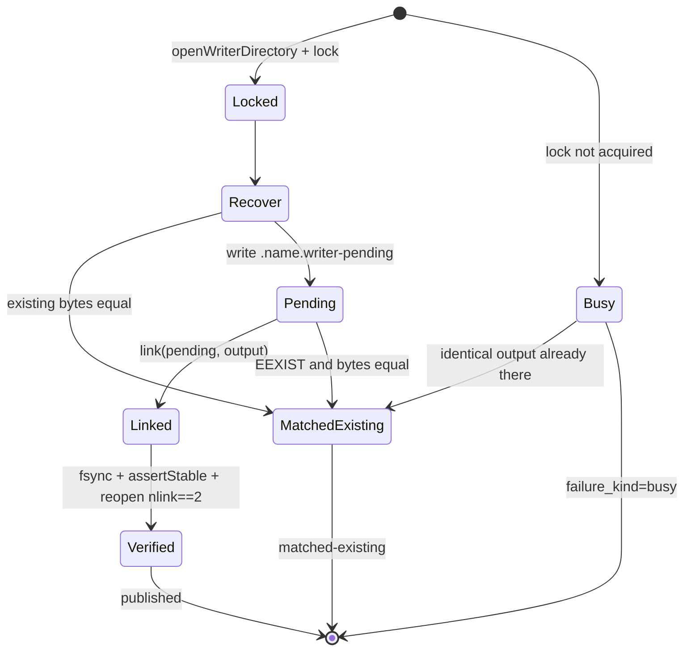

# Writer publication

The subsystem that publishes one file safely under concurrency, and the only place in the operator
where admission-grade race, leak and silent-failure evidence is produced. Four modules: an entrypoint,
a native directory-handle layer, the publication algorithm, and a set of observers used by the
production journey.

## The entrypoint contract

`writer-entrypoint.ts` takes five flags, parsed pairwise with duplicates rejected
(src: .agents/skills/repo-terminal-operator/writer-entrypoint.ts `if (values.has(flag)) throw new Error(`), each required
(src: .agents/skills/repo-terminal-operator/writer-entrypoint.ts `runId: required(values.get("--run-id"), "--run-id"),`). Identifiers must
match a strict pattern (src: .agents/skills/repo-terminal-operator/writer-entrypoint.ts `if (!/^[a-z0-9][a-z0-9._-]{2,127}$/u.test(value))`).

Three containment rules apply before anything is opened
(src: .agents/skills/repo-terminal-operator/writer-entrypoint.ts `throw new Error("--output must stay inside --root");`):
the output must be relative and inside the realpath'd root, the candidate must be inside it, and the
output's parent must not resolve through a symlink
(src: .agents/skills/repo-terminal-operator/writer-entrypoint.ts `throw new Error("--output parent must not resolve through a symlink");`).

The candidate is read with `O_NOFOLLOW` and verified to be a regular file *through the descriptor*
(src: .agents/skills/repo-terminal-operator/writer-entrypoint.ts `const descriptor = openSync(path, constants.O_RDONLY | constants.O_NOFOLLOW);`),
and a close failure is not swallowed — it is aggregated with the primary error
(src: .agents/skills/repo-terminal-operator/writer-entrypoint.ts `"candidate descriptor cleanup failed",`).

On success it prints `repo-terminal-writer-receipt@v1`
(src: .agents/skills/repo-terminal-operator/writer-entrypoint.ts `schema_version: "repo-terminal-writer-receipt@v1",`) with the
publication outcome, the recovery outcome and the candidate digest.

## Failures are typed, and the exit code follows the type

Any throw becomes a `repo-terminal-writer-failure@v1` document on stderr
(src: .agents/skills/repo-terminal-operator/writer-entrypoint.ts `schema_version: "repo-terminal-writer-failure@v1",`) carrying the
preserved diagnostic chain (src: .agents/skills/repo-terminal-operator/writer-entrypoint.ts `original_error_preserved: true,`) and
whether an artifact was created before the failure. The kind is parsed out of the message
(src: .agents/skills/repo-terminal-operator/writer-entrypoint.ts `return /failure_kind=([a-z-]+)/u.exec(detail)?.[1] ?? "system";`),
and a conflict exits 1 while everything else exits 2
(src: .agents/skills/repo-terminal-operator/writer-entrypoint.ts `return kind === "conflict" ? 1 : 2;`).

(inferred) Encoding the kind inside the message text and re-extracting it looks indirect, but it lets a
failure raised deep in the native layer choose the process exit code without every intermediate frame
having to know about exit codes. The cost is a text contract — every raiser must spell `failure_kind=`
exactly, and an unrecognised message silently degrades to `system`.

## The publication algorithm

`publishWriterArtifact` works through an open directory handle rather than by path
(src: .agents/skills/repo-terminal-operator/writer-publication.ts `const directory = openWriterDirectory(root, parent);`), refuses to
proceed if the parent's identity changed
(src: .agents/skills/repo-terminal-operator/writer-publication.ts `[new Error("[writer] failure_kind=parent-identity-mismatch"), ...cleanup],`),
and requires an exclusive lock — without one it may only report an existing match, never write
(src: .agents/skills/repo-terminal-operator/writer-publication.ts `"[writer] failure_kind=busy retry_budget=3 wait_budget_ms=600",`).

The locked path is five steps:

1. **Recover** any pending file left by a crashed predecessor, yielding `pre-link` or `post-link`
   (src: .agents/skills/repo-terminal-operator/writer-publication-contract.ts `export type RecoveryOutcome = "none" | "pre-link" | "post-link";`).
2. **Short-circuit** if the output already exists with identical bytes — the outcome is
   `matched-existing`, not an error
   (src: .agents/skills/repo-terminal-operator/writer-publication-contract.ts `export type WriterOutcome = "published" | "matched-existing";`).
3. **Write a pending file** with `O_CREAT|O_EXCL|O_NOFOLLOW`, verify it is a regular file with exactly
   one link (src: .agents/skills/repo-terminal-operator/writer-publication.ts `throw new Error("[writer] failure_kind=unsafe-pending");`),
   chmod 0600 and `fsync` it.
4. **Link** pending → output. `EEXIST` is handled as a legitimate concurrent publication, re-checked for
   content equality (src: .agents/skills/repo-terminal-operator/writer-publication.ts `throw new Error("[writer] output disappeared after conflict");`).
5. **Verify after the fact**: fsync the directory, assert root and parent dev/ino are unchanged
   (src: .agents/skills/repo-terminal-operator/writer-publication.ts `"[writer] failure_kind=boundary-drift root or parent changed",`), then
   reopen the published name and require exactly two links and identical bytes
   (src: .agents/skills/repo-terminal-operator/writer-publication.ts `if (!file.isFile() || file.nlink !== 2)`)
   (src: .agents/skills/repo-terminal-operator/writer-publication.ts `throw new Error("[writer] failure_kind=publication-mismatch");`).

(inferred) `nlink !== 2` after the link is the check that makes this more than a rename. Between linking
and verifying, another process could have replaced the name; two links prove the name still points at
*this* pending inode, and the byte comparison proves the inode still holds what was written. Cleanup
then unlinks the pending name, dropping it back to one.

### Conflict: existing content that differs

`existingWriterOutcome` reads the output through the same anchored descriptor and branches three ways:
absent → `undefined` (proceed), byte-identical → `matched-existing`, anything else → a conflict that
carries both digests and **leaves the existing file untouched**
(src: .agents/skills/repo-terminal-operator/writer-publication-read.ts `[writer] failure_kind=conflict existing_sha256=`).
That is the only `failure_kind` the entrypoint maps to exit 1 rather than 2 — see the taxonomy above.
An output that is not a regular file is a separate failure
(src: .agents/skills/repo-terminal-operator/writer-publication-read.ts `if (!file.isFile()) throw new Error("[writer] failure_kind=unsafe-output non-regular file");`).

There is no overwrite path anywhere in this module: publication is by `link`, which fails with `EEXIST`
rather than replacing, and the only `unlink` calls target the *pending* name or an output whose bytes the
caller proved.

### Crash and cancellation recovery

`recoverPending` runs before anything else on the locked path and distinguishes where a predecessor died
by the pending file's link count
(src: .agents/skills/repo-terminal-operator/writer-publication.ts `if (!pendingFile.isFile() || ![1, 2].includes(pendingFile.nlink)) {`):

| Pending state | Meaning | Outcome | Action |
|---|---|---|---|
| absent | nothing to recover | `none` | continue |
| present, `nlink === 1` | died **after write, before link** — cancellation at the `pending-written` stage | `pre-link` | unlink the pending file and republish from scratch |
| present, `nlink === 2` | died **after link, before cleanup** | `post-link` | verify output and pending are the same inode, then unlink the pending name only |

The post-link branch proves the identity by `dev`/`ino` before touching anything
(src: .agents/skills/repo-terminal-operator/writer-publication.ts `outputFile.ino !== pendingFile.ino`), failing loudly if they differ
(src: .agents/skills/repo-terminal-operator/writer-publication.ts `throw new Error("[writer] failure_kind=recovery-link-mismatch");`). Any
other link count is rejected rather than guessed
(src: .agents/skills/repo-terminal-operator/writer-publication.ts `throw new Error("[writer] failure_kind=unsafe-recovery-pending");`), and a
recovery unlink that fails is fatal — `missingAllowed` is false here
(src: .agents/skills/repo-terminal-operator/writer-publication.ts `unlink(directory, pending, false);`).

The recovery outcome is reported alongside the writer outcome in every receipt, so a caller can tell a
clean publish from one that cleaned up after a crash.

(inferred) Deriving "where did it die" from `nlink` rather than from a journal is what lets recovery be
stateless: the filesystem already records whether the link step completed, so no separate intent record
can go out of sync with reality.

### Cleanup failure

Cleanup always runs — the pending unlink (this time with `missingAllowed`) and the directory close — and
its errors are appended to a list rather than replacing the primary error
(src: .agents/skills/repo-terminal-operator/writer-publication.ts `cleanupFailures.push(...closeWriterDirectory(directory));`). The final
result is decided by one helper: if there is any primary or cleanup failure, it throws a
`WriterPublicationFailure` carrying **whether the artifact was created**, with a single cause or an
`AggregateError` when there are several
(src: .agents/skills/repo-terminal-operator/writer-publication-lifecycle.ts `new AggregateError(failures, "writer publication and cleanup failed")`)
(src: .agents/skills/repo-terminal-operator/writer-publication-lifecycle.ts `throw new WriterPublicationFailure(artifactCreated, cause);`); a
publication that produced no result is also a failure rather than a silent undefined
(src: .agents/skills/repo-terminal-operator/writer-publication-lifecycle.ts `new Error("publication returned no result")`).

So **a cleanup failure after a successful link still fails the call**, and the receipt records
`artifact_created: true` for it
(src: .agents/skills/repo-terminal-operator/writer-entrypoint.ts `error instanceof WriterPublicationFailure && error.artifactCreated,`). The
`artifactCreated` flag is set at the moment the link succeeds
(src: .agents/skills/repo-terminal-operator/writer-publication.ts `state.artifactCreated = true;`).

(inferred) That combination — failing the call while truthfully reporting the artifact exists — is the
alternative to the two common wrong answers. Reporting success would leak a resource; reporting plain
failure would invite a caller to retry into an output that is already correct and get a conflict. The
flag is what makes the retry decision available to the caller.

Two probe hooks exist so tests can pause or fail at exact points
(src: .agents/skills/repo-terminal-operator/writer-publication-probe.ts `export function pauseWriterAt(stage: "pending-written" | "output-linked"): void {`) —
they are inert unless enabled, and are how the race scenarios force a cancellation at `pending-written`
or a failure at `output-linked`.

`removeWriterArtifact` is the mirror image: same lock, same parent-identity check, and it refuses to
delete a file whose contents differ from what the caller expected
(src: .agents/skills/repo-terminal-operator/writer-publication.ts `throw new Error("[writer] failure_kind=remove-content-mismatch");`).

## The native layer

`writer-native.ts` opens directories and performs `openat`-style operations against a held descriptor
(src: .agents/skills/repo-terminal-operator/writer-native.ts `export function openWriterDirectory(`), rejecting unsafe names
(src: .agents/skills/repo-terminal-operator/writer-native.ts `throw new Error(`) and any parent that escapes the root
(src: .agents/skills/repo-terminal-operator/writer-native.ts `throw new Error("writer parent escapes root");`). It re-checks that the
root and parent did not change between resolution and open
(src: .agents/skills/repo-terminal-operator/writer-native.ts `throw new Error("writer root changed before open");`). The FFI bindings
live in `writer-native-library.ts` and fail with a typed message when a symbol is missing
(src: .agents/skills/repo-terminal-operator/writer-native-library.ts `throw new Error(`).

## Observers

`writer-production-observer.ts` runs the entrypoint and parses its receipt, treating an unparseable one
as failure (src: .agents/skills/repo-terminal-operator/writer-production-observer.ts `catch (error) { throw new Error("writer emitted invalid JSON", { cause: error }); }`),
and provides concurrency and stage-kill probes plus a residue counter
(src: .agents/skills/repo-terminal-operator/writer-production-observer.ts `export function writerResidue(paths: WriterJourneyPaths, output: string): number {`)
— the leak evidence. Scenario modules turn those observations into the three named safety checks; see
[Production profiles and evidence](production-profiles-and-evidence.md).

## Related

- [Shared primitives](shared-primitives.md) · [Async production](async-production.md) — the worker carrier reuses this publisher for its result transactions.
- [Terminal operator overview](overview.md)
