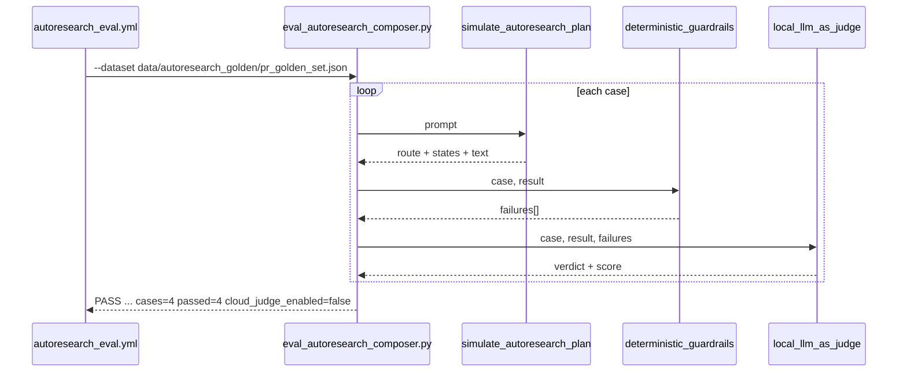

# Behavioral eval and judge

Four scripts claim to evaluate behaviour. All four are **local-first**: none of them calls a model in
its default configuration, and each says so in its own telemetry rather than leaving the reader to
infer it.

| Script | Subject | Model calls | Emits |
|---|---|---|---|
| `eval_autoresearch_composer.py` | golden datasets | none (local) / disabled (cloud) | per-case route, states, judge verdict |
| `llm_judge.py` | a judge response string | none | accept/reject of a verdict payload |
| `sample_autoresearch_traces.py` | trace JSONL | none | sample and observed-state counts |
| `local_regex_runner.py` | `cases.json` | none | per-case pass rate over 5 trials |

`interactions_patch_assert_runner.py` belongs to the same family and is covered under
[Synthetic corpus](synthetic-corpus.md).

## The golden-dataset harness

`eval_autoresearch_composer.py` is the PR gate for [autoresearch_composer](../skill-assets/autoresearch-composer.md).
Its loader accepts JSON arrays, `{cases: [...]}` objects and JSONL
(src: scripts/eval_autoresearch_composer.py `raise ValueError("dataset must be a JSON list, JSON object with cases, or JSONL records")`),
and every case must carry eight fields
(src: scripts/eval_autoresearch_composer.py `"judge_rubric",`).

The "agent" is a keyword-routed simulator
(src: scripts/eval_autoresearch_composer.py `def simulate_autoresearch_plan(prompt: str) -> dict[str, object]:`)
that maps a prompt to one of five routes — three native yields (`diagnose`, `security-review`, `tdd`),
`/autoresearch:evals`, and the default `/autoresearch:plan` — and returns a bag of marker words. The
guardrail layer then does the actual judging deterministically: route equality plus `must_include` and
`must_not_include` literals
(src: scripts/eval_autoresearch_composer.py `failures.append(f"forbidden literal present: {literal}")`).

(inferred) The judge is downstream of the guardrails and cannot rescue them: its score collapses the
moment any deterministic failure exists (src: scripts/eval_autoresearch_composer.py `score = 0.96 if not failures else max(0.0, 0.82 - (0.05 * len(failures)))`),
so the LLM-shaped layer can only ever agree with the mechanical one. That ordering is the point — a
judge that could overturn a literal-match failure would make the literals decorative.

The cloud path exists and is fenced twice: it returns `SKIP` unless explicitly enabled
(src: scripts/eval_autoresearch_composer.py `if os.environ.get("ENABLE_LLM_JUDGE") != "1":`), and only
then demands a key (src: scripts/eval_autoresearch_composer.py `raise RuntimeError("OPENAI_API_KEY is required only when ENABLE_LLM_JUDGE=1")`).
Even enabled, it is a placeholder that still returns `SKIP`
(src: scripts/eval_autoresearch_composer.py `"judge_mode": "cloud-placeholder-disabled-in-seed",`).
Note also the switch mismatch: the workflow forwards a repository variable whose value is the string
`true` (src: .github/workflows/autoresearch_eval.yml `ENABLE_LLM_JUDGE: ${{ vars.ENABLE_CLOUD_EVALS }}`)
into a check that only accepts `1`, so the "enabled" job still takes the disabled branch.

**What makes the process fail.** Only two things are accumulated as failures — a deterministic
guardrail failure, or a judge verdict of `FAIL`
(src: scripts/eval_autoresearch_composer.py `if case_failures or judge["verdict"] == "FAIL":`). A cloud
verdict of `SKIP` matches neither, so in `--mode cloud` a run in which the judge never executed exits
zero with `passed_cases` equal to the case count. The exit code is decided by that accumulated list
alone (src: scripts/eval_autoresearch_composer.py `print("FAIL: autoresearch eval suite", "; ".join(failures), file=sys.stderr)`).

(inferred) `SKIP` deliberately not counting as failure is what keeps the cloud job from turning red on
a repository that has no key — but it also means a green cloud run proves only that the deterministic
guardrails passed. The `cloud_judge_enabled` field in the summary is the only place that distinction is
visible, which is why the focused tests assert on that field rather than on the exit code.

Observed at `5d3c42f`: `PASS: autoresearch eval suite cases=4 passed=4 mode=local cloud_judge_enabled=false`.

## The double-lock judge parser

`llm_judge.py` never talks to a model; it parses what one would have said and decides whether the
answer is admissible at all. It extracts the first JSON object from a response wrapped in a marker tag
(src: scripts/llm_judge.py `payload = extract_json(f"<judge_output>{args.response}</judge_output>")`),
refuses non-standard JSON constants such as `NaN`
(src: scripts/llm_judge.py `parse_constant=lambda _value: (_ for _ in ()).throw(ValueError("non-standard JSON constant")),`),
and requires a finite numeric score
(src: scripts/llm_judge.py `raise ValueError("score must be finite")`). Acceptance needs all three locks
(src: scripts/llm_judge.py `if verdict != "PASS" or score < 0.85 or "breach detected" in reasoning:`).

(inferred) The `NaN` rejection is the interesting one. `float("nan") >= 0.85` is false, so a naive
threshold already rejects it — but `json.loads` accepting `NaN` at all means the payload was never
strict JSON, and a parser that quietly repairs malformed judge output is a parser that will quietly
repair an injected one. Failing at parse time keeps the trust boundary where the data enters.

## Trace sampling

`sample_autoresearch_traces.py` validates that recorded traces are complete and local. Seven fields
are required per trace (src: scripts/sample_autoresearch_traces.py `"cloud_judge_enabled",`), cloud
must be off in every seed trace
(src: scripts/sample_autoresearch_traces.py `failures.append(f"{trace.get('trace_id', '<unknown>')}: cloud_judge_enabled must be false in seed traces")`),
verdicts are constrained to three values, and the union of observed states must cover the four core
nodes (src: scripts/sample_autoresearch_traces.py `for state in ("S1 match", "S2 route", "S3 generate", "S4 validate"):`).

Observed: `PASS: autoresearch trace sampler sample_count=3 observed_state_count=5 cloud_judge_enabled=false`.

(inferred) Requiring the *union* of states rather than per-trace completeness is what lets a
native-yield trace legitimately skip `S3 generate` while still proving the sample set exercises the
whole graph. Per-trace completeness would have forced every sample through every node and quietly
deleted the yield path from the evidence.

## The five-trial regex runner

`local_regex_runner.py` replays `cases.json` against a canned agent five times per case
(src: scripts/local_regex_runner.py `TRIALS_COUNT = 5`). The canned agent returns a fixed compliant
snippet when the case should trigger and a sentinel otherwise
(src: scripts/local_regex_runner.py `return "NO_SKILL_TRIGGER"`). `FORBID:`-prefixed checks invert
(src: scripts/local_regex_runner.py `forbidden = pattern.removeprefix("FORBID:")`), an invalid regex is
fatal rather than skipped
(src: scripts/local_regex_runner.py `raise ValueError(f"invalid regex pattern: {pattern}") from exc`),
and any case below a perfect pass rate fails the suite
(src: scripts/local_regex_runner.py `if pass_rate < 1.0:`).

Observed: `PASS: local regex runner case_count=10 total_trials=50 zero_llm_api_calls=0`.

(inferred) With a deterministic agent, five trials cannot vary — the count is a contract for the day a
real driver is substituted, not a measurement today. Reading `total_trials=50` as fifty independent
observations is the single easiest mistake to make about this repository's telemetry.
`check_expected` is nevertheless real shared code: `real_driver_ablation.py` imports it
(src: scripts/real_driver_ablation.py `from local_regex_runner import check_expected`), so the scoring
function used against a live agent is the same one measured here.

## Related

- [Ablation and benchmark](ablation-and-benchmark.md) — the A/B side, including the real-agent driver.
- [Structured lifecycle datasets](../lifecycle/structured-datasets.md) — where these results are recorded.
- [Test map](../testing/test-map.md) — the pytest module that pins these outputs.
- [Prompt trace assets](../nonofficial/prompt-trace-assets.md) — the prompt-slot dataset and its gate.
