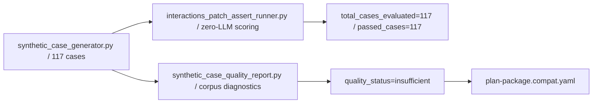

# Synthetic corpus

The `117/117` figure that appears throughout this repository comes from three scripts that generate a
fixed corpus, score it without any model, and then measure how weak it is. All three sit inside
`git_gate.py`.



## Generation is fixed, not sampled

`synthetic_case_generator.py` produces exactly 117 cases from ten scenario strings
(src: scripts/synthetic_case_generator.py `"migration from v2 chat",`), alternating language by index
(src: scripts/synthetic_case_generator.py `return "typescript" if index % 2 else "python"`) and giving
each an id of the form `P11-001`
(src: scripts/synthetic_case_generator.py `"case_id": f"P11-{index:03d}",`). The prompt is one template
with the index and scenario substituted
(src: scripts/synthetic_case_generator.py `f"Case {index}: build a {scenario} using the newest Gemini Interactions API; "`).

The count is not configurable in practice — any other total is refused
(src: scripts/synthetic_case_generator.py `print("FAIL: production P11 matrix must contain exactly 117 cases", file=sys.stderr)`).
It writes only when `--output` is given, so the gate invocation is pure
(src: scripts/synthetic_case_generator.py `if args.output:`), and its PASS line goes to stderr
(observed: `PASS: generated synthetic_cases=117 typescript=59 python=58`).

(inferred) A pinned 117 with a hard failure on any other value is a deliberate choice against "tune the
corpus until the number looks good". It also means the constant is load-bearing in three other places
— the runner, the quality report and the pytest module all assume it — which is why changing it is a
four-file edit rather than a flag.

## Scoring is a regex canary

`interactions_patch_assert_runner.py` scores the corpus against a fixed rule table per language
(src: scripts/interactions_patch_assert_runner.py `"must_not_match": [r"\.start_chat\(", r"gemini\.interactions\.create_session\("],`)
using a hard-coded "patched agent" that returns compliant code
(src: scripts/interactions_patch_assert_runner.py `def patched_agent(_prompt: str, language: str) -> str:`).
It counts model calls and requires zero
(src: scripts/interactions_patch_assert_runner.py `"zero_llm_api_calls": self.llm_api_calls,`), sets its
own success bar (src: scripts/interactions_patch_assert_runner.py `"verdict": "TARGET_MET" if success_rate >= 0.88 else "TARGET_FAILED",`),
and then re-asserts all three conditions before exiting zero
(src: scripts/interactions_patch_assert_runner.py `if telemetry["total_cases_evaluated"] != 117 or telemetry["zero_llm_api_calls"] != 0 or telemetry["verdict"] != "TARGET_MET":`).

Observed at `5d3c42f`:
`PASS: interactions regex assertions total_cases_evaluated=117 passed_cases=117 success_rate=1.0 zero_llm_api_calls=0`.

(inferred) Both the writer and the reader of these 117 outputs are the same file, so the result is a
tautology by construction — and that is exactly what a canary is for. It detects the day someone edits
the rule table and forgets that generated `expected_checks` encode the same rules; it cannot detect
anything about a model.

## The corpus grades itself as insufficient

`synthetic_case_quality_report.py` re-imports the generator by path
(src: scripts/synthetic_case_quality_report.py `spec = importlib.util.spec_from_file_location("synthetic_case_generator", path)`)
and measures the corpus against four thresholds
(src: scripts/synthetic_case_quality_report.py `insufficient_reasons.append("template_similarity_gt_0_35")`):
at least 12 unique expected-check sets, at least 20 negative cases, at least 10 non-triggering cases,
and maximum pairwise template similarity at or below 0.35.

Observed:

```text
PASS: synthetic case quality perceived quality_status=insufficient case_count=117
      unique_scenarios=10 unique_expected_check_sets=2 negative_cases=0
      max_template_similarity_ratio=0.9969
```

All four thresholds fail. The report nevertheless exits zero — it is a **perception** gate, not a
promotion gate: it also hard-codes the two axes it cannot measure
(src: scripts/synthetic_case_quality_report.py `"real_agent_runs": 0,`).

That verdict is then pinned as a manifest value
(src: plan-package.compat.yaml `synthetic_case_quality_status: insufficient`) and re-asserted by the
compatibility guard (src: scripts/check_plan_package_compat.py `or manifest.get("synthetic_case_quality_status") != "insufficient"`),
alongside the scope label (src: plan-package.compat.yaml `p11_current_scope: local-zero-llm-regex-canary`).

(inferred) Pinning `insufficient` as a required value inverts the usual gate. Here the failure is the
asserted state, so an over-eager improvement that flipped the status without also adding
`real_synthetic_generation_gate_required` evidence would turn the compatibility check red. That is the
mechanism by which "we know this is weak" survives contact with someone trying to make the dashboard
green.

The same limit is recorded a third time as a claim with adversarial reviews attached
(src: data/semantic_arbitration_claims.json `"claim_text": "The 117/117 P11 result proves local zero-LLM regex canary coverage, not real synthetic case quality.",`)
— see [Semantic arbitration](semantic-arbitration.md).

## Narrow validation

```sh
python3 scripts/synthetic_case_generator.py
python3 scripts/interactions_patch_assert_runner.py
python3 scripts/synthetic_case_quality_report.py --json
```

## Related

- [gemini_interactions](../skill-assets/gemini-interactions.md) — the asset whose rules this corpus encodes.
- [Ablation and benchmark](ablation-and-benchmark.md) — the real-agent path this corpus cannot substitute for.
- [Production bottlenecks](../nonofficial/production-bottlenecks.md) — the same limit stated as a repository-level caveat.
