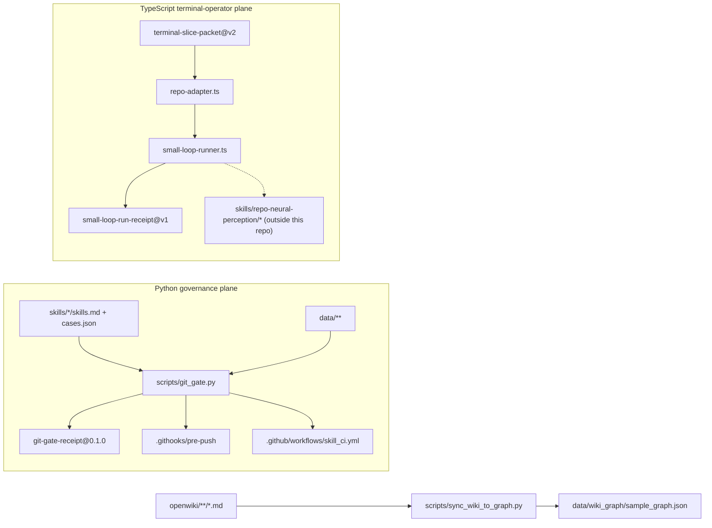

# Repository overview

## What this repository is

`agent-skills-repo` is a **skill-asset governance seed**, not an application.
It declares its own archetype as `project_archetype: skill-asset-governance-repo`
(src: PROJECT-SSOT.md `project_archetype: skill-asset-governance-repo`) and states
outright that it "is a GCR skill-asset governance repo, not a LangGraph
application seed" (src: PROJECT-SSOT.md `not a LangGraph application seed`).
Its `pyproject.toml` describes the package as a "GCR skill asset governance seed
with deterministic local defenses" (src: pyproject.toml `deterministic local defenses`)
and requires Python 3.11 or newer (src: pyproject.toml `requires-python = ">=3.11"`).

The artefacts it governs are *agent skills* — prompt assets plus behaviour cases —
and the machinery it ships is the set of deterministic checks that decide whether
such an asset may be promoted. `README.md` lists what the repository owns,
including the skill asset `skills/gemini_interactions/skills.md`, the local
defence entries `.githooks/pre-push` and `.githooks/commit-msg`, and the
production gate entry `scripts/git_gate.py` (src: README.md `production gate entry`).
It equally lists what it does **not** own — "plan packets", "small-loop routes",
"template drafts" and antigravity `kb-ingest` (src: README.md `- small-loop routes;`).
That exclusion is enforced, not merely stated: two separate gates fail if the
directories `small-loop`, `packets` or `templates/skill-defense-governance`
appear here (src: scripts/check_openwiki.py `forbidden final repo path exists`).

## The two planes

Everything in the tree belongs to one of two systems that share a repository but
almost no code.

**The Python governance and evaluation plane** — `scripts/`, `tests/`, `data/`,
`skills/`, `.githooks/`, `.github/workflows/` — is roughly 4,950 lines across 31
scripts. Its composition root is [`scripts/git_gate.py`](../governance/git-gate.md),
which runs an ordered list of gate scripts as subprocesses and prints
`PASS: git gate defenses passed` only when every one of them exits zero
(src: scripts/git_gate.py `PASS: git gate defenses passed`). Everything in this
plane is deterministic and offline: the eval harness advertises itself as a
"Local-first eval and judge harness" (src: scripts/eval_autoresearch_composer.py `Local-first eval and judge harness`)
and the regex canary asserts that it made zero model calls
(src: scripts/local_regex_runner.py `zero_llm_api_calls`).

**The TypeScript terminal-operator plane** — `.agents/skills/repo-terminal-operator/`
— is roughly 9,700 lines across 47 modules plus three JSON gate profiles. Its
entry contract is a `terminal-slice-packet@v2` and its output contract is a
`small-loop-run-receipt@v1` (src: .agents/skills/repo-terminal-operator/repo-adapter.ts `output_contract: "small-loop-run-receipt@v1"`).
Its composition root is
[`repo-adapter.ts`](../terminal-operator/preflight-and-small-loop.md), which
exposes `--describe|--selftest|--preflight <packet>|--run <packet>`
(src: .agents/skills/repo-terminal-operator/repo-adapter.ts `usage: repo-adapter.ts --describe|--selftest|--preflight <packet>|--run <packet>`).

The `artifacts/` directory holds only output of the second plane — journey
receipts and packet fixtures, described on
[production journeys](../terminal-operator/production-journeys.md).

## Where the boundary runs

`git_gate.py` gates the Python plane only. Its `GATES` list contains 22 Python
scripts and no TypeScript at all (src: scripts/git_gate.py `GATES = [`). The
operator plane is gated by its own profiles, which *are* tracked here —
`code-quality.profile.json` names one argv command
(src: .agents/skills/repo-terminal-operator/code-quality.profile.json `repo-code-quality.ts`)
— but whose commands and imports resolve outside this checkout. The
production-use profile points at
`../../skills/repo-neural-perception/scripts/writer-contained-production-profile.ts`
(src: .agents/skills/repo-terminal-operator/production-use.profile.json `writer-contained-production-profile.ts`),
and the operator's own modules import from the same absent tree, for example
`../../../../../skills/repo-neural-perception/scripts/owned-profile-command`
(src: .agents/skills/repo-terminal-operator/small-loop-runner.ts `skills/repo-neural-perception/scripts/owned-profile-command`).
No such directory exists here; `skills/` contains only `autoresearch_composer`
and `gemini_interactions`. (inferred) The consequence for anyone changing the
operator is concrete: you can read and type-check it as source, but you cannot
execute its gates from a standalone clone — it is a component that has been
vendored into a governance seed, and its runtime home is the enclosing
workspace. The
[validation matrix](../ci/validation-matrix.md) records exactly which commands
run here and which do not.

## Reading order

Start with the [plan-package contract](plan-package-contract.md) for the
repository-wide invariants, then the
[evidence and promotion policy](evidence-and-promotion-policy.md) for the rule
that explains why so many gates report a problem instead of failing. From there
the [git gate](../governance/git-gate.md) is the shortest route into the Python
plane, and the [terminal-operator overview](../terminal-operator/overview.md)
into the other one.

## Scope boundary

This page does not enumerate directories. Each substantive area has its own
page, and `openwiki/nonofficial/` is documented as a *gate input* on the
[openwiki contract](../wiki/openwiki-contract.md) page rather than as a
subsystem — several gates assert literal strings inside those hand-written
pages (src: scripts/check_openwiki.py `REQUIRED_LITERALS`).
