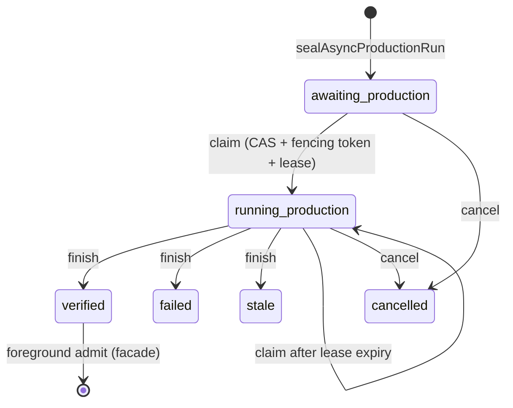

# Async production lifecycle and the admission facade

## Scope, stated by the contract

`SKILL.md` rule 9 fixes what this component is: an internal durable state-machine
prerequisite that "atomically seals candidate + foreground receipt + production
job, appends monotonic CAS events, fences expired workers, and resolves
cancel/finish races"
(src: .agents/skills/repo-terminal-operator/SKILL.md `appends monotonic CAS events, fences expired workers`), and rule 13 makes
the facade "the only public async lifecycle seam"
(src: .agents/skills/repo-terminal-operator/SKILL.md `as the only public async lifecycle seam`).

## The seal

`sealAsyncProductionRun` writes one immutable record
(src: .agents/skills/repo-terminal-operator/async-job-lifecycle.ts `schemaVersion: "repo-async-production-seal@v2";`) containing the candidate
files inline as base64 plus their digests, the foreground receipt and the
production job. Construction validates first: run and job ids against a pattern
(src: .agents/skills/repo-terminal-operator/async-job-lifecycle.ts `const RUN_ID = /^[a-z0-9][a-z0-9._-]{0,127}$/u;`), a git object id
(src: .agents/skills/repo-terminal-operator/async-job-lifecycle.ts `invalid-seal-binding`), a parseable deadline
(src: .agents/skills/repo-terminal-operator/async-job-lifecycle.ts `invalid-deadline`), a non-empty candidate set
(src: .agents/skills/repo-terminal-operator/async-job-lifecycle.ts `candidate-files-empty`), safe relative candidate paths with no
duplicates (src: .agents/skills/repo-terminal-operator/async-job-lifecycle.ts `duplicate-candidate-path:`), and non-empty sealed components
(src: .agents/skills/repo-terminal-operator/async-job-lifecycle.ts `sealed-component-empty`).

The aggregate digest is computed over the sorted path/digest pairs only
(src: .agents/skills/repo-terminal-operator/async-job-lifecycle.ts `const candidateSha256 = sha256`), and after publication the record is
re-read and compared
(src: .agents/skills/repo-terminal-operator/async-job-lifecycle.ts `published-seal-readback-mismatch`). Every later read re-validates the
whole record, including that each stored body still hashes to its recorded digest
(src: .agents/skills/repo-terminal-operator/async-job-lifecycle.ts `candidate-binding-mismatch`) and that the aggregate still matches
(src: .agents/skills/repo-terminal-operator/async-job-lifecycle.ts `seal-component-hash-mismatch`).

State lives under a directory whose shape is asserted, not assumed
(src: .agents/skills/repo-terminal-operator/async-job-lifecycle.ts `state-root-and-runs-must-be-real-directories`), and records are read
through `O_NOFOLLOW` with a size bound
(src: .agents/skills/repo-terminal-operator/async-job-lifecycle.ts `unsafe-or-oversized-lifecycle-record`).

## The event log

Events are files named by zero-padded version
(src: .agents/skills/repo-terminal-operator/async-job-lifecycle.ts `return `), read in sorted order and checked against their own index:
name, schema, run id, version, sequence and previous version must all agree, or
the log is rejected wholesale
(src: .agents/skills/repo-terminal-operator/async-job-lifecycle.ts `non-monotonic-event-log`). Every event carries the seal digest, and a
mismatch between the latest event and the seal is fatal
(src: .agents/skills/repo-terminal-operator/async-job-lifecycle.ts `event-seal-hash-mismatch`).

**Claim** requires a matching CAS version
(src: .agents/skills/repo-terminal-operator/async-job-lifecycle.ts `cas-version-mismatch:`), the exact seal digest
(src: .agents/skills/repo-terminal-operator/async-job-lifecycle.ts `seal-hash-mismatch`), a lease that ends after now and before the run
deadline (src: .agents/skills/repo-terminal-operator/async-job-lifecycle.ts `lease-exceeds-run-deadline`), and a job that is either
unclaimed or whose lease has expired
(src: .agents/skills/repo-terminal-operator/async-job-lifecycle.ts `job-not-claimable:`). **Finish** additionally requires the caller to
present the current fencing token
(src: .agents/skills/repo-terminal-operator/async-job-lifecycle.ts `fencing-token-mismatch`) that has not expired
(src: .agents/skills/repo-terminal-operator/async-job-lifecycle.ts `expired-fencing-token`). **Cancel** needs a reason and a cancellable
state (src: .agents/skills/repo-terminal-operator/async-job-lifecycle.ts `job-not-cancellable:`).

(inferred) Fencing is what makes lease expiry safe rather than merely tidy: a
worker whose lease lapsed can still be running, and the token check means its
late `finish` is rejected instead of overwriting the replacement worker's result.

The three transitions check the following, in order:

| Transition | Checks |
|---|---|
| `claim` | dates parse (src: .agents/skills/repo-terminal-operator/async-job-lifecycle.ts `assertDate("claim-time", input.now);`); lease ends after now (src: .agents/skills/repo-terminal-operator/async-job-lifecycle.ts `lease-must-expire-after-claim`); worker id and token match the identifier pattern (src: .agents/skills/repo-terminal-operator/async-job-lifecycle.ts `invalid-worker-or-fencing-token`); CAS version; seal digest; run deadline not passed (src: .agents/skills/repo-terminal-operator/async-job-lifecycle.ts `run-deadline-expired`); lease within the deadline; state claimable |
| `finish` | terminal status is one of three (src: .agents/skills/repo-terminal-operator/async-job-lifecycle.ts `invalid-terminal-status`); token and result digest well-formed (src: .agents/skills/repo-terminal-operator/async-job-lifecycle.ts `invalid-finish-binding`); optional transaction parent ids are safe integers (src: .agents/skills/repo-terminal-operator/async-job-lifecycle.ts `invalid-transaction-parent-binding`); result ref is a safe relative path; CAS version; deadline; state is running (src: .agents/skills/repo-terminal-operator/async-job-lifecycle.ts `job-not-running:`); token matches; token not expired |
| `cancel` | cancel time parses; reason non-empty (src: .agents/skills/repo-terminal-operator/async-job-lifecycle.ts `cancel-reason-required`); CAS version; state is awaiting or running (src: .agents/skills/repo-terminal-operator/async-job-lifecycle.ts `job-not-cancellable:`) |

`finish` optionally records the device and inode of the directory that held the
pending result (src: .agents/skills/repo-terminal-operator/async-job-lifecycle.ts `transactionParentDev?: number;`); the control plane later uses that
pair to decide whether an interrupted result can be recovered — see
[worker and control plane](async-worker-and-control-plane.md).

The derived view never reports eligibility
(src: .agents/skills/repo-terminal-operator/async-job-lifecycle.ts `admissionEligible: false,`) and always names a next action, including
the reclaimable case
(src: .agents/skills/repo-terminal-operator/async-job-lifecycle.ts `? "verification-lease-expired-reclaimable"`) and the terminal one
(src: .agents/skills/repo-terminal-operator/async-job-lifecycle.ts `? "foreground-admission-required"`).

## The facade

`executeAsyncProductionFacade` dispatches four actions after checking the request
schema (src: .agents/skills/repo-terminal-operator/async-admission-facade.ts `facade-request-invalid`), with request shapes defined in
`async-admission-contract.ts`
(src: .agents/skills/repo-terminal-operator/async-admission-contract.ts `schema_version: "repo-async-production-facade-request@v1";`).

**start** reopens live state before sealing: HEAD must match
(src: .agents/skills/repo-terminal-operator/async-admission-facade.ts `head-stale:`), candidate refs must be bounded and inside the target
(src: .agents/skills/repo-terminal-operator/async-admission-facade.ts `candidate-outside-target-repo`), the foreground receipt must be a
complete passing small-loop receipt
(src: .agents/skills/repo-terminal-operator/async-admission-verifier.ts `foreground-receipt-binding-invalid`), and the production job must
parse (src: .agents/skills/repo-terminal-operator/async-admission-facade.ts `production-job-binding-invalid`). It never launches anything
(src: .agents/skills/repo-terminal-operator/SKILL.md `it never launches a worker`).

**inspect** is read-only, **cancel** appends exactly one event.

**admit** is the strict one. It re-checks the CAS version, requires status
`verified` with the expected seal
(src: .agents/skills/repo-terminal-operator/async-admission-facade.ts `run-not-currently-verified`), re-reads HEAD, re-hashes **every**
candidate file against the sealed digest
(src: .agents/skills/repo-terminal-operator/async-admission-facade.ts `candidate-stale:`), re-validates the foreground receipt and job,
requires the verified result binding to exist
(src: .agents/skills/repo-terminal-operator/async-admission-facade.ts `verified-result-binding-missing`) and to still hash correctly
(src: .agents/skills/repo-terminal-operator/async-admission-facade.ts `worker-result-hash-stale`), and only then publishes one admission
record (src: .agents/skills/repo-terminal-operator/async-admission-facade.ts `schema_version: "repo-async-production-admission@v1",`) which is read
back and compared
(src: .agents/skills/repo-terminal-operator/async-admission-facade.ts `admission-readback-mismatch`).

Because publication converges on conflict, a second admitter observes
(src: .agents/skills/repo-terminal-operator/async-admission-facade.ts `? "admitted" : "already-admitted"`) and only the first is eligible
(src: .agents/skills/repo-terminal-operator/async-admission-facade.ts `admission_eligible: publication === "published",`). This is the
`EEXIST` behaviour of the [writer](writer-publication.md) surfaced as a business
rule.

**Degraded isolation is never admissible.** The verifier computes the mode and
refuses it outright
(src: .agents/skills/repo-terminal-operator/async-admission-verifier.ts `degraded-worker-not-admissible`), matching rule 13's statement that
`cwd-only-degraded` "remains advisory rather than admissible"
(src: .agents/skills/repo-terminal-operator/SKILL.md `remains advisory rather than admissible`). See
[worker and control plane](async-worker-and-control-plane.md) for where the mode
comes from.

## CLI

`async-admission-facade-cli.ts` accepts one flag pair
(src: .agents/skills/repo-terminal-operator/async-admission-facade-cli.ts `args.length === 2 && args[0] === "--request" ? args[1] : undefined;`) with a
request-size bound
(src: .agents/skills/repo-terminal-operator/async-admission-facade-cli.ts `const MAX_REQUEST_BYTES = 64 * 1024;`), and
`async-job-lifecycle-cli.ts` exposes the internal transitions.
