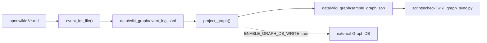

# Wiki-to-graph sync

## The architecture in one sentence

`PROJECT-SSOT.md` fixes the roles: sync "is local-first Event Sourcing: Markdown
is human SSOT, event log is audit trail, graph JSON is default projection,
external Graph DB write is opt-in"
(src: PROJECT-SSOT.md `external Graph DB write is opt-in`). The script header repeats it
(src: scripts/sync_wiki_to_graph.py `Local-first Wiki -> Event Log -> Graph projection.`).



## Events

Every Markdown file under the wiki root becomes one event
(src: scripts/sync_wiki_to_graph.py `for path in wiki_root.rglob`),
and an empty tree is a hard failure
(src: scripts/sync_wiki_to_graph.py `FAIL: no wiki markdown files found`). The event id is derived, not
random (src: scripts/sync_wiki_to_graph.py `event_id = "evt:" + sha256_text`),
and the timestamp is a constant
(src: scripts/sync_wiki_to_graph.py `GENERATED_EVENT_TIMESTAMP = "2026-07-23T00:00:00Z"`). (inferred) Both choices
exist to make the output byte-reproducible: a random id or a wall-clock stamp
would make every run a diff, and the gate below relies on being able to
regenerate the artefacts and compare behaviour rather than noise.

The front-matter reader is deliberately primitive — it requires a leading `---`
line and splits each key on the first `": "`
(src: scripts/sync_wiki_to_graph.py `key, value = line.split`). Headings are collected with their
ancestor path (src: scripts/sync_wiki_to_graph.py `stack = stack[: level - 1] + [title]`), links are
extracted by regex (src: scripts/sync_wiki_to_graph.py `def extract_links`), and fenced
blocks are counted in pairs
(src: scripts/sync_wiki_to_graph.py `def code_block_count`).

Every event carries a five-field license payload with defaults
(src: scripts/sync_wiki_to_graph.py `"N/A-deterministic-local-hash-no-model-weights"`),
so provenance exists even for pages that declare nothing.

## The projection

`project_graph` emits three node and edge families: a `WikiDocument` per page, a
`WikiSection` per heading joined by `HAS_SECTION`
(src: scripts/sync_wiki_to_graph.py `"edge_type": "HAS_SECTION"`), a `LINKS_TO` edge per Markdown link
(src: scripts/sync_wiki_to_graph.py `"edge_type": "LINKS_TO"`), and a `USES_SCHEMA` edge per document. Each
heading also becomes a retrieval chunk whose text is the heading path
(src: scripts/sync_wiki_to_graph.py `"text": " > ".join`) tagged with the embedding
model id. The retrieval contract declares both modes enabled and external writes
off (src: scripts/sync_wiki_to_graph.py `"graphrag": {"enabled": True, "graph_store": "local-json", "external_write_enabled": False},`)
and fixes the fields a fused result must carry
(src: scripts/sync_wiki_to_graph.py `"fusion": {"required_fields": ["source_path", "heading_path", "commit_sha", "schema_version"]},`).

`data/wiki_graph/schema.json` is the contract: schema version
(src: data/wiki_graph/schema.json `"schema_version": "wiki-graph-schema@0.1.0"`), the seven required event
fields (src: data/wiki_graph/schema.json `"required_event_fields": [`), the five provenance fields
(src: data/wiki_graph/schema.json `"required_provenance_fields": [`), a commercial-license allowlist
(src: data/wiki_graph/schema.json `"commercial_license_allowlist": [`), the default embedding model
(src: data/wiki_graph/schema.json `"embedding_model_id": "local-hash-embedding@0.1.0",`), and the write policy
(src: data/wiki_graph/schema.json `"external_graph_write_policy": "disabled-by-default",`).

## The opt-in external writer

Nothing leaves the machine unless a flag *and* an environment variable agree:
`--write-external-graph` must be passed
(src: scripts/sync_wiki_to_graph.py `--write-external-graph`) and the
env gate must be exactly `true`
(src: scripts/sync_wiki_to_graph.py `ENABLE_GRAPH_DB_WRITE`). Missing secrets fail
fast and name the missing ones
(src: scripts/sync_wiki_to_graph.py `external graph write requested but missing secrets:`). Two backends exist —
a generic JSON POST and a Neo4j transaction endpoint whose three Cypher
statements merge nodes, chunks and edges
(src: scripts/sync_wiki_to_graph.py `UNWIND $edges AS row `)
— with anything else refused
(src: scripts/sync_wiki_to_graph.py `unsupported GRAPH_DB_KIND:`). Neo4j errors in the response body are
surfaced rather than swallowed
(src: scripts/sync_wiki_to_graph.py `neo4j graph write returned errors:`).

## The gate

`scripts/check_wiki_graph_sync.py` validates the artefacts *and* the behaviour
(src: scripts/check_wiki_graph_sync.py `Validate Wiki -> Event Log -> GraphRAG/Vector RAG sync artifacts.`). It
requires seven files, pins literals in the workflow
(src: scripts/check_wiki_graph_sync.py `workflow missing literal:`), in the architecture page
(src: scripts/check_wiki_graph_sync.py `"GRAPH_DB_KIND=neo4j-http"`) and in the schema-standards page
(src: scripts/check_wiki_graph_sync.py `"LicenseProvenance"`), and it checks the sync script still contains its
external-writer symbols
(src: scripts/check_wiki_graph_sync.py `sync script missing external graph writer literal:`).

Two live sub-runs make it more than a literal check. The first regenerates the
projection into a temp directory and requires success
(src: scripts/check_wiki_graph_sync.py `sync_wiki_to_graph.py did not pass:`). The second is the interesting
one: it sets the enable flag, strips the three secrets, and requires the run to
**fail** (src: scripts/check_wiki_graph_sync.py `external graph write must fail fast when enabled without secrets`).
(inferred) That is a negative control — it proves the safety branch is reachable,
which a purely positive test never could.

Finally the committed artefacts are read back and checked against the schema,
including that every event carries all provenance fields
(src: scripts/check_wiki_graph_sync.py `event license missing field:`) and that external writes remain off
by default (src: scripts/check_wiki_graph_sync.py `external graph write must be disabled by default`).

## CI wiring

`.github/workflows/wiki_graph_sync.yml` triggers on wiki and schema changes
(src: .github/workflows/wiki_graph_sync.yml `- 'openwiki/**/*.md'`), runs the projection with the commit
sha (src: .github/workflows/wiki_graph_sync.yml `--commit-sha "$GITHUB_SHA"`), runs the gate, and uploads the
artefacts (src: .github/workflows/wiki_graph_sync.yml `name: wiki-graph-local-projection`). The external write
lives in a second job behind a repository variable
(src: .github/workflows/wiki_graph_sync.yml `if: ${{ vars.ENABLE_GRAPH_DB_WRITE == 'true' }}`).

Because the trigger path is `openwiki/**/*.md`, **every page added by a
documentation run changes this projection** — the node, edge and chunk counts in
the success line (src: scripts/sync_wiki_to_graph.py `PASS: wiki graph sync events=`) are a
function of how many pages exist.

## Validation

```sh
python3 scripts/sync_wiki_to_graph.py --event-log /tmp/e.jsonl --graph-out /tmp/g.json
python3 scripts/check_wiki_graph_sync.py
```
